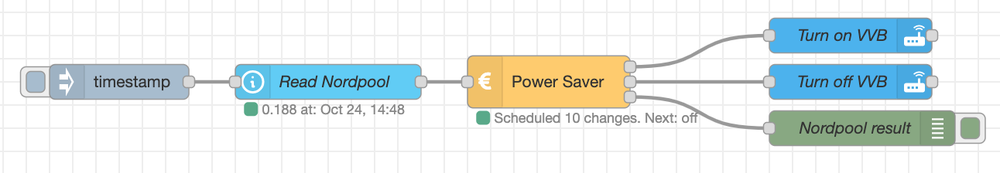

## Example with Nordpool and current state node

In this example, data is read from the Nordpool sensor in HA via the `current state` node.



Flow:

```json
[
    {
        "id": "e2578f6a.210a8",
        "type": "debug",
        "z": "d938c47f.3398f8",
        "name": "Nordpool result",
        "active": true,
        "tosidebar": true,
        "console": false,
        "tostatus": false,
        "complete": "true",
        "targetType": "full",
        "statusVal": "",
        "statusType": "auto",
        "x": 760,
        "y": 460,
        "wires": []
    },
    {
        "id": "eff3b00f.d85f4",
        "type": "power-saver",
        "z": "d938c47f.3398f8",
        "name": "Power Saver",
        "maxHoursToSaveInSequence": 3,
        "minHoursOnAfterMaxSequenceSaved": "1",
        "minSaving": "0.001",
        "sendCurrentValueWhenRescheduling": true,
        "outputIfNoSchedule": true,
        "x": 490,
        "y": 420,
        "wires": [
            [
                "a6f2769b.1a62a8"
            ],
            [
                "9fc75126.65dd3"
            ],
            [
                "e2578f6a.210a8"
            ]
        ]
    },
    {
        "id": "48bcdcca.fe42a4",
        "type": "api-current-state",
        "z": "d938c47f.3398f8",
        "name": "Read Nordpool",
        "server": "ec4a12a1.b2be9",
        "version": 1,
        "outputs": 1,
        "halt_if": "",
        "halt_if_type": "str",
        "halt_if_compare": "is",
        "override_topic": false,
        "entity_id": "sensor.nordpool_kwh_trheim_nok_3_095_025",
        "state_type": "str",
        "state_location": "",
        "override_payload": "msg",
        "entity_location": "",
        "override_data": "msg",
        "blockInputOverrides": false,
        "x": 300,
        "y": 420,
        "wires": [
            [
                "eff3b00f.d85f4"
            ]
        ]
    },
    {
        "id": "97cc8e58.4247a",
        "type": "inject",
        "z": "d938c47f.3398f8",
        "name": "",
        "props": [
            {
                "p": "payload"
            },
            {
                "p": "topic",
                "vt": "str"
            }
        ],
        "repeat": "",
        "crontab": "",
        "once": false,
        "onceDelay": 0.1,
        "topic": "",
        "payload": "",
        "payloadType": "date",
        "x": 120,
        "y": 420,
        "wires": [
            [
                "48bcdcca.fe42a4"
            ]
        ]
    },
    {
        "id": "a6f2769b.1a62a8",
        "type": "api-call-service",
        "z": "d938c47f.3398f8",
        "name": "Turn on VVB",
        "server": "ec4a12a1.b2be9",
        "version": 1,
        "debugenabled": false,
        "service_domain": "switch",
        "service": "turn_on",
        "entityId": "switch.varmtvannsbereder_switch",
        "data": "",
        "dataType": "jsonata",
        "mergecontext": "",
        "output_location": "",
        "output_location_type": "none",
        "mustacheAltTags": false,
        "x": 750,
        "y": 380,
        "wires": [
            []
        ]
    },
    {
        "id": "9fc75126.65dd3",
        "type": "api-call-service",
        "z": "d938c47f.3398f8",
        "name": "Turn off VVB",
        "server": "ec4a12a1.b2be9",
        "version": 1,
        "debugenabled": true,
        "service_domain": "switch",
        "service": "turn_off",
        "entityId": "switch.varmtvannsbereder_switch",
        "data": "",
        "dataType": "json",
        "mergecontext": "",
        "output_location": "",
        "output_location_type": "none",
        "mustacheAltTags": false,
        "x": 750,
        "y": 420,
        "wires": [
            []
        ]
    },
    {
        "id": "ec4a12a1.b2be9",
        "type": "server",
        "name": "Home Assistant",
        "legacy": false,
        "addon": true,
        "rejectUnauthorizedCerts": true,
        "ha_boolean": "y|yes|true|on|home|open",
        "connectionDelay": true,
        "cacheJson": true
    }
]
```