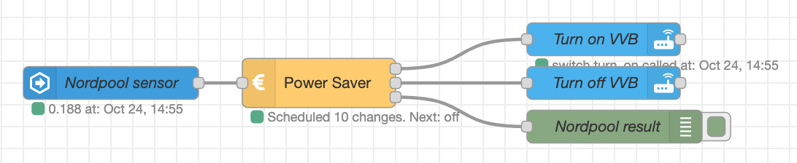

## Example with Nordpool and events: state node

In this example, data is read from the Nordpool sensor in HA via the `events: state` node.



Flow:

```json
[
    {
        "id": "3662aca5.dfe974",
        "type": "server-state-changed",
        "z": "d938c47f.3398f8",
        "name": "Nordpool sensor",
        "server": "ec4a12a1.b2be9",
        "version": 1,
        "exposeToHomeAssistant": false,
        "haConfig": [
            {
                "property": "name",
                "value": ""
            },
            {
                "property": "icon",
                "value": ""
            }
        ],
        "entityidfilter": "sensor.nordpool_kwh_trheim_nok_3_095_025",
        "entityidfiltertype": "exact",
        "outputinitially": true,
        "state_type": "str",
        "haltifstate": "",
        "halt_if_type": "str",
        "halt_if_compare": "is",
        "outputs": 1,
        "output_only_on_state_change": true,
        "for": 0,
        "forType": "num",
        "forUnits": "minutes",
        "ignorePrevStateNull": false,
        "ignorePrevStateUnknown": false,
        "ignorePrevStateUnavailable": false,
        "ignoreCurrentStateUnknown": false,
        "ignoreCurrentStateUnavailable": false,
        "x": 120,
        "y": 620,
        "wires": [
            [
                "fc7df8c4.e50c88"
            ]
        ]
    },
    {
        "id": "fc7df8c4.e50c88",
        "type": "power-saver",
        "z": "d938c47f.3398f8",
        "name": "Power Saver",
        "maxHoursToSaveInSequence": 3,
        "minHoursOnAfterMaxSequenceSaved": "1",
        "minSaving": "0.001",
        "sendCurrentValueWhenRescheduling": true,
        "outputIfNoSchedule": true,
        "x": 310,
        "y": 620,
        "wires": [
            [
                "32f17ab2.927cf6"
            ],
            [
                "2a3cd7db.0891f8"
            ],
            [
                "ed7202ff.b5725"
            ]
        ]
    },
    {
        "id": "ed7202ff.b5725",
        "type": "debug",
        "z": "d938c47f.3398f8",
        "name": "Nordpool result",
        "active": true,
        "tosidebar": true,
        "console": false,
        "tostatus": false,
        "complete": "true",
        "targetType": "full",
        "statusVal": "",
        "statusType": "auto",
        "x": 580,
        "y": 660,
        "wires": []
    },
    {
        "id": "32f17ab2.927cf6",
        "type": "api-call-service",
        "z": "d938c47f.3398f8",
        "name": "Turn on VVB",
        "server": "ec4a12a1.b2be9",
        "version": 1,
        "debugenabled": false,
        "service_domain": "switch",
        "service": "turn_on",
        "entityId": "switch.varmtvannsbereder_switch",
        "data": "",
        "dataType": "jsonata",
        "mergecontext": "",
        "output_location": "",
        "output_location_type": "none",
        "mustacheAltTags": false,
        "x": 570,
        "y": 580,
        "wires": [
            []
        ]
    },
    {
        "id": "2a3cd7db.0891f8",
        "type": "api-call-service",
        "z": "d938c47f.3398f8",
        "name": "Turn off VVB",
        "server": "ec4a12a1.b2be9",
        "version": 1,
        "debugenabled": true,
        "service_domain": "switch",
        "service": "turn_off",
        "entityId": "switch.varmtvannsbereder_switch",
        "data": "",
        "dataType": "json",
        "mergecontext": "",
        "output_location": "",
        "output_location_type": "none",
        "mustacheAltTags": false,
        "x": 570,
        "y": 620,
        "wires": [
            []
        ]
    },
    {
        "id": "ec4a12a1.b2be9",
        "type": "server",
        "name": "Home Assistant",
        "legacy": false,
        "addon": true,
        "rejectUnauthorizedCerts": true,
        "ha_boolean": "y|yes|true|on|home|open",
        "connectionDelay": true,
        "cacheJson": true
    }
]
```