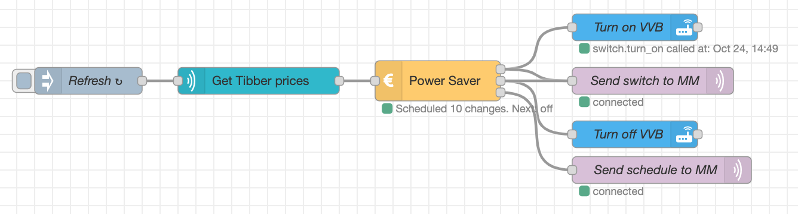

## Example with Tibber, a switch and MQTT

In this example, data is read from Tibber and used to turn on/off a switch. Data is also sent to MQTT for being displayed on Magic Mirror. This is optional, of course.



Flow:

```json
[
    {
        "id": "467a5fe.d0bbba",
        "type": "mqtt out",
        "z": "d938c47f.3398f8",
        "name": "Send switch to MM",
        "topic": "powersaver/switch",
        "qos": "0",
        "retain": "false",
        "broker": "24fbcfb5.569ea",
        "x": 730,
        "y": 120,
        "wires": []
    },
    {
        "id": "8c533305.eacaa",
        "type": "power-saver",
        "z": "d938c47f.3398f8",
        "name": "Power Saver",
        "maxHoursToSaveInSequence": "3",
        "minHoursOnAfterMaxSequenceSaved": "1",
        "minSaving": "0.001",
        "sendCurrentValueWhenRescheduling": true,
        "outputIfNoSchedule": "true",
        "x": 490,
        "y": 120,
        "wires": [
            [
                "5e485ff7.db156",
                "467a5fe.d0bbba"
            ],
            [
                "9c978d1c.ee76",
                "467a5fe.d0bbba"
            ],
            [
                "42d8b632.402e38"
            ]
        ]
    },
    {
        "id": "ab2d599a.077738",
        "type": "tibber-query",
        "z": "d938c47f.3398f8",
        "name": "Get Tibber prices",
        "active": true,
        "apiEndpointRef": "b70ec5d0.6f8f08",
        "x": 290,
        "y": 120,
        "wires": [
            [
                "8c533305.eacaa"
            ]
        ]
    },
    {
        "id": "4f11b5ae.4cc22c",
        "type": "inject",
        "z": "d938c47f.3398f8",
        "name": "Refresh",
        "props": [
            {
                "p": "payload"
            }
        ],
        "repeat": "3600",
        "crontab": "",
        "once": false,
        "onceDelay": "1",
        "topic": "",
        "payload": "{   viewer {     homes {       currentSubscription{         priceInfo{           today {             total             startsAt           }           tomorrow {             total             startsAt           }         }       }     }   } }",
        "payloadType": "str",
        "x": 100,
        "y": 120,
        "wires": [
            [
                "ab2d599a.077738"
            ]
        ]
    },
    {
        "id": "42d8b632.402e38",
        "type": "mqtt out",
        "z": "d938c47f.3398f8",
        "name": "Send schedule to MM",
        "topic": "powersaver/plan",
        "qos": "0",
        "retain": "true",
        "broker": "24fbcfb5.569ea",
        "x": 740,
        "y": 220,
        "wires": []
    },
    {
        "id": "5e485ff7.db156",
        "type": "api-call-service",
        "z": "d938c47f.3398f8",
        "name": "Turn on VVB",
        "server": "ec4a12a1.b2be9",
        "version": 1,
        "debugenabled": false,
        "service_domain": "switch",
        "service": "turn_on",
        "entityId": "switch.varmtvannsbereder_switch",
        "data": "",
        "dataType": "jsonata",
        "mergecontext": "",
        "output_location": "",
        "output_location_type": "none",
        "mustacheAltTags": false,
        "x": 710,
        "y": 60,
        "wires": [
            []
        ]
    },
    {
        "id": "9c978d1c.ee76",
        "type": "api-call-service",
        "z": "d938c47f.3398f8",
        "name": "Turn off VVB",
        "server": "ec4a12a1.b2be9",
        "version": 1,
        "debugenabled": true,
        "service_domain": "switch",
        "service": "turn_off",
        "entityId": "switch.varmtvannsbereder_switch",
        "data": "",
        "dataType": "json",
        "mergecontext": "",
        "output_location": "",
        "output_location_type": "none",
        "mustacheAltTags": false,
        "x": 710,
        "y": 180,
        "wires": [
            []
        ]
    },
    {
        "id": "24fbcfb5.569ea",
        "type": "mqtt-broker",
        "name": "MQTT",
        "broker": "10.0.0.15",
        "port": "1883",
        "clientid": "",
        "usetls": false,
        "compatmode": false,
        "keepalive": "60",
        "cleansession": true,
        "birthTopic": "",
        "birthQos": "0",
        "birthPayload": "",
        "closeTopic": "",
        "closeQos": "0",
        "closePayload": "",
        "willTopic": "",
        "willQos": "0",
        "willPayload": ""
    },
    {
        "id": "b70ec5d0.6f8f08",
        "type": "tibber-api-endpoint",
        "feedUrl": "wss://api.tibber.com/v1-beta/gql/subscriptions",
        "queryUrl": "https://api.tibber.com/v1-beta/gql",
        "name": "Tibber API"
    },
    {
        "id": "ec4a12a1.b2be9",
        "type": "server",
        "name": "Home Assistant",
        "legacy": false,
        "addon": true,
        "rejectUnauthorizedCerts": true,
        "ha_boolean": "y|yes|true|on|home|open",
        "connectionDelay": true,
        "cacheJson": true
    }
]
```