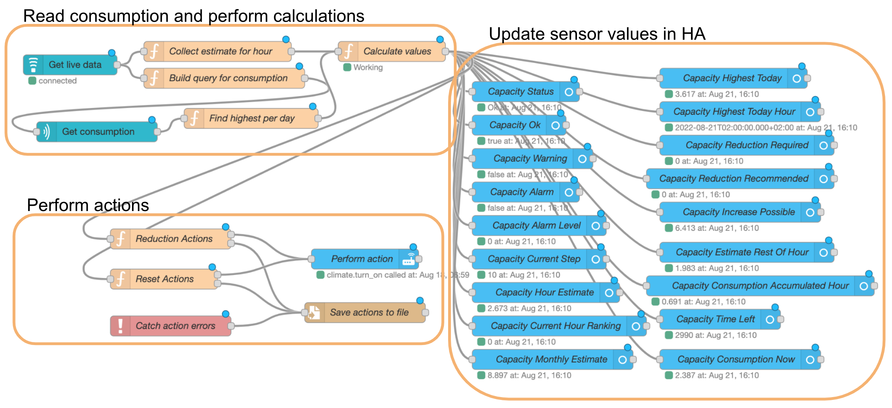
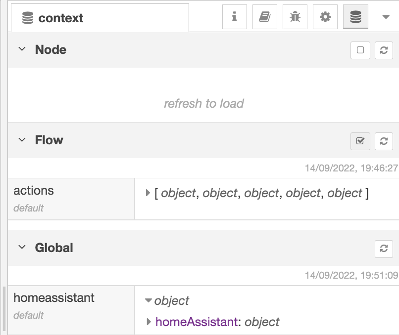

# Capacity part of grid tariff

## Introduction

I Norway, there has been introduced a monthly fee for grid capacity.
The purpose is to get people to avoid peaks of high capacity usage.

The fee is calculated based on the average consumption per hour (kWh).
For each day, the worst hour is used, that is the hour with highest consumption that day.
Then the 3 days where this number is highest (the 3 highest) is used.
The average of these 3 days is calculated, and the result decides what capacity step you will pay for.

The steps are for example like this:

- 0-2 kW
- 2-5 kW
- 5-10 kW
- 10-15 kW
- 15-20 kW

This may be different for different grid providers.

If, for example, the average of the 3 worst days is 6 kW, you pay for step 5-10 kW.

Here is an example how this can be controlled. The example contains several features,
and you may not want to use them all, so it is a good idea to read through it all before you decide how to use it.



The first part of nodes (upper part) is used to read consumption from Tibber, and to perform all calculations.
The upper right two nodes are used to update a set of sensors in HA. You can use those sensor for many
purposes related to the grid capacity.
The bottom part is used to take actions in order to reduce power consumption,
or to reset actions when the consumption is lowered.

You may use the whole example, or only part of it, so you should read through the whole documentation before you start,
so you can decide what to use and how to use it.

The complex parts are solved by scripts in the function nodes, and you will have to change parts of them to use it all.

::: warning No guarantee
There is no guarantee that this works, so use at your own risk.
:::

## Requirements

You need the following to be able to use this example:

- Home Assistant with Node-RED
- Tibber Pulse to measure consumption continuously.
- Tibber subscription to get consumption data per hour.
- Token to access Tibber API.
- [Node-RED Companion Integration](https://github.com/zachowj/hass-node-red)
- Tibber nodes in Node-RED [(node-red-contrib-tibber-api)](https://flows.nodered.org/node/node-red-contrib-tibber-api).

If you have the same information from other sources, you may be able to adapt the example.

## Features

- 15-20 sensors in HA showing information related to the capacity and the calculation, including:
  - Status Ok, Warning or Alarm related to current consumption compared to the next step.
  - Alarm level 0-9 based on how serious the current consumption is.
  - Current step based on usage the whole month.
  - The highest consumption any hour today.
  - Reduction required to avoid breaking the limit.
  - Reduction recommended to reduce risk of breaking he limit.
  - Estimates for the current hour.
  - Current consumption based on average the last minute (can be configured).
- Automatically take actions to reduce consumption if it is recommended or required.
- Automatically reset actions if the consumption is sufficiently reduced.
- Log actions taken to a file
- Actions may also be done by directly and automatically overriding strategy nodes.

## Algorithm

The consumption is measured by Tibber Pulse continuously (every 2 seconds),
and is used to calculate average consumption the last minute.
(Can be configured to another number of minutes.)
**It is assumed that you will have this consumption the rest of the current hour.**
Based on the real consumption until now this hour, and the assumed consumption the
rest of the hour, the total for the current hour is estimated. This is the `hourEstimate`.

The highest hour previously this day is found as `highestToday`.

The highest hour for each day this month is found, and the 3 highest is used
in the calculation as the `highestCounting`.

Then the `hourEstimate` is compared to those other numbers to calculate an alarm level.

If the current hour is todays worst, it is ranked together with the other days this month.
If today is ranked as 4 or better, where 1 is the worst this month, then status is Ok.
It will not affect the fee.

The `currentStep` is decided based on the 3 worst days, including today, but not considering the current hour.

If today is ranked as 1, 2 or 3, it may affect the fee. Then the average of the three worst days, including this hour, is calculated. This is `currentMonthlyEstimate`.

Other sensor values are calculated based on values available.
See description for each of them for details.

## Calculated sensor values

The `Calculate values` node creates a payload with values that are used to create
sensors in Home Assistant. The `Update sensors` node maps these values to entity ids,
and the `Set entity` node uses the HA API to update sensors.

Here is a description of each of those sensor values.

### Status

The status of the current hour as text: `Ok`, `Warning` or `Alarm`.

`Alarm` means that if you do not reduce the consumption, you will break the limit of the next step.

`Warning` means that there is an increased risk for breaking the limit.

`Ok` means you are pretty safe.

### Ok

A boolean value, `true` if the status is `Ok`, `false` if not.

### Warning

A boolean value, `true` if the status is `Warning`, `false` if not.

### Alarm

A boolean value, `true` if the status is `Alarm`, `false` if not.

You can configure the constant `ALARM` to the lowest level that will cause status `Alarm`. Default is `8`,
meaning you have a small buffer (the `BUFFER`).

### Alarm Level

A number from 0 to 9, meaning as follows:

| Level | Description                                                                                                                                                                                                                     |
| ----- | ------------------------------------------------------------------------------------------------------------------------------------------------------------------------------------------------------------------------------- |
| 0     | You're good, either because consumption is low or because there was a worse hour earlier today.                                                                                                                                 |
| 9     | The current consumption will lead to breaking the limit for the next step, if continued.                                                                                                                                        |
| 8     | Same as `9`but with a buffer you can configure to reduce risk. The buffer is a constant named `BUFFER`, and the default value is 0.5 kWh                                                                                        |
| 7     | The `hourEstimate` (estimate for the hour) is higher than the limit for the next step, but since previous consumption has been low, the average of the 3 worst is below the limit, so you will not break the limit **yet (!)**. |
| 6     | Same as 7 but with a the same buffer as for alarm level `8`                                                                                                                                                                     |
| 5     | The `hourEstimate` is the worst this month, and it is only a _safe zone_ away from breaking the limit. The safe zone can be configured using the constant called `SAFE_ZONE`, default 2 kWh.                                    |
| 4     | The `hourEstimate` is the second to worst this month, and it is only a _safe zone_ away from breaking the limit.                                                                                                                |
| 3     | The `hourEstimate` is the third to worst this month, and it is only a _safe zone_ away from breaking the limit.                                                                                                                 |
| 2     | The `hourEstimate` is the worst this month. Consumption may still be low.                                                                                                                                                       |
| 1     | The `hourEstimate` is the second to worst this month. Consumption may still be low.                                                                                                                                             |

### Current Step

Shows the step you are currently on (under), that is the limit you do not want to break.
The steps are configured using the constant `STEPS` in the script.
The default is

```
const STEPS = [2, 5, 10, 15, 20]
```

::: warning Configure steps
You must edit the `STEPS`constant in the script.
Set it to the relevant steps for your grid supplier.
You should omit steps that you do not plan to stay under,
so you avoid alarms and actions for that step in the beginning of the month.
:::

### Hour Estimate

The estimated consumption for the current hour (`hourEstimate`).
This is calculated as real consumption earlier this hour plus estimated consumption for the rest of the hour.

### Current Hour Ranking

A number (0-4) ranking the current hour with the 3 highest hours this month.

The current hour ranking has the following meaning:

| Value | Description                                                                        |
| ----- | ---------------------------------------------------------------------------------- |
| 0     | Not counting, since there has been another hour earlier today that is higher.      |
| 1     | This is estimated to be the worst hour in the month.                               |
| 2     | This is estimated to be the second worst hour in the month.                        |
| 3     | This is estimated to be the third worst hour in the month.                         |
| 4     | This hour is estimated to be the worst today, but not one of the top 3 this month. |

::: warning Max ranking value
The highest value here, 4, is based on the value of `MAX_COUNTING` in the `Find highest per day` node.
If you change `MAX_COUNTING`, the values here will also change.
:::

### Monthly Estimate

The average of the 3 worst hours so far this month, in kWh.

### Highest Today

The consumption in kWh of the worst hour today, not including the current hour.

### Highest Today Hour

The start time of the worst hour today (Highest Today).

### Reduction Required

The number of kW you must reduce the rest of the hour in order to not get alarm (break the limit),
based on `hourEstimate`.

This follows the `Alarm` state, and thus also the `ALARM` constant, so if
alarm level `8` gives status `Alarm`, reduction required is also set when the alarm level is `8`.
However, if you reconfigure `ALARM` to be only on level `9`, then reduction required is only set when
the alarm level is `9`.

Please note that this takes the time in consideration, so if the `hourEstimate` is 1 kWh
over the limit, and the time left of the hour is 15 minutes, the reduction required will
be 4 kW. You must reduce the consumption with 4kW in order to save 1 kWh during 15 minutes.

### Reduction Recommended

The number of kW you must reduce the rest of the hour in order to stay under alarm level 3,
based on `hourEstimate`. Calculated the same way as reduction required.

### Increase Possible

The number of kW you can increase consumption and still stay within the configured safe zone.
If alarm level is > 2, this value will be 0. You will never have increase possible at the same time as
reduction recommended (nor reduction required).

### Estimate Rest Of Hour

The estimated consumption in kWh for the rest of the hour.

### Consumption Accumulated Hour

The actual consumption in kWh until now this hour.

### Time Left

The time left of the current hour in seconds.

### Consumption Now

The current consumption, measured as average the last minute.
Can be set to another number of minutes using the `ESTIMATION_TIME_MINUTES` constant in
the `Collect estimate for hour` node.

## Node description

Here is a description of each node in the example.

### Get live data

This is a `tibber-feed` node. It sets up a subscription of live Tibber data from Tibber Pulse, and uses this data to run the automation. Tick the following check boxes:

- Timestamp
- Power
- Accumulated consumption
- Accumulated consumption last hour

Uncheck all the others.

If you do not use Tibber, but can get this information from another source, convert it to the following format and use it the same way as data from this node is used:

```json
{
  "timestamp": "2022-06-12T14:42:00.000+02:00",
  "power": 9503,
  "accumulatedConsumption": 33.459665,
  "accumulatedConsumptionLastHour": 7.046665
}
```

### Build query for consumption

This is a function node that is used to build a Tibber query. It runs for all the live data, takes the time and calculates how many hours there has been since the beginning of the month. It uses this number to build a Tibber query to get consumption per hour since the beginning of the month. It sends output only when first started and when the hour changes, so it initiates a Tibber query once per hour.

::: warning Tibber Home Id
This node needs the tibber home id, so you must find it in the [Tibber Developer Pages](https://developer.tibber.com/) and set the vale of `TIBBER_HOME_ID` in the beginning of the code.
:::

::: details Code

<CodeGroup>
  <CodeGroupItem title="On Start">

```js
context.set("previousHour", undefined);
```

  </CodeGroupItem>

  <CodeGroupItem title="On Message" active>

```js
/*
   Calculate number of hours to receive consumption for,
   that is number of hours in the month until now.
   Constructs a tibber query to get consumption per hour.
*/

const TIBBER_HOME_ID = "put your tibber ome id here";

const timestamp = msg.payload.timestamp;

// Stop if hour has not changed
const time = new Date(timestamp);
const hour = time.getHours();
const previousHour = context.get("previousHour");
if (previousHour !== undefined && hour === previousHour) {
  return;
}
context.set("previousHour", hour);

// Calculate number of hours to query
const date = time.getDate() - 1;
const hour2 = time.getHours();
const count = date * 24 + hour2;

// Build query
const query = `
{
  viewer {
    home (id: "${TIBBER_HOME_ID}") {
      consumption(resolution: HOURLY, last: ${count}) {
        nodes {
          from
          consumption
        }
      }
    }
  }
}
`;

msg.payload = query;
return msg;
```

  </CodeGroupItem>
</CodeGroup>

:::

### Get consumption

This is a `tibber-query` node used to get consumption per hour for passed hours. It takes a Tibber query as input, and sends the result as output. The query is built by the previous node.

If you do not use Tibber, but can get this information from another source, convert it to the following format and use it the same way as data from this node is used:

```json
{
  "viewer": {
    "home": {
      "consumption": {
        "nodes": [
          {
            "from": "2022-06-01T00:00:00.000+02:00",
            "consumption": 4.307
          },
          {
            "from": "2022-06-01T01:00:00.000+02:00",
            "consumption": 3.648
          },
          {
            "from": "2022-06-01T02:00:00.000+02:00",
            "consumption": 2.406
          },
          // ...
          {
            "from": "2022-06-12T12:00:00.000+02:00",
            "consumption": 0.969
          },
          {
            "from": "2022-06-12T13:00:00.000+02:00",
            "consumption": 7.612
          }
        ]
      }
    }
  }
}
```

It must contain data for every hour from the beginning of the month until the last complete hour.

### Collect estimate for hour

This is a function node that receives all the live data and estimates the consumption for the rest of the current hour.
It sums up the actual consumption from the beginning of the hour until the current time,
and adds the estimate for the rest of the hour, giving a total estimate for the hour.

In the beginning of the code, there is a constant `ESTIMATION_TIME_MINUTES` that you can use to decide how many minutes that is used
to calculate assumed average consumption.

The function keeps a buffer with all readings for the last period of length given with `ESTIMATION_TIME_MINUTES`.
It uses this buffer to calculate the average consumption for the period.
It uses the result and estimates the consumption for the rest of the hour, assuming that the consumption will be the same.

As outputs it sends the following:

| Name                             | Description                                                                                                                                      |
| -------------------------------- | ------------------------------------------------------------------------------------------------------------------------------------------------ |
| `accumulatedConsumption`         | Accumulated consumption the current day                                                                                                          |
| `accumulatedConsumptionLastHour` | Accumulated consumption the current hour.                                                                                                        |
| `periodMs`                       | Period the average is calculated for, in milliseconds. It will increase in the beginning, until it reaches `ESTIMATION_TIME_MINUTES * 60 * 1000` |
| `consumptionInPeriod`            | Consumption in the last `periodMs` milliseconds. Used as estimate for the remaining of the hour.                                                 |
| `averageConsumptionNow`          | Consumption the last minute (or `ESTIMATION_TIME_MINUTES` minutes).                                                                              |
| `timeLeftMs`                     | Number of milliseconds left in the current hour.                                                                                                 |
| `consumptionLeft`                | Estimated consumption the remaining of the hour.                                                                                                 |
| `hourEstimate`                   | The estimated consumption for the total hour.                                                                                                    |
| `currentHour`                    | The time of the current hour.                                                                                                                    |

::: details Code

<CodeGroup>
  <CodeGroupItem title="On Start">

```js
context.set("buffer", []);
```

  </CodeGroupItem>

  <CodeGroupItem title="On Message" active>

```js
// Number of minutes used to calculate assumed consumption:
const ESTIMATION_TIME_MINUTES = 1;
// Allows records to deviate from maxAgeMs
const DELAY_TIME_MS_ALLOWED = 3 * 1000;

const buffer = context.get("buffer") || [];

// Add new record to buffer
const time = new Date(msg.payload.timestamp);
const timeMs = time.getTime();
const accumulatedConsumption = msg.payload.accumulatedConsumption;
const accumulatedConsumptionLastHour = msg.payload.accumulatedConsumptionLastHour;
buffer.push({ timeMs, accumulatedConsumption });

const currentHour = new Date(msg.payload.timestamp);
currentHour.setMinutes(0);
currentHour.setSeconds(0);

// Remove too old records from buffer
const maxAgeMs = (ESTIMATION_TIME_MINUTES * 60 * 1000) + DELAY_TIME_MS_ALLOWED;
let oldest = buffer[0];
while (timeMs - oldest.timeMs > maxAgeMs) {
  buffer.splice(0, 1);
  oldest = buffer[0];
}
context.set("buffer", buffer);

// Calculate buffer
const periodMs = buffer[buffer.length - 1].timeMs - buffer[0].timeMs;
let consumptionInPeriod = buffer[buffer.length - 1].accumulatedConsumption - buffer[0].accumulatedConsumption;
if (consumptionInPeriod < 0) {
  consumptionInPeriod = 0;
}
if (periodMs === 0) {
  //Should only occur during startup
  node.status({ fill: "red", shape: "dot", text: "First item in buffer" });
  return; // Stopping rest of the flow for this message
}
node.status({ fill: "green", shape: "dot", text: "Working" });

// Estimate remaining of current hour
const timeLeftMs = 60 * 60 * 1000 - (time.getMinutes() * 60000 + time.getSeconds() * 1000 + time.getMilliseconds());
const consumptionLeft = (consumptionInPeriod / periodMs) * timeLeftMs;
const averageConsumptionNow = (consumptionInPeriod / periodMs) * 60 * 60 * 1000;

// Estimate total hour
const hourEstimate = accumulatedConsumptionLastHour + consumptionLeft + 0; // Change for testing

msg.payload = {
  accumulatedConsumption,
  accumulatedConsumptionLastHour,
  periodMs,
  consumptionInPeriod,
  averageConsumptionNow,
  timeLeftMs,
  consumptionLeft,
  hourEstimate,
  currentHour,
};

return msg;
```

  </CodeGroupItem>
</CodeGroup>

:::

### Find highest per day

Based on the result from the tibber query, gives the following output:

| Name                   | Description                                                                                                                   |
| ---------------------- | ----------------------------------------------------------------------------------------------------------------------------- |
| highestPerDay          | The highest hour for each day until now this month, including current day.                                                    |
| highestCounting        | The 3 highest days current month. Can be other than 3 by changing the `MAX_COUNTING` constant in the beginning of the script. |
| highestToday           | The highest hour that has ended until now this day.                                                                           |
| currentMonthlyEstimate | The average of the 3 highest days until now this month. That is the capacity that will be used unless it is increased.        |

Output is sent when the query is run, that is on startup and when the hour changes.

::: details Code

<CodeGroup>
  <CodeGroupItem title="On Message" active>

```js
const MAX_COUNTING = 3;
const hours = msg.payload.viewer.home.consumption.nodes;
const days = new Map();
hours.forEach((h) => {
  const date = new Date(h.from).getDate();
  if (!days.has(date) || h.consumption > days.get(date).consumption) {
    days.set(date, { from: h.from, consumption: h.consumption });
  }
});
const highestToday = days.get(new Date().getDate()) ?? 0;
const highestPerDay = [...days.values()].sort((a, b) => b.consumption - a.consumption);
const highestCounting = highestPerDay.slice(0, MAX_COUNTING);
const currentMonthlyMaxAverage =
  highestCounting.length === 0
    ? 0
    : highestCounting.reduce((prev, val) => prev + val.consumption, 0) / highestCounting.length;
msg.payload = {
  highestPerDay,
  highestCounting,
  highestToday,
  currentMonthlyMaxAverage,
};
return msg;
```

  </CodeGroupItem>
</CodeGroup>

:::

### Calculate values

This is where calculation is done to produce all the output sensor values.

In the beginning of the script there are some constants you can configure:

```js
const HA_NAME = "homeAssistant"; // Your HA name
const STEPS = [2, 5, 10, 15, 20]; // Grid tariff steps in kWh
const MAX_COUNTING = 3; // Number of days to calculate month average of
const BUFFER = 0.5; // kWh - Closer to limit increases alarm level
const SAFE_SONE = 2; // kWh - Further from limit reduces level
const ALARM = 8; // Min level that causes status to be alarm
const MIN_TIMELEFT = 30; //Min level for time left (30 seconds)
```

The `HA_NAME` must be set to the name you have given your Home Assistant. One place to find this is in Node-RED,
in the `Context Data` window (next to the `Debug` window), under `Global`, click the refresh button and see the `homeassistant` object.
Find the name used to the right.
In this example the value you are looking for is `homeAssistant`:



You must configure the `STEPS` array to contain steps relevant for you.
You should omit steps you do not plan to go under, to avoid non-necessary actions and warnings.

See [Calculated sensor values](#calculated-sensor-values) for description of the output.

::: details Code

<CodeGroup>
  <CodeGroupItem title="On Message" active>

```js
const HA_NAME = "homeAssistant"; // Your HA name
const STEPS = [10, 15, 20];
const MAX_COUNTING = 3; // Number of days to calculate month
const BUFFER = 0.5; // Closer to limit increases level
const SAFE_ZONE = 2; // Further from limit reduces level
const ALARM = 8; // Min level that causes status to be alarm
const MIN_TIMELEFT = 3 * 60; //Min level for time left

const ha = global.get("homeassistant")[HA_NAME];
if (!ha.isConnected) {
  node.status({ fill: "red", shape: "dot", text: "Ha not connected" });
  return;
}

function isNull(value) {
  return value === null || value === undefined;
}

function calculateLevel(hourEstimate, currentHourRanking, highestCountingAverageWithCurrent, nextStep) {
  if (currentHourRanking === 0) {
    return 0;
  }
  if (highestCountingAverageWithCurrent > nextStep) {
    return 9;
  }
  if (highestCountingAverageWithCurrent > nextStep - BUFFER) {
    return 8;
  }
  if (hourEstimate > nextStep) {
    return 7;
  }
  if (hourEstimate > nextStep - BUFFER) {
    return 6;
  }
  if (currentHourRanking === 1 && nextStep - hourEstimate < SAFE_ZONE) {
    return 5;
  }
  if (currentHourRanking === 2 && nextStep - hourEstimate < SAFE_ZONE) {
    return 4;
  }
  if (currentHourRanking === 3 && nextStep - hourEstimate < SAFE_ZONE) {
    return 3;
  }
  if (currentHourRanking === 1) {
    return 2;
  }
  if (currentHourRanking === 2) {
    return 1;
  }
  return 0;
}

if (msg.payload.highestPerDay) {
  context.set("highestPerDay", msg.payload.highestPerDay);
  context.set("highestCounting", msg.payload.highestCounting);
  context.set("highestToday", msg.payload.highestToday);
  context.set("currentMonthlyMaxAverage", msg.payload.currentMonthlyMaxAverage);
  node.status({ fill: "green", shape: "ring", text: "Got ranking" });
  return;
}

const highestPerDay = context.get("highestPerDay");
const highestCounting = context.get("highestCounting");
const highestToday = context.get("highestToday");
const currentMonthlyMaxAverage = context.get("currentMonthlyMaxAverage");
const hourEstimate = msg.payload.hourEstimate;
const timeLeftMs = msg.payload.timeLeftMs;
const timeLeftSec = timeLeftMs / 1000;
const periodMs = msg.payload.periodMs;
const accumulatedConsumption = msg.payload.accumulatedConsumption;
const accumulatedConsumptionLastHour = msg.payload.accumulatedConsumptionLastHour;
const consumptionLeft = msg.payload.consumptionLeft;
const averageConsumptionNow = msg.payload.averageConsumptionNow;
const currentHour = msg.payload.currentHour;

if (timeLeftSec === 0) {
  node.status({ fill: "red", shape: "dot", text: "Time Left 0" });
  return null;
}

if (isNull(highestPerDay)) {
  node.status({ fill: "red", shape: "dot", text: "No highest per day" });
  return;
}
if (isNull(highestToday)) {
  node.status({ fill: "red", shape: "dot", text: "No highest today" });
  return;
}
if (isNull(hourEstimate)) {
  node.status({ fill: "red", shape: "dot", text: "No estimate" });
  return;
}

const currentStep = STEPS.reduceRight(
  (prev, val) => (val > currentMonthlyMaxAverage ? val : prev),
  STEPS[STEPS.length - 1]
);

// Set currentHourRanking
let currentHourRanking = MAX_COUNTING + 1;
for (let i = highestCounting.length - 1; i >= 0; i--) {
  if (hourEstimate > highestCounting[i].consumption) {
    currentHourRanking = i + 1;
  }
}
if (hourEstimate < highestToday.consumption) {
  currentHourRanking = 0;
}

const current = { from: currentHour, consumption: hourEstimate };
const highestCountingWithCurrent = [...highestCounting, current]
  .sort((a, b) => b.consumption - a.consumption)
  .slice(0, highestCounting.length);
const currentMonthlyEstimate =
  highestCountingWithCurrent.length === 0
    ? 0
    : highestCountingWithCurrent.reduce((prev, val) => prev + val.consumption, 0) / highestCountingWithCurrent.length;

// Set alarm level
const alarmLevel = calculateLevel(hourEstimate, currentHourRanking, currentMonthlyEstimate, currentStep);

// Evaluate status
const status = alarmLevel >= ALARM ? "Alarm" : alarmLevel > 0 ? "Warning" : "Ok";

// Avoid calculations to increase too much when timeLeftSec is approaching zero
const minTimeLeftSec = Math.max(timeLeftSec, MIN_TIMELEFT);
// Calculate reduction
const reductionRequired =
  alarmLevel < ALARM
    ? 0
    : (Math.max((currentMonthlyEstimate - currentStep) * highestCounting.length, 0) * 3600) / minTimeLeftSec;
const reductionRecommended =
  alarmLevel < 3 ? 0 : (Math.max(hourEstimate + SAFE_ZONE - currentStep, 0) * 3600) / minTimeLeftSec;

// Calculate increase possible
const increasePossible =
  alarmLevel >= 3 ? 0 : (Math.max(currentStep - hourEstimate - SAFE_ZONE, 0) * 3600) / minTimeLeftSec;

// Create output
const fill = status === "Ok" ? "green" : status === "Alarm" ? "red" : "yellow";
node.status({ fill, shape: "dot", text: "Working" });

const RESOLUTION = 1000;

const payload = {
  status, // Ok, Warning, Alarm
  statusOk: status === "Ok",
  statusWarning: status === "Warning",
  statusAlarm: status === "Alarm",
  alarmLevel,
  highestPerDay,
  highestCounting,
  highestCountingWithCurrent,
  highestToday,
  highestTodayConsumption: highestToday.consumption,
  highestTodayFrom: highestToday.from,
  currentMonthlyEstimate: Math.round(currentMonthlyEstimate * RESOLUTION) / RESOLUTION,
  accumulatedConsumptionLastHour: Math.round(accumulatedConsumptionLastHour * RESOLUTION) / RESOLUTION,
  consumptionLeft: Math.round(consumptionLeft * RESOLUTION) / RESOLUTION,
  hourEstimate: Math.round(hourEstimate * RESOLUTION) / RESOLUTION,
  averageConsumptionNow: Math.round(averageConsumptionNow * RESOLUTION) / RESOLUTION,
  reductionRequired: Math.round(reductionRequired * RESOLUTION) / RESOLUTION,
  reductionRecommended: Math.round(reductionRecommended * RESOLUTION) / RESOLUTION,
  increasePossible: Math.round(increasePossible * RESOLUTION) / RESOLUTION,
  currentStep,
  currentHourRanking,
  timeLeftSec,
  periodMs,
  accumulatedConsumption,
};

msg.payload = payload;

return msg;
```

  </CodeGroupItem>
</CodeGroup>

:::

### Update sensors

This function node maps the values from the previous node to entity_ids that shall be updated in HA.
Then, for each sensor, it sends output that uses the API node to perform the actual update.

You can remove sensors that you do not want.

::: details Code

<CodeGroup>
  <CodeGroupItem title="On Message" active>

```js
const sensors = [
  { id: "sensor.ps_cap_status", value: "status", uom: null },
  { id: "binary_sensor.ps_cap_ok", value: "statusOk", uom: null },
  { id: "binary_sensor.ps_cap_warning", value: "statusWarning", uom: null },
  { id: "binary_sensor.ps_cap_alarm", value: "statusAlarm", uom: null },
  { id: "sensor.ps_cap_alarm_level", value: "alarmLevel", uom: null },
  { id: "sensor.ps_cap_current_step", value: "currentStep", uom: "kW" },
  { id: "sensor.ps_cap_hour_estimate", value: "hourEstimate", uom: "kW" },
  { id: "sensor.ps_cap_current_hour_ranking", value: "currentHourRanking", uom: null },
  { id: "sensor.ps_cap_monthly_estimate", value: "currentMonthlyEstimate", uom: "kW" },
  { id: "sensor.ps_cap_highest_today", value: "highestTodayConsumption", uom: "kW" },
  { id: "sensor.ps_cap_highest_today_time", value: "highestTodayFrom", uom: null },
  { id: "sensor.ps_cap_reduction_required", value: "reductionRequired", uom: "kW" },
  { id: "sensor.ps_cap_reduction_recommended", value: "reductionRecommended", uom: "kW" },
  { id: "sensor.ps_cap_increase_possible", value: "increasePossible", uom: "kW" },
  { id: "sensor.ps_cap_estimate_rest_of_hour", value: "consumptionLeft", uom: "kW" },
  { id: "sensor.ps_cap_consumption_accumulated_hour", value: "accumulatedConsumptionLastHour", uom: "kW" },
  { id: "sensor.ps_cap_time_left", value: "timeLeftSec", uom: "s" },
  { id: "sensor.ps_cap_consumption_now", value: "averageConsumptionNow", uom: "kW" },
];

sensors.forEach((sensor) => {
  const payload = {
    protocol: "http",
    method: "post",
    path: "/api/states/" + sensor.id,
    data: {
      state: msg.payload[sensor.value],
      attributes: { unit_of_measurement: sensor.uom },
    },
  };
  node.send({ payload });
});
```

  </CodeGroupItem>
</CodeGroup>

:::

### Set entity

### Reduction Actions

This is where you set up actions to be taken in case reduction is required or recommended.

::: danger Configure actions
You must set up your own actions in this script, if you are going to use actions.
:::

In the **On Start** tab of this node, you set up the actions by writing a Javascript array,
the `actions` array.
The example shows some actions, but you may set up any number of actions.

There are two types of actions that can be sent:

#### Call service actions

These actions are taken by sending a payload to a HA `call service` node (the `Perform action` node).
The items in the `actions` array contains the payload you need to send to the `call service` node
in order to take action, and the payload you need to send to the same `call service` node
in order to reset the action.

#### Override Power Saver actions

These actions are taken by sending an override message to one or more strategy nodes.
Reduction is done by sending override `off`, and reset is done by sending override `auto`.
To use this type of action, specify the name of the strategy node that shall be overridden
in the `nameOfStrategyToOverride` attribute of the action.

Then send output 2 from the `Reduction Actions` node to the input of the strategy node.

You may have multiple actions controlling multiple strategy nodes. They are separated using the `name`
of the strategy node, so make sure they all have different names.
Output 2 must be sent to all strategy nodes that shall be controlled.

If you send the output to two strategy nodes with the same name, they will both be controlled.

You can use this to override the following nodes:

- Best Save
- Lowest Price
- Schedule Merger
- Fixed Schedule

If you are using the schedule merger node, you do not have to override the strategy nodes preceding the schedule merger,
only override the schedule merger.

#### Entity consumption

An action may be to turn on or off a switch, to perform a climate control or what ever else
you can do to control your entities.

In order to know how much power that is saved by turning off an action, you should specify this for each action, using the `consumption` attribute. This can be used in 3 different ways:

- The entity_id of a sensor that gives the consumption in kW (recommended)
- A number with the consumption in kW
- A function returning the consumption.

::: warning Consumption must be kW
If your sensor gives consumption in W, not the required kW, you should find a way to divide it by 1000.
:::

#### Actions configuration

Each item in the `actions` array contains the following data:

| Variable name            | Description                                                                                                                                                                                                                               |
| ------------------------ | ----------------------------------------------------------------------------------------------------------------------------------------------------------------------------------------------------------------------------------------- |
| consumption              | The consumption that will be reduced by taking the action, given as either a) (Recommended) The entity_id of a sensor that gives the consumption, or b) A number with the consumption in kWh, or c) a function returning the consumption. |
| name                     | The name of the actions. Can be any thing.                                                                                                                                                                                                |
| id                       | A unique id of the action.                                                                                                                                                                                                                |
| minAlarmLevel            | The minimum alarm level that must be present to take this action.                                                                                                                                                                         |
| reduceWhenRecommended    | If `true` the action will be taken when `Reduction Recommended` > 0. If `false` the action will be taken only when `Reduction Required` > 0                                                                                               |
| minTimeOffSec            | The action will not be reset until minimum this number of seconds has passed since the action was taken.                                                                                                                                  |
| payloadToTakeAction      | The payload that shall be sent to the `call service` node to take the action (for example turn off a switch).                                                                                                                             |
| payloadToResetAction     | The payload that shall be sent to the `call service` node to reset the action (for example turn a switch back on again).                                                                                                                  |
| nameOfStrategyToOverride | The name of the strategy node that shall be overridden by this action.                                                                                                                                                                    |

::: warning Action type
Use either `nameOfStrategyToOverride` or `payloadToTakeAction` and `payloadToResetAction`. If you use them both at the same time, both actions are performed.
:::

::: tip Actions order
Actions to reduce consumption are taken in the order they appear in the `actions` array until enough reduction has been done,
so put first the actions you want to take first, and last those actions that you want to take only when really necessary.
:::

Here is an example of an `actions` array with two items (a water heater and a heating cable):

::: danger On Start code
Please note that there is a small piece of code after the `actions` array
in the `On Start` tab. Make sure you do not delete that code.
:::

::: tip Sensors without actions
If you don't want the actions, or you want to control actions another way,
you can omit the action-related nodes and only use the nodes creating the sensors.
:::

The `MIN_MINUTES_INTO_HOUR_TO_TAKE_ACTION` constant in the `On Message` code sets a period (of default 5 minutes) in the beginning of the hour when no reduction action is taken. This is to avoid that a high consumption at the end of the previous hour causes reduction actions to be taken as soon as the hour changes.

::: details Code

<CodeGroup>
  <CodeGroupItem title="On Start">

```js
// You MUST edit the actions array with your own actions.

const actions = [
  {
    consumption: "sensor.varmtvannsbereder_electric_consumption_w",
    name: "Varmtvannsbereder",
    id: "vvb",
    minAlarmLevel: 3,
    reduceWhenRecommended: true,
    minTimeOffSec: 300,
    nameOfStrategyToOverride: "Lowest Price VVB",
  },
  {
    consumption: "sensor.varme_gulv_bad_electric_consumption_w_2",
    name: "Varme gulv bad 1. etg.",
    id: "gulvbad",
    minAlarmLevel: 3,
    reduceWhenRecommended: true,
    minTimeOffSec: 300,
    nameOfStrategyToOverride: "Lowest Price Varmekabel",
  },
  {
    consumption: "sensor.varme_gulv_gang_electric_consumption_w",
    name: "Varme gulv gang 1. etg.",
    id: "gulvgang",
    minAlarmLevel: 3,
    reduceWhenRecommended: true,
    minTimeOffSec: 300,
    payloadToTakeAction: {
      domain: "climate",
      service: "turn_off",
      target: {
        entity_id: ["climate.varme_gulv_gang"],
      },
    },
    payloadToResetAction: {
      domain: "climate",
      service: "turn_on",
      target: {
        entity_id: ["climate.varme_gulv_gang"],
      },
    },
  },
  {
    consumption: "sensor.varme_gulv_kjellerstue_electric_consumption_w",
    name: "Varme gulv kjellerstue",
    id: "gulvkjeller",
    minAlarmLevel: 3,
    reduceWhenRecommended: true,
    minTimeOffSec: 300,
    payloadToTakeAction: {
      domain: "climate",
      service: "turn_off",
      target: {
        entity_id: ["climate.varme_gulv_kjellerstue"],
      },
    },
    payloadToResetAction: {
      domain: "climate",
      service: "turn_on",
      target: {
        entity_id: ["climate.varme_gulv_kjellerstue"],
      },
    },
  },
  {
    consumption: 0.1,
    name: "Test",
    id: "test",
    minAlarmLevel: 3,
    reduceWhenRecommended: true,
    minTimeOffSec: 30,
    payloadToTakeAction: {
      domain: "switch",
      service: "turn_off",
      target: {
        entity_id: ["switch.lys_kjokkenskap_switch"],
      },
    },
    payloadToResetAction: {
      domain: "switch",
      service: "turn_on",
      target: {
        entity_id: ["switch.lys_kjokkenskap_switch"],
      },
    },
  },
];
// End of actions array

// DO NOT DELETE THE CODE BELOW

// Set default values for all actions
actions.forEach((a) => {
  a.actionTaken = false;
  a.savedConsumption = 0;
});

flow.set("actions", actions);
```

  </CodeGroupItem>

  <CodeGroupItem title="On Message" active>

```js
const MIN_CONSUMPTION_TO_CARE = 0.05; // Do not reduce unless at least 50W
const MIN_MINUTES_INTO_HOUR_TO_TAKE_ACTION = 5;

const actions = flow.get("actions");
const ha = global.get("homeassistant").homeAssistant;

let reductionRequired = msg.payload.reductionRequired;
let reductionRecommended = msg.payload.reductionRecommended;

node.status({});

if (reductionRecommended <= 0) {
  return null;
}

if (3600 - msg.payload.timeLeftSec < MIN_MINUTES_INTO_HOUR_TO_TAKE_ACTION * 60) {
  node.status({
    fill: "yellow",
    shape: "ring",
    text: "No action during first " + MIN_MINUTES_INTO_HOUR_TO_TAKE_ACTION + " minutes",
  });
  return;
}

function takeAction(action, consumption) {
  const info = {
    time: new Date().toISOString(),
    name: "Reduction action",
    data: msg.payload,
    action,
  };

  // output1 is for actions
  const output1 = action.payloadToTakeAction ? { payload: action.payloadToTakeAction } : null;
  // output 2 is for overriding PS strategies
  const output2 = action.nameOfStrategyToOverride
    ? { payload: { config: { override: "off" }, name: action.nameOfStrategyToOverride } }
    : null;
  // output 3 is for logging
  const output3 = { payload: info };

  node.send([output1, output2, output3]);
  reductionRequired = Math.max(0, reductionRequired - consumption);
  reductionRecommended = Math.max(0, reductionRecommended - consumption);
  action.actionTaken = true;
  action.actionTime = Date.now();
  action.savedConsumption = consumption;
  flow.set("actions", actions);
}

function getConsumption(consumption) {
  if (typeof consumption === "string") {
    const sensor = ha.states[consumption];
    return sensor.state / 1000;
  } else if (typeof consumption === "number") {
    return consumption;
  } else if (typeof consumption === "function") {
    return consumption();
  } else {
    node.warn("Config error: consumption has illegal type: " + typeof consumption);
    return 0;
  }
}

actions
  .filter((a) => msg.payload.alarmLevel >= a.minAlarmLevel && !a.actionTaken)
  .forEach((a) => {
    const consumption = getConsumption(a.consumption);
    if (consumption < MIN_CONSUMPTION_TO_CARE) {
      return;
    }
    if (reductionRequired > 0 || (reductionRecommended > 0 && a.reduceWhenRecommended)) {
      takeAction(a, consumption);
    }
  });
```

  </CodeGroupItem>
</CodeGroup>

:::

### Reset Actions

This node will reset actions when there is enough capacity available, that is for example turning switches back on again.

In the script, there is a `BUFFER_TO_RESET` constant used to set a buffer (in kW) so actions are not reset until there is
some spare capacity. By default is it set to 1 kW.

::: details Code

<CodeGroup>
  <CodeGroupItem title="On Message" active>

```js
const actions = flow.get("actions");
const ha = global.get("homeassistant").homeAssistant;

const BUFFER_TO_RESET = 1; // Must have 1kW extra to perform reset

let increasePossible = msg.payload.increasePossible;

if (increasePossible <= 0) {
  return null;
}

function resetAction(action) {
  const info = {
    time: new Date().toISOString(),
    name: "Reset action",
    data: msg.payload,
    action,
  };
  const output1 = action.payloadToResetAction ? { payload: action.payloadToResetAction } : null;
  const output2 = action.nameOfStrategyToOverride
    ? { payload: { config: { override: "auto" }, name: action.nameOfStrategyToOverride } }
    : null;
  const output3 = { payload: info };

  node.send([output1, output2, output3]);
  increasePossible -= action.savedConsumption;
  action.actionTaken = false;
  action.savedConsumption = 0;
  flow.set("actions", actions);
}

actions
  .filter(
    (a) =>
      a.actionTaken &&
      a.savedConsumption + BUFFER_TO_RESET <= increasePossible &&
      Date.now() - a.actionTime > a.minTimeOffSec * 1000
  )
  .forEach((a) => resetAction(a));
```

  </CodeGroupItem>
</CodeGroup>

:::

### Perform action

This is a `call service` node used to perform the call service actions (both taking actions and resetting actions).
There is no setup here except selecting the HA server.

### Save actions to file

Saves some information to a file, when actions are taken or reset. This is just so you can watch what has been done.
Please make sure the file name configured works for you (for example that the folder exists in your HA instance).

### Catch action errors

This is supposed to catch any errors in the action-related nodes, and log them to the file.

## The code

Below is the code for the Node-RED flow.
Copy the code and paste it to Node-RED using Import in the NR menu.

::: details Flow code
@[code](../../examples/example-grid-tariff-capacity-flow.json)
:::
