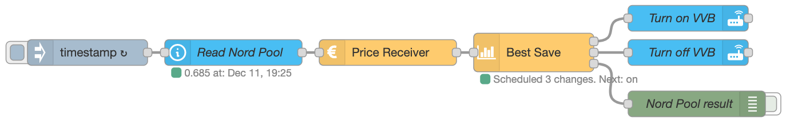

# Nord Pool and current state node

## Description

In this example, data is read from the Nord Pool sensor in HA via the `current state` node. The `ps-best-save` node is used to control a water heater via a switch, controlled by `call service` nodes in Home Assistant. The schedule is printed to a debug node. An `inject` node is used to trigger the reading of the Nord Pool sensor every hour.



## Flow

```json:no-line-numbers
[
  {
    "id": "e2578f6a.210a8",
    "type": "debug",
    "z": "d938c47f.3398f8",
    "name": "Nord Pool result",
    "active": true,
    "tosidebar": true,
    "console": false,
    "tostatus": false,
    "complete": "true",
    "targetType": "full",
    "statusVal": "",
    "statusType": "auto",
    "x": 820,
    "y": 440,
    "wires": []
  },
  {
    "id": "48bcdcca.fe42a4",
    "type": "api-current-state",
    "z": "d938c47f.3398f8",
    "name": "Read Nord Pool",
    "server": "ec4a12a1.b2be9",
    "version": 2,
    "outputs": 1,
    "halt_if": "",
    "halt_if_type": "str",
    "halt_if_compare": "is",
    "entity_id": "sensor.nordpool_kwh_trheim_nok_3_095_025",
    "state_type": "str",
    "blockInputOverrides": false,
    "outputProperties": [
      {
        "property": "payload",
        "propertyType": "msg",
        "value": "",
        "valueType": "entityState"
      },
      {
        "property": "payload",
        "propertyType": "msg",
        "value": "",
        "valueType": "entity"
      }
    ],
    "x": 280,
    "y": 380,
    "wires": [["428d7c7ca88db95f"]]
  },
  {
    "id": "97cc8e58.4247a",
    "type": "inject",
    "z": "d938c47f.3398f8",
    "name": "",
    "props": [
      {
        "p": "payload"
      },
      {
        "p": "topic",
        "vt": "str"
      }
    ],
    "repeat": "3600",
    "crontab": "",
    "once": true,
    "onceDelay": 0.1,
    "topic": "",
    "payloadType": "date",
    "x": 110,
    "y": 380,
    "wires": [["48bcdcca.fe42a4"]]
  },
  {
    "id": "a6f2769b.1a62a8",
    "type": "api-call-service",
    "z": "d938c47f.3398f8",
    "name": "Turn on VVB",
    "server": "ec4a12a1.b2be9",
    "version": 3,
    "debugenabled": false,
    "service_domain": "switch",
    "service": "turn_on",
    "entityId": "switch.varmtvannsbereder_switch",
    "data": "",
    "dataType": "jsonata",
    "mergecontext": "",
    "mustacheAltTags": false,
    "outputProperties": [],
    "queue": "none",
    "x": 810,
    "y": 320,
    "wires": [[]]
  },
  {
    "id": "9fc75126.65dd3",
    "type": "api-call-service",
    "z": "d938c47f.3398f8",
    "name": "Turn off VVB",
    "server": "ec4a12a1.b2be9",
    "version": 3,
    "debugenabled": true,
    "service_domain": "switch",
    "service": "turn_off",
    "entityId": "switch.varmtvannsbereder_switch",
    "data": "",
    "dataType": "json",
    "mergecontext": "",
    "mustacheAltTags": false,
    "outputProperties": [],
    "queue": "none",
    "x": 810,
    "y": 360,
    "wires": [[]]
  },
  {
    "id": "428d7c7ca88db95f",
    "type": "ps-receive-price",
    "z": "d938c47f.3398f8",
    "name": "Price Receiver",
    "x": 460,
    "y": 380,
    "wires": [["4147bf0b99fe626f"]]
  },
  {
    "id": "4147bf0b99fe626f",
    "type": "ps-strategy-best-save",
    "z": "d938c47f.3398f8",
    "name": "Best Save",
    "maxHoursToSaveInSequence": "4",
    "minHoursOnAfterMaxSequenceSaved": "1",
    "minSaving": "0.03",
    "sendCurrentValueWhenRescheduling": true,
    "outputIfNoSchedule": "true",
    "scheduleOnlyFromCurrentTime": "false",
    "x": 630,
    "y": 380,
    "wires": [["a6f2769b.1a62a8"], ["9fc75126.65dd3"], ["e2578f6a.210a8"]]
  },
  {
    "id": "ec4a12a1.b2be9",
    "type": "server",
    "name": "Home Assistant",
    "version": 2,
    "addon": true,
    "rejectUnauthorizedCerts": true,
    "ha_boolean": "y|yes|true|on|home|open",
    "connectionDelay": true,
    "cacheJson": true,
    "heartbeat": false,
    "heartbeatInterval": 30
  }
]
```
