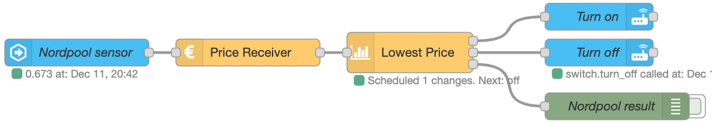

# Nord Pool and events: state node

## Description

In this example, data is read from the Nord Pool sensor in HA via the `events: state` node. The `ps-lowest-price` node is used to control a switch, controlled by `call service` nodes in Home Assistant, to turn on the cheapest 4 hours between 18:00 and 08:00. The schedule is printed to a debug node. The flow is triggered every time the Nord Pool sensor receives new prices.



## Flow

```json:no-line-numbers
[
  {
    "id": "3662aca5.dfe974",
    "type": "server-state-changed",
    "z": "d938c47f.3398f8",
    "name": "Nord Pool sensor",
    "server": "ec4a12a1.b2be9",
    "version": 3,
    "exposeToHomeAssistant": false,
    "haConfig": [
      {
        "property": "name",
        "value": ""
      },
      {
        "property": "icon",
        "value": ""
      }
    ],
    "entityidfilter": "sensor.nordpool_kwh_trheim_nok_3_095_025",
    "entityidfiltertype": "exact",
    "outputinitially": true,
    "state_type": "str",
    "haltifstate": "",
    "halt_if_type": "str",
    "halt_if_compare": "is",
    "outputs": 1,
    "output_only_on_state_change": true,
    "for": 0,
    "forType": "num",
    "forUnits": "minutes",
    "ignorePrevStateNull": false,
    "ignorePrevStateUnknown": false,
    "ignorePrevStateUnavailable": false,
    "ignoreCurrentStateUnknown": false,
    "ignoreCurrentStateUnavailable": false,
    "outputProperties": [
      {
        "property": "payload",
        "propertyType": "msg",
        "value": "",
        "valueType": "entityState"
      },
      {
        "property": "data",
        "propertyType": "msg",
        "value": "",
        "valueType": "eventData"
      },
      {
        "property": "topic",
        "propertyType": "msg",
        "value": "",
        "valueType": "triggerId"
      }
    ],
    "x": 120,
    "y": 620,
    "wires": [["e21a4b49adea2350"]]
  },
  {
    "id": "ed7202ff.b5725",
    "type": "debug",
    "z": "d938c47f.3398f8",
    "name": "Nord Pool result",
    "active": false,
    "tosidebar": true,
    "console": false,
    "tostatus": false,
    "complete": "true",
    "targetType": "full",
    "statusVal": "",
    "statusType": "auto",
    "x": 720,
    "y": 680,
    "wires": []
  },
  {
    "id": "32f17ab2.927cf6",
    "type": "api-call-service",
    "z": "d938c47f.3398f8",
    "name": "Turn on",
    "server": "ec4a12a1.b2be9",
    "version": 3,
    "debugenabled": false,
    "service_domain": "switch",
    "service": "turn_on",
    "entityId": "switch.varmtvannsbereder_switch",
    "data": "",
    "dataType": "jsonata",
    "mergecontext": "",
    "mustacheAltTags": false,
    "outputProperties": [],
    "queue": "none",
    "x": 700,
    "y": 580,
    "wires": [[]]
  },
  {
    "id": "2a3cd7db.0891f8",
    "type": "api-call-service",
    "z": "d938c47f.3398f8",
    "name": "Turn off",
    "server": "ec4a12a1.b2be9",
    "version": 3,
    "debugenabled": true,
    "service_domain": "switch",
    "service": "turn_off",
    "entityId": "switch.varmtvannsbereder_switch",
    "data": "",
    "dataType": "json",
    "mergecontext": "",
    "mustacheAltTags": false,
    "outputProperties": [],
    "queue": "none",
    "x": 700,
    "y": 620,
    "wires": [[]]
  },
  {
    "id": "e21a4b49adea2350",
    "type": "ps-receive-price",
    "z": "d938c47f.3398f8",
    "name": "Price Receiver",
    "x": 310,
    "y": 620,
    "wires": [["391ac08890e0dd40"]]
  },
  {
    "id": "391ac08890e0dd40",
    "type": "ps-strategy-lowest-price",
    "z": "d938c47f.3398f8",
    "name": "Lowest Price",
    "fromTime": "18",
    "toTime": "08",
    "hoursOn": "04",
    "doNotSplit": false,
    "sendCurrentValueWhenRescheduling": true,
    "outputIfNoSchedule": "false",
    "outputOutsidePeriod": "false",
    "x": 490,
    "y": 620,
    "wires": [["32f17ab2.927cf6"], ["2a3cd7db.0891f8"], ["ed7202ff.b5725"]]
  }
]
```
