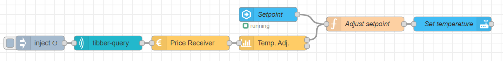

# Temperature manipulation of a climate entity utilizing Tibber pricing information and a home assistant service call

## Description

In this example, the temperature setpoint of a climate entity is manipulated to move power consumption from expensive to cheap periods. It does this by changing the temperature setpoint of the climate entity up at times when electricity is cheap, and reducing it when electricity is expensive.

It is a good application for cabins/heated storage spaces, as the entity never actually shuts off the climate entities and should therefore be rather safe to apply (still at you own risk :-) )


Requirements:
1. Home assistant integrated with Node-RED
2. Tibber node installed and correctly configured
3. A climate entity

Instructions:
1. Create an "input_number" entity in Home Assistant
2. Import the flow into Node-RED
3. Configure the temperature manipulation node:
  a. Insert an approximate time it takes to increase the temperature by 1 Centigrade (could be 90 minutes)
  b. Insert an approximate time it takes to decrease 1 Centigrade
  c. Insert minimum savings for a heating/cooling cycle (should usually not be zero, as a cycle might have a cost)
4. Configure the climate service to target the correct climate entity (this has to be edited in two places)
  a. Change `Entity Id` in the properties menu
  b. Change the `entity_id` vaule in the `Data` property




## Flow

```json:no-line-numbers
[{"id":"135c4e7649611314","type":"tab","label":"PowerSaver","disabled":false,"info":"","env":[]},{"id":"cf5908a52e0aee5e","type":"ps-receive-price","z":"135c4e7649611314","name":"Price Receiver","x":400,"y":320,"wires":[["e9a69afa1e06932f"]]},{"id":"b08bc12bf8734c5a","type":"tibber-query","z":"135c4e7649611314","name":"","active":true,"apiEndpointRef":"9ea07b03b88cb526","x":230,"y":320,"wires":[["cf5908a52e0aee5e"]]},{"id":"d0d4dd31efe67e85","type":"inject","z":"135c4e7649611314","name":"","props":[{"p":"payload"},{"p":"topic","vt":"str"}],"repeat":"60","crontab":"","once":true,"onceDelay":"1","topic":"","payload":"{   viewer {     homes {       currentSubscription {         priceInfo {           today {             total             startsAt           }           tomorrow {             total             startsAt           }         }       }     }   } }","payloadType":"str","x":90,"y":320,"wires":[["b08bc12bf8734c5a"]]},{"id":"e9a69afa1e06932f","type":"ps-strategy-temperature-manipulation","z":"135c4e7649611314","name":"Temp. Adj.","time_heat_1c":90,"time_cool_1c":"60","max_temp_adjustment":"1.0","min_saving_NOK_kWh":"0.07","x":570,"y":320,"wires":[["2b7cbdef3203a482"],[]]},{"id":"4831f393a0066565","type":"api-call-service","z":"135c4e7649611314","name":"Set temperature","server":"e2dd69fb.8f70a8","version":3,"debugenabled":false,"service_domain":"climate","service":"set_temperature","entityId":"climate.stue","data":"{\"entity_id\": \"climate.stue\",\"temperature\": \"{{adj_setpoint}}\"}","dataType":"json","mergecontext":"","mustacheAltTags":false,"outputProperties":[],"queue":"none","x":940,"y":280,"wires":[[]]},{"id":"027f4267d969e1b8","type":"server-state-changed","z":"135c4e7649611314","name":"Setpoint","server":"e2dd69fb.8f70a8","version":3,"exposeToHomeAssistant":false,"haConfig":[{"property":"name","value":""},{"property":"icon","value":""}],"entityidfilter":"input_number.setpoint","entityidfiltertype":"exact","outputinitially":true,"state_type":"num","haltifstate":"","halt_if_type":"str","halt_if_compare":"is","outputs":1,"output_only_on_state_change":false,"for":0,"forType":"num","forUnits":"minutes","ignorePrevStateNull":false,"ignorePrevStateUnknown":false,"ignorePrevStateUnavailable":false,"ignoreCurrentStateUnknown":true,"ignoreCurrentStateUnavailable":true,"outputProperties":[{"property":"payload","propertyType":"msg","value":"","valueType":"entityState"},{"property":"data","propertyType":"msg","value":"","valueType":"eventData"},{"property":"topic","propertyType":"msg","value":"","valueType":"triggerId"}],"x":560,"y":260,"wires":[["2b7cbdef3203a482"]]},{"id":"2b7cbdef3203a482","type":"function","z":"135c4e7649611314","name":"Adjust setpoint","func":"if(topic===\"input_number.setpoint\"){\n    //Set setpoint if msg is from the setpoint node\n    flow.set('setpoint',msg.payload)\n}else if(flow.get(\"setpoint\")===undefined){\n    //Do nothing if the setpoint is not defined\n} else{\n    //Calculate adjusted setpoing for the climate entity and return the msg\n    msg.adj_setpoint=Math.round(flow.get(\"setpoint\")+msg.payload);\n    return msg\n}","outputs":1,"noerr":0,"initialize":"","finalize":"","libs":[],"x":760,"y":280,"wires":[["4831f393a0066565"]]},{"id":"9ea07b03b88cb526","type":"tibber-api-endpoint","feedUrl":"wss://api.tibber.com/v1-beta/gql/subscriptions","queryUrl":"https://api.tibber.com/v1-beta/gql","name":"Tibber"},{"id":"e2dd69fb.8f70a8","type":"server","name":"Home Assistant","version":2,"addon":false,"rejectUnauthorizedCerts":true,"ha_boolean":"y|yes|true|on|home|open","connectionDelay":false,"cacheJson":true,"heartbeat":false,"heartbeatInterval":30}]