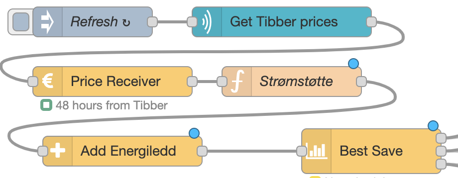

# Strømstøtte

::: tip Strømstøtte = Norwegian governental support
:::

In Norway there is currently economical support from the government when the power prices are high.
The support per December 2023 is supposed to continue until end of 2024, and is calculated as follows:

::: tip Calculation
The government will cover 90% of the cost that is over 0.875 NOK per kWh.
:::

This will have great effect on how the PowerSaver nodes calculates the saving, especially the Best Save node.

To take the governmental support into the calculation, insert a Function node after the Price Receiver node:



And use the following code in the function node:

```js
const LIMIT = 0.875
const OVER_LIMIT_SHARE = 0.1

msg.payload.priceData.forEach((hour) => {
    if (hour.value > LIMIT) {
        hour.value = LIMIT + (hour.value - LIMIT) * OVER_LIMIT_SHARE
    }
})
return msg;
```