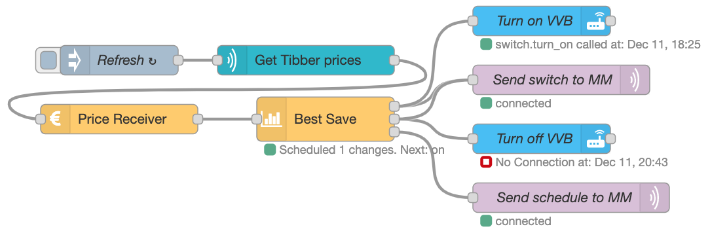

# Tibber, a switch and MQTT

## Description

In this example, data is read from Tibber and used to turn on/off a switch, scheduled by the `ps-best-save` node to be off up to 5 hours in a row, but only if at least 5 cents/øre is saved per kWh. Data is also sent to MQTT, for example to be displayed on [Magic Mirror](https://magicmirror.builders/).



## Flow

```json:no-line-numbers
[
  {
    "id": "467a5fe.d0bbba",
    "type": "mqtt out",
    "z": "d938c47f.3398f8",
    "name": "Send switch to MM",
    "topic": "powersaver/switch",
    "qos": "0",
    "retain": "false",
    "broker": "24fbcfb5.569ea",
    "x": 730,
    "y": 120,
    "wires": []
  },
  {
    "id": "ab2d599a.077738",
    "type": "tibber-query",
    "z": "d938c47f.3398f8",
    "name": "Get Tibber prices",
    "active": true,
    "apiEndpointRef": "b70ec5d0.6f8f08",
    "x": 470,
    "y": 100,
    "wires": [["0ef929fde193cf4d"]]
  },
  {
    "id": "4f11b5ae.4cc22c",
    "type": "inject",
    "z": "d938c47f.3398f8",
    "name": "Refresh",
    "props": [
      {
        "p": "payload"
      }
    ],
    "repeat": "3600",
    "crontab": "",
    "once": true,
    "onceDelay": "1",
    "topic": "",
    "payload": "{   viewer {     homes {       currentSubscription{         priceInfo{           today {             total             startsAt           }           tomorrow {             total             startsAt           }         }       }     }   } }",
    "payloadType": "str",
    "x": 280,
    "y": 100,
    "wires": [["ab2d599a.077738"]]
  },
  {
    "id": "42d8b632.402e38",
    "type": "mqtt out",
    "z": "d938c47f.3398f8",
    "name": "Send schedule to MM",
    "topic": "powersaver/plan",
    "qos": "0",
    "retain": "true",
    "broker": "24fbcfb5.569ea",
    "x": 740,
    "y": 240,
    "wires": []
  },
  {
    "id": "5e485ff7.db156",
    "type": "api-call-service",
    "z": "d938c47f.3398f8",
    "name": "Turn on VVB",
    "server": "ec4a12a1.b2be9",
    "version": 3,
    "debugenabled": false,
    "service_domain": "switch",
    "service": "turn_on",
    "entityId": "switch.varmtvannsbereder_switch",
    "data": "",
    "dataType": "jsonata",
    "mergecontext": "",
    "mustacheAltTags": false,
    "outputProperties": [],
    "queue": "none",
    "x": 710,
    "y": 60,
    "wires": [[]]
  },
  {
    "id": "9c978d1c.ee76",
    "type": "api-call-service",
    "z": "d938c47f.3398f8",
    "name": "Turn off VVB",
    "server": "ec4a12a1.b2be9",
    "version": 3,
    "debugenabled": true,
    "service_domain": "switch",
    "service": "turn_off",
    "entityId": "switch.varmtvannsbereder_switch",
    "data": "",
    "dataType": "json",
    "mergecontext": "",
    "mustacheAltTags": false,
    "outputProperties": [],
    "queue": "none",
    "x": 710,
    "y": 180,
    "wires": [[]]
  },
  {
    "id": "5b6be1568744c6cf",
    "type": "ps-strategy-best-save",
    "z": "d938c47f.3398f8",
    "name": "Best Save",
    "maxHoursToSaveInSequence": "5",
    "minHoursOnAfterMaxSequenceSaved": "1",
    "minSaving": "0.05",
    "sendCurrentValueWhenRescheduling": true,
    "outputIfNoSchedule": "true",
    "scheduleOnlyFromCurrentTime": "false",
    "x": 490,
    "y": 160,
    "wires": [["467a5fe.d0bbba", "5e485ff7.db156"], ["9c978d1c.ee76", "467a5fe.d0bbba"], ["42d8b632.402e38"]]
  },
  {
    "id": "0ef929fde193cf4d",
    "type": "ps-receive-price",
    "z": "d938c47f.3398f8",
    "name": "Price Receiver",
    "x": 280,
    "y": 160,
    "wires": [["5b6be1568744c6cf"]]
  },
  {
    "id": "24fbcfb5.569ea",
    "type": "mqtt-broker",
    "name": "MQTT",
    "broker": "10.0.0.15",
    "port": "1883",
    "clientid": "",
    "usetls": false,
    "compatmode": false,
    "keepalive": "60",
    "cleansession": true,
    "birthTopic": "",
    "birthQos": "0",
    "birthPayload": "",
    "closeTopic": "",
    "closeQos": "0",
    "closePayload": "",
    "willTopic": "",
    "willQos": "0",
    "willPayload": ""
  },
  {
    "id": "b70ec5d0.6f8f08",
    "type": "tibber-api-endpoint",
    "feedUrl": "wss://api.tibber.com/v1-beta/gql/subscriptions",
    "queryUrl": "https://api.tibber.com/v1-beta/gql",
    "name": "Tibber API"
  },
  {
    "id": "ec4a12a1.b2be9",
    "type": "server",
    "name": "Home Assistant",
    "version": 2,
    "addon": true,
    "rejectUnauthorizedCerts": true,
    "ha_boolean": "y|yes|true|on|home|open",
    "connectionDelay": true,
    "cacheJson": true,
    "heartbeat": false,
    "heartbeatInterval": 30
  }
]
```
