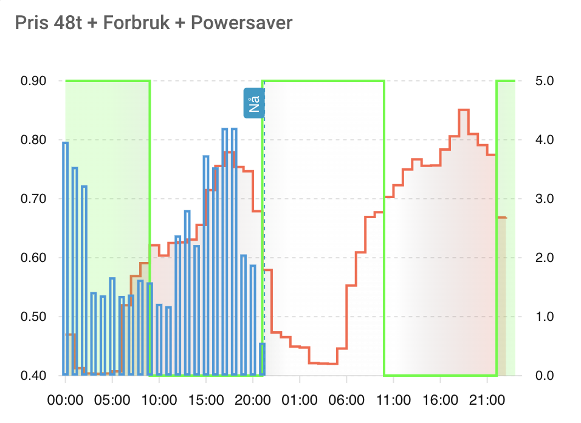
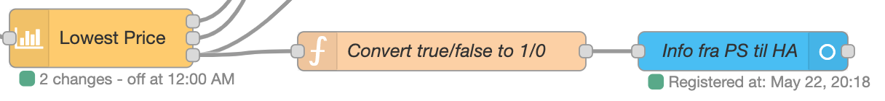

# Lovelace Visualization

The source of this example is made by Kim Storøy, and Otto Paulsen has written the documentation and made some changes to the files.

## Introduction

With this example you can visualize the schedule together with the price and the consumption in Lovelace, as shown above.

## Installation

You need the following installed before you can use this example:

- The [Node-RED Companion Integration](https://github.com/zachowj/hass-node-red).
- The [apexcharts-card](https://github.com/RomRider/apexcharts-card)
- The Tibber integration (Configuration -> Integrations)

If you don't already have them, install them first.

In Node-RED, select `Import` from the menu, and paste the code for nodes below. Connect them like this:

In Lovelace, use the Lovelace code below for the new card.
Replace the `sensor.accumulated_consumption_current_hour_your_address`
with the correct name for your corresponding sensor in your Tibber integration.

### Code

::: details Nodes

@[code](./nodes.json)

:::

::: details Lovelace

@[code](./lovelace.yaml)

:::
