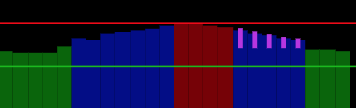

---
sidebar:
  - /faq/README.md
  - /faq/best-save-viewer.md
---

# FAQ

## How can I contribute?

You can donate:

<DonateButtons/>

or take a look at the [contribute page](../contribute/README.md)

## Why is the best save schedule like this?

There may be many reasons for the best save node planning like it does. Here are some considerations:

- It is turning off only if it can save the `Min saving` amount in average per kWh per hour for the hours turned off, compared to the next hour that is on.
- It will not turn off more than `Max per sequence` hours, so it may have to stay on through the most expensive hours, if there are more than the configured number of hours until the price is low enough.

In order to understand how the node works, try out the [Best Save Viewer](./best-save-viewer.md)

## Why does the Best Save node not turn off the most expensive hours?

Here is an example:

The purple strokes shows the savings. The Best Save node is configured to save up to 5 hours in a sequence, and only when saving is more than 0.05 NOK.

Why does it not save the most expensive period?

If you move the saving-period 4-5 hours earlier, the most expensive hours would have been saved. Why is this not better?

Remember that the power that is not used during the saving-period, will be used immediately after. At least, that is the idea, and the normal behavior if the power consumer is a water heater or another heater controlled by a thermostat. So, then the power would be used one of the blue hours in stead of the green cheaper hour.

Also remember that when saving, you do not save the full price. You only save what is the difference between the price during the saved hours and the price the hour immediately after.

So the best saving is found where this difference is the largest, and that is not always by turning off the most expensive hours. In the case above, the difference is largest when you turn off the hours marked wit a purple stroke, so this is the best saving you can get.

Of course, if you expand the saving period from 5 to 10 hours you would save even more, but that would be a different case, and you can do that if it is ok for you to turn off for that long time.

Another alternative is to reduce the minimum saving from 0.05 to 0.001. Then the 3 first red hours would be turned off, but the last red would have to be on, in order to get one hour on until the next 5-hour period off. This would however not save you for much money, since the hour that is on is almost as expensive as the hours you would turn off.

## Can we get Legionella bacteria when turning off the water heater?

Be aware that the norwegian [FHI](https://www.fhi.no/nettpub/legionellaveilederen/) recommends that the temperature in the water heater is at least 70°C to avoid growth of legionella. At this temperature, legionalla bacteria die quickly.

###

<AdsenseAdd type="nederst"/>
