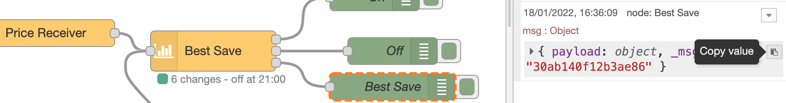

# Best Save Viewer

::: danger Quarterly hour prices
The Best Save Viewer has not been prepared for quarterly hour prices.
:::

## Tool

Below is a tool you can use to look at how the Best Save node is working.
In order to use it, you must copy the payload from output 3 on the node:

Then paste it here and see the result below:

<BestSaveVerificator/>

###

## Explanation

### Config

This is the configuration you have used.

### Meta data

Other information about the calculation etc.

### Days

Here you can see some summary and average for each date in the data set. Hover over the column title for explanation.

### Hours

Here is your dta represented per hour, as well as potential savings calculated by the tool. Negative numbers are hidden, but you can select to show them.

#### Input data

This is the data per hour that you used as input.

#### Saving if turned off x hours

There are the same number of columns as you have configured as `Max in sequence`.
The cells show how much you will save per hWh by turning that hour off for `x` hours,
starting at that hour. It is the difference between the price at that hour and the price x hours later. Click on a cell to see the cells used in the calculation.

#### Saving for sequence of x hours

These cells show how much you can save per kWh in average per hour by turning off a sequence of x hours starting at that hour. Click on a cell to see the cells used in the calculation.

Above the table you can select to see the average per hour or the su for all saved hours.

If the average per hour is less than what you have configured as `Minimum saving`, the number is red, and that sequence will not be used.

If the number is black, it could be used, but only if all other criteria are satisfied, and only if it saves more than any other combination.

###

## Something seems wrong

The tool is not using the same code as the node, so in case there is a bug in the node (or in the tool) the numbers may not match.

<DonateButtons/>
