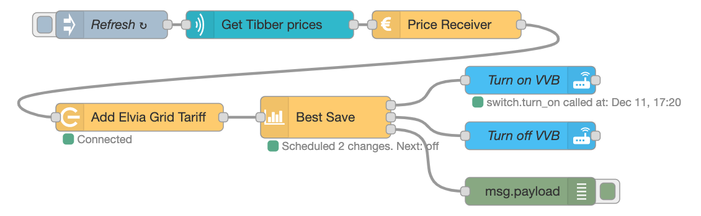
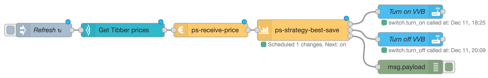

# Guide

## Introduction

This is a collection of nodes for the popular [Node-RED](https://nodered.org/) that you can use to save money on variable electricity prices. Node-RED is a widely used low-code programming tool that can be used together with many smart home solutions to create automations.

The solution can be used to control switches or other entities in a smart home system, and for example turn on when the price is low, and turn off when the price is high.
There are different ways to calculate what hours to turn on and off, and these are implemented as **strategy nodes**. Each strategy node can be configured to fit different purposes.

The strategies need price data to work. These can be received from different sources, for example Tibber, Nord Pool or custom sources.

::: warning Price sources
Tibber and Nord Pool are only available in the nordics, so if you live outside the nordics, you must find another source of price data, and make your own input.
:::

Grid tariff is normally not part of the electricity price, so if this varies by the hour, it must be added before sent to the strategy nodes for calculation. This can be done by putting a `ps-xxx-add-tariff` node between the price receiver and the strategy.

The strategy nodes have 3 outputs. Output 1 is used to "turn on", output 2 is used to "turn off", and on output 3, the calculated schedule and some other information is sent. You can use this to make graphs, or just send it to a debug node to view it.

Example:



Here prices are received from Tibber, converted in the `ps-receive-price` node, then grid tariff for Elvia is added before sent to the `ps-strategy-best-save` node. Output is sent to Home Assistant via two `call-service` nodes, and the schedule is sent to a debug node.

::: tip Home Assistant
The node collection fits very well with Home Assistant (HA), as Node-RED is frequently used for automations, and there also is an integration with Nord Pool, but there is no direct dependency to HA, so all nodes can be used also without HA.
:::

###

<AdsenseAdd type="artikkel"/>

## Getting started

### Installation

Install in Node-RED via the Manage Palette menu.

May also be installed via npm:

`npm install node-red-contrib-power-saver`

Make sure that you upgrade now and then to get the latest version. See [changelog](../changelog/README.md) for changes.

### Get price data

This solution is useless without price data. In the nordics, there are at least two very common places to get price data from:

- Tibber
- Nord Pool

The `ps-receive-price` node is designed to handle price input from both these, and convert it to the format required by the strategy nodes.

If you are a Tibber customer, use the `tibber-query` node from the [Tibber API](https://flows.nodered.org/node/node-red-contrib-tibber-api) to receive price, with one of the following queries:

<CodeGroup>
  <CodeGroupItem title="All homes">

```gql
{
  viewer {
    homes {
      currentSubscription {
        priceInfo {
          today {
            total
            startsAt
          }
          tomorrow {
            total
            startsAt
          }
        }
      }
    }
  }
}
```

  </CodeGroupItem>

  <CodeGroupItem title="Single home" active>

```gql{3}
{
  viewer {
    home(id: "142c1670-ab43-2ab3-ba6d-723703a551e2") {
      currentSubscription{
        priceInfo{
          today {
            total
            energy
            tax
            startsAt
          }
          tomorrow {
            total
            energy
            tax
            startsAt
          }
        }
      }
    }
  }
}
```

  </CodeGroupItem>
</CodeGroup>

See more details in the [documentation](../nodes/ps-receive-price#tibber-input) for the `ps-receive-price` node.

Se documentation for [node-red-contrib-tibber-api](https://flows.nodered.org/node/node-red-contrib-tibber-api) for details about the Tibber query.

::: tip Tibber query
You can use an `inject` node (standard Node-RED) to send the Tibber query as a text string int to the `tibber-query` node. This can be set to repeat the query for example every hour.
:::

[See example of Tibber flow and mqtt](../examples/example-tibber-mqtt.md)

If you use Home Assistant (HA), you can install the
[Nord Pool custom component](https://github.com/custom-components/nordpool),
that provides a _sensor_ that gives price per hour for today and tomorrow.
Data can be sent from both the `current state` node or the `events: state` node.

[See example with Nord Pool and `current state` node](../examples/example-nordpool-current-state.md)

[See example with Nord Pool and `events: state` node](../examples/example-nordpool-events-state.md)

###

<AdsenseAdd type="artikkel"/>

### Add grid tariff

When also the grid tariff changes per hour, it must be added to the electricity price in order to get the calculations right.

After the the `ps-receive-price` node, add a `ps-xxx-add-tariff` node to add grid tariff. What node to choose depends on what grid you get electricity through. The following grids are supported:

| Grid supplier | Node                    |
| ------------- | ----------------------- |
| General (any) | `ps-general-add-tariff` |
| Elvia         | `ps-elvia-add-tariff`   |

If your grid is not supported, you may code this yourself.

::: tip Skip this step
If the grid tariff is the same the whole day, you can skip this step i the flow.
:::

### Calculate and run schedule

This is the step where the value is produced. Based on the prices received, the optimal schedule for you is calculated automatically, based on your configuration. You can choose between the following strategies:

| Strategy       | Node                         | Description                                                                  |
| -------------- | ---------------------------- | ---------------------------------------------------------------------------- |
| Best Save      | `ps-strategy-best-save`      | Postpone power consumption when there is most to save.                       |
| Lowest Price   | `ps-strategy-lowest-price`   | Turn on power when the prices are the lowest in a given period.              |
| Heat Capacitor | `ps-strategy-heat-capacitor` | Move consumption from expensive to cheap periods utilizing climate entities. |

These nodes must be configured for your purpose. See configuration description and other details in the documentation for each node.

Send the result from the `ps-xxx-add-tariff` node (or the `ps-receive-price` node) as input to the
strategy node you choose.

::: tip Choose strategy
Choose the best save strategy if you can postpone power consumption, and expect the consumption to occur during the first hour after power is turned on again.

Choose the lowest price strategy if you need the power to be on for x hours, but it is not important when that is. Note that you can select to have all hours on in one consecutive period, or spread around on the cheapest hours.

Choose the heat capacitor strategy for controlling for example room heating, where you can turn the heat a little down when electricity is expensive, and a little up when it is cheap, using trading principles (only that you know up front when the prices will change).
:::

### Use schedule signals

Use the outputs to control switches, thermostats or other entities to control your power consumers.

The following os valid for the Best Save and Lowest Price strategies:

**Output 1** is used to turn on. A payload with value `true` (or another configured value) is sent every time turning on is scheduled.

**Output 2** is used to turn off. A payload with value `false` (or another configured value) is sent every time turning off is scheduled.

Example using Home Assistant:


::: tip Use output
There are many ways you can use the output:

- Turn on/off a switch
- Set a thermostat up, down or to specific values
- Change setting of a dimmer
- Send a notification
  :::

###

<AdsenseAdd type="artikkel"/>

### Display schedule

**Output 3** can be used to print or display the calculated schedule. If you just want to see it, send it to a debug node. You can also use it to display the result as graphs in HA.

For users of Magic Mirror and Tibber, the `ps-best-save` node can send its schedule to the MMM-Tibber module. See more details in the `ps-best-save` node documentation.

### Combine schedules

With the Schedule Merger node, you can combine multiple schedules in order to get more control of the result.
You can combine the schedule output from Best Save or Lowest Price nodes using logical `OR`or `AND` algorithms.
Here is an example:


In this example, the result of two Lowest Price nodes and one Best Save node are combined in a Schedule Merger node, resulting in one schedule. The output from the Schedule Merger node is used to control a switch.

Se the [Schedule Merger](../nodes/ps-schedule-merger.md) node for more details.

### More information

There are more details and more information in the documentation for each [node](/nodes/) and in the [examples](/examples/).

###

<AdsenseAdd type="artikkel"/>

## Migration from v2

The `Power Saver` node from v2 has been removed and must be replaced.
You may directly replace the `Power Saver` node by two of the new nodes (`ps-receive-price` and `ps-strategy-best-save`):



See more details in the [documentation for the `ps-strategy-best-save`](../nodes/ps-strategy-best-save.md) node.

## Disclaimer

This software is offered for free as open source. You use it totally on your own risk. The developers take no responsibility of any consequences caused by use or misuse of this software.

It is not recommended to reduce the temperature of the water heater or similar over longer periods, due to the risk of legionella. Please read the recommendations of [FHI](https://www.fhi.no/sv/smittsomme-sykdommer/legionella/) about this. You do this at your own risk.
