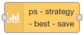
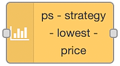
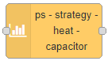
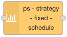
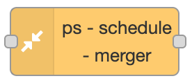
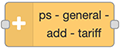
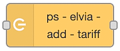

<AdsenseAdd type="øverst"/>

# Nodes

Here is an overview of the nodes, and links to detailed descriptions for eah of them.

###

<AdsenseAdd type="artikkel"/>

## Strategy nodes

These are the nodes used to calculate and control saving.

### [ps-strategy-best-save](./ps-strategy-best-save)

Strategy to find the best hours to postpone power consumption to achieve the most saving.

### [ps-strategy-lowest-price](./ps-strategy-lowest-price)

Strategy to find the x hours with lowest price in a given period each day.

### [ps-strategy-heat-capacitor](./ps-strategy-heat-capacitor) <Badge type="warning">Experimental</Badge>

A strategy for moving consumption from expensive to cheap periods utilizing climate entities and trading principles.

### [ps-strategy-fixed-schedule](./ps-strategy-fixed-schedule)

A strategy for setting a fixed daily or weekly schedule.

###

<AdsenseAdd type="artikkel"/>

## Utility nodes

### [ps-receive-price](./ps-receive-price)

Node to convert different types of input data to the format used by the strategy nodes.

### [ps-schedule-merger](./ps-schedule-merger)

Node to combine multiple schedules into one schedule.

## Grid tariff nodes

### [ps-general-add-tariff](./ps-general-add-tariff)

Node to add a variable grid tariff (or any value) to the prices before sending them to the strategy nodes.

### [ps-elvia-add-tariff](./ps-elvia-add-tariff)

Node to add Elvia grid tariff to the prices before sending them to the strategy nodes.

## Other nodes

These are a couple of other nodes for using the Elvia API, but these are not important to the Power Saver, so they are not given any further documentation here.

### ps-elvia-tariff-types

Use this to get a list of the tariff types available in the Elvia API.

### ps-elvia-tariff

Use this to get the Elvia grid tariff for a selected tariff type.

###

<AdsenseAdd type="nederst"/>
