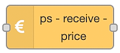

# Nodes

Here is an overview of the nodes, and links to detailed descriptions for eah of them.

## [Power Saver](./power-saver) <Badge type="warning" text="deprecated" vertical="middle" />

The old node from version 2 is still working, but should be replaced.

## Strategy nodes

These are the nodes used to calculate and control saving.

### [ps-strategy-best-save](./ps-strategy-best-save)

Strategy to find the best hours to turn off for most saving.

### [ps-strategy-lowest-price](./ps-strategy-lowest-price)

Strategy to find the x hours with lowest price in a given period each day.

## Utility nodes

### [ps-receive-price](./ps-receive-price)

Node to convert different types of input data to the format used by the strategy nodes.

## Grid tariff nodes

### [ps-elvia-add-tariff](./ps-elvia-add-tariff)

Node to add Elvia grid tariff to the prices before sending them to the strategy nodes.

## Other nodes

These are a couple of other nodes for using the Elvia API, but these are not important to the Power Saver, so they are not given any further documentation here.

### ps-elvia-tariff-types

Use this to get a list of the tariff types available in the Elvia API.

### ps-elvia-tariff

Use this to get the Elvia grid tariff for a selected tariff type.
