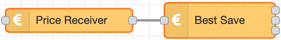
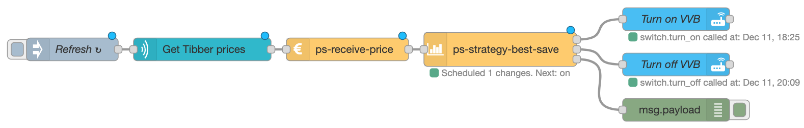

# power-saver <Badge type="warning" text="deprecated" vertical="middle" />

This is the node from version 2. It is still working, but should be replaced.

To migrate, just replace the Power Saver node by a combination of the ps-receive-price and the ps-best-save nodes:

Replace the `Power Saver` node from version 2:

with this combination of `ps-receive-price` and `ps-strategy-best-save` from version 3:

The configuration is done in the `ps-strategy-best-save` node, and is the same as in the old `Power Saver` node.

Should you need it, here is the [old documentation](./old-power-saver-doc) for the PowerSaver node from version 2.
