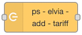
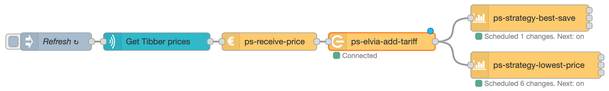
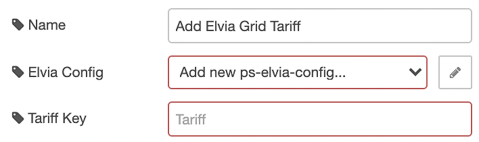
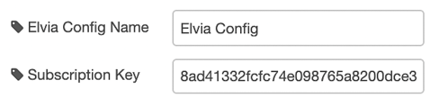
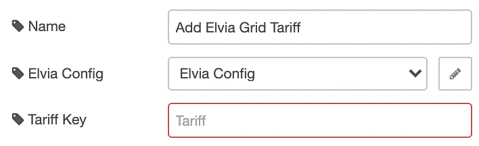
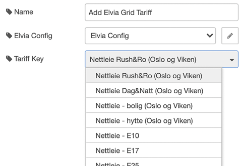

# ps-elvia-add-tariff

Node to add grid tariff from Elvia.

::: warning Elvia API
You need an Elvia API subscription key to use this node. See [configuration](#elvia-configuration).
:::

###

<AdsenseAdd type="artikkel"/>

## Description

When grid tariff changes from hour to hour, this should normally also be considered when finding the most favorable hours to use power. This node retrieves prices from Elvia, so if you are an elvia customer, you can put this node between the `ps-receive-price` node and the strategy nodes. When configured, it will add Elvia tariff to the power prices before doing the calculation:

## Configuration

::: warning Elvia API subscription key
This node uses the Elvia API, and you must get your own Elvia API subscription key in order to use it.
Go to the [Elvia Developer Portal](https://elvia.portal.azure-api.net/) to sign up,
and then request for a subscription to the GridTariffAPI.
When your subscription is approved, you will find your subscription key in the
[developer portal](https://elvia.portal.azure-api.net/developer) under Your subscriptions.
:::

The first time you use this node, you must create a `ps-elvia-config` entry. Click on the edit button to the right of Elvia Config:

Then enter the Elvia API subscription key:

After entering the Elvia API subscription key the first time, it is not possible to select tariff.

To fix that, save the config, deploy, and then open the node again.
Now you should be able to select the right tariff:

The next time you use this node, you can select the same config as you created the first time, and then you can also select tariff immediately.

###

<AdsenseAdd type="artikkel"/>

## Input

The input is the [common strategy input format](./strategy-input.md)

## Output

The output is the [common strategy input format](./strategy-input.md)

###

<AdsenseAdd type="nederst"/>
