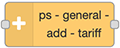

# ps-general-add-tariff

Node to add a value, for example a variable grid tariff, to the price before it is used to calculate savings in the strategy nodes.

###

<AdsenseAdd type="artikkel"/>

## Description

This node is useful if there is an addition to the electricity price that varies over the day or the week, as it might be for the grid tariff.

If there is one price for example from 22:00 to 06:00 every day, and another price from 06:00 to 22:00, this is the right node to use. It can be used for more than two periods, as long as the time it changes is the same every day.

If the price is different for some days of the week, use two nodes in series, one for some days and one for the other days.

::: warning Different days
When using two nodes in series to support for example different rates for weekend than weekdays,
make sure each day is handled by only one node, else both nodes will add to the price.
:::

Here is how this node is normally used:

::: tip Changes during the year
If there is one price now, and another price from a specific date, you can use two nodes after each other. Set the `Valid to date` of the node with the current prices to the last date the current prices are valid. Set the `Valid from date` of the node with the upcoming prices to the first date those prices are valid.
:::

## Configuration

### Add and delete periods

You can have from 1 to 24 periods during the day, with different values to add for each hour. Click the `Add period` button to add more periods. Click the `X` button to delete a period.

### From time and Value

For each period, select the time of the day the value is valid from, and enter the value.

::: danger Price unit
Be careful to use the correct unit when entering the price here. If the price is `28 øre` enter `0.28`.
If the price is `36 cents` enter `0.36`.
:::

### Days

Check which days the price is valid for. For the price to be added, both the time and the day must be correct.

If there is one price for Mon-Fri, and another price for Sat-Sun, use two nodes in series,
where one handles Mon, Tue, Wed, Thu and Fri, and the other one Sat and Sun.

### Valid from date

Fill in the first date the config is valid.

If this is empty, the config is valid from the dawn of time.

### Valid to date

Fill in the last date the config is valid.

If this is empty, the config is valid until forever.

###

<AdsenseAdd type="artikkel"/>

## Input

The input is the [common strategy input format](./strategy-input.md)

## Output

The output is the [common strategy input format](./strategy-input.md)

If there is a config property in the input payload, it is passed on to the output payload.

###

<AdsenseAdd type="nederst"/>
