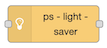
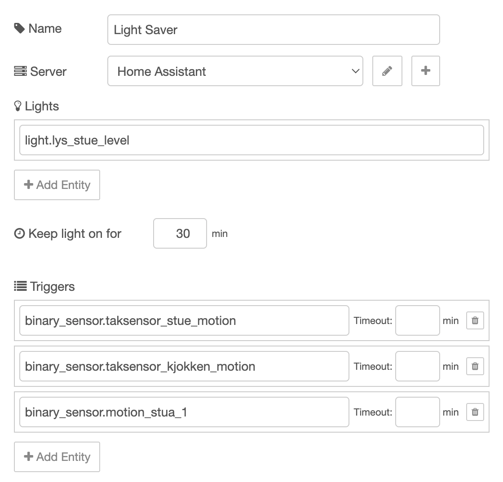
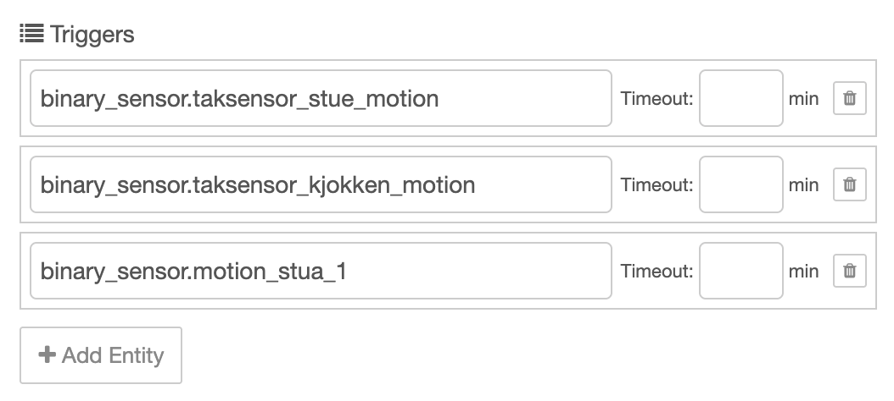

---
---

# ps-light-saver



Node to automatically control lights based on motion sensors.

::: warning Home Assistant
This node can only be used with Home Assistant.
:::


## Description

This is a powerful node to control lights based on motion sensors or other binary sensors.
If you have enough motion sensors you can control lights without even thinking about them.
They will be on when you need them to, and off when you are away.
You can control lights manually without feeling disturbed by the node.

Here are some of the main ideas:

* Lights are turned on when there is motion, and off when there is a long enough period without motion.
* You do not have to enter the middle of the room before light goes on. The light shall be on before you enter the room.
* You can configure different default levels on different times of the day.
* You can have separate night levels or away levels that override the standard time of day levels.
* If motion remains, the lights will not change automatically, so for example if you set the desired level manually,
it will remain as long as there is motion inside the configured timeout.

The node works fine without any input or output, but you can use input to control or configure it, and you can get interesting information on the output.

### Night light

You may want the lights to behave differently at night, but when the night starts is not something you can schedule. Maybe you are watching a movie or having a party until 02:00, then you want to keep lights on even if you normally want night mode to start earlier. Therefor you can use a binary sensor to decide when it is night or not. You can set the sensor to on by a click on a button, and you may set it off by a timer (a time in the morning) or with another button switch.

When the night sensor goes on, all lights are set to the night level after the delay configured with the night sensor.

### Away light

The away sensor works exactly the same way as the night sensor, and it overrides the night sensor, so you can have a specific light setting when you are away.


## Configuration

You normally configure one node for each light, but if you have multiple lights that shall be controlled exactlhy the same way, you can add multiple lights to each node.

You need at least one sensor to trigger the light, normally a motion sensor, but you may use other sensors too, for example a door lock to turn on the light when you open the door. Often it is convenient to control one light with muløtiple sensors. You may turn on the light in the bathroom when there is motion in the hall outside so that the light is on when you enter the bathroom. You can set a short timeout on this sensor so thjat if you do not enter the bathroom and trigger the sensor inside, the light will turn off sooner.

Litghts and sensors are selected from Home Assistant. 

Configuration example. See description below:



| Value                  | Description                                                                                                                                                                                    |
| ---------------------- | ---------------------------------------------------------------------------------------------------------------------------------------------------------------------------------------------- |
| Name                   | Optional name for the node                                                                                                                                                                     |
| Server                 | Home Assistant server connection (requires `node-red-contrib-home-assistant-websocket` to be installed and configured)                                                                          |
| Lights                 | List of light entities or switches to control. Normally you control one light with each node, but you can add multiple lights if they shall be controlled the exact same way.                 |
| Keep light on for      | Default timeout in minutes (1-999) to keep lights on when no motion is detected on any trigger. This can be overridden per trigger.                                                            |
| Triggers               | List of motion sensors or binary sensors that trigger light activation. Each trigger can have its own timeout override in minutes, allowing different sensors to have different timeout periods. |
| Night sensor           | Optional binary sensor or `input_boolean` that indicates night mode. When active (and night level is set), all lights use the night level instead of time-based levels.                        |
| Night sensor invert    | Reverse the night sensor logic. When checked, night mode is active when the sensor is off/false instead of on/true.                                                                            |
| Night level            | Brightness level (0-100%) to use when night sensor is active. Leave empty to disable night level (time-based levels will be used instead).                                                     |
| Night delay            | Seconds to wait (0-999) before applying night level when night sensor activates. This way you can keep the light on for some time while you find your bedroom.       |
| Away sensor            | Optional binary sensor or `input_boolean` that indicates away mode. When active (and away level is set), all lights use the away level instead of night or time-based levels.                  |
| Away sensor invert     | Reverse the away sensor logic. When checked, away mode is active when the sensor is off/false instead of on/true.                                                                              |
| Away level             | Brightness level (0-100%) to use when away sensor is active. Leave empty to disable away level (night or time-based levels will be used instead).                                              |
| Away delay             | Seconds to wait (0-999) before applying away level when away sensor activates. This way you can keep the light on while you are getting out.   |
| Light levels           | Time-based brightness levels throughout the day. Each entry specifies a time (HH:MM, 24-hour format) and a brightness level (0-100%). The level remains active until the next time entry. This is the level that the light will be turned on to when motion is detected after a timeout.    |
| Override               | Check to override automatic behavior and set the node out of play. Select if the light shall be off, on or have a specific level. See [Override](#override) section below for details.                                                                                            |
| Context storage        | Choose where to persist runtime state across Node-RED restarts (default, file, etc.). Must match a context store configured in Node-RED's `settings.js` file.                                  |
| Debug log              | Enable detailed logging to Node-RED's console for troubleshooting. Logs all sensor state changes, level calculations, and light commands.                                                      |


::: tip Level and switches
Switches or lights that can only turn on or off will be switched off if the level is 0 and on if the level is anything else.
:::


### Override

If you want to set the node temporarily out of play, check the override checkbox and select how you want the light to be set.
You can force the light to be off, on or at a specific level. If you select on, the level will be based on the time of they settings, but the light will never turn off. If you change the light manually, you manual change will be used instead. If Node-RED restarts, the override setting may override your manual setting.

You can also override by using dynamic config (see below). Then the following values can be useds:

| Override Mode          | Behavior                                                                                                                                                                                       |
| ---------------------- | ---------------------------------------------------------------------------------------------------------------------------------------------------------------------------------------------- |
| **off**                | The lights are turned off immediately. The node will not respond to motion or sensor changes until override is changed.                                                                        |
| **on**                 | Lights are set to their appropriate automatic level (based on away/night/time-based priority). The node will not respond to motion or sensor changes until override is changed.                                                |
| **\<level>**     | A number from 0 to 100 (%). Lights are set to the specified brightness level immediately. The node will not change the level automatically until override is changed.                                                      |
| **auto**    | Same as unchecked in the edit dialog. Normal automatic operation. The node responds to motion and applies levels based on away mode, night mode, or time-based configuration.                                                        |

::: tip Persistence
If you select `file` as context storage, override sent as dynamic config is saved acrtoss Node-RED restarts. Else the setting in the flow is applied after restart.
:::

::: warning
When override is set to "Off", "On", or a specific level, the node will not respond to motion sensor changes or time-of-day changes. You must return to "Auto" mode for normal operation.
:::


## Input

### Dynamic config

The following config values can be changed dynamically by sending messages to the node's input:

| Name                               | Description                                              |
| ---------------------------------- | -------------------------------------------------------- |
| `triggers`                         | Array of trigger objects with `entity_id` and `timeoutMinutes` |
| `lights`                           | Array of light objects with `entity_id`                  |
| `lightTimeout`                     | Number (minutes), default timeout for lights            |
| `nightSensor`                      | Object with `entity_id`, `level`, `delay`, `invert`      |
| `awaySensor`                       | Object with `entity_id`, `level`, `delay`, `invert`      |
| `levels`                           | Array of level objects with `fromTime` and `level`       |
| `debugLog`                         | Legal values: `true`, `false`                            |
| `override`                         | Legal values: `"on"`, `"off"`, `"auto"`, or number 0-100 |
| `contextStorage`                   | String (name of context store)                           |


Example:

```json
{
  "payload": {
    "config": {
      "override": "off",
      "nightSensor": {
        "level": 15,
        "delay": 10
      }
    }
  }
}
```


### Dynamic commands

You can send dynamic commands to this node via its input.

The Light Saver node supports the following commands:

| Command                | Description                                                                                                                                                                                    |
| ---------------------- | ---------------------------------------------------------------------------------------------------------------------------------------------------------------------------------------------- |
| `sendConfig`           | Request the node to send its current configuration to the output. Only configuration data is included (entity IDs, timeouts, levels, etc.), no runtime state.                                  |
| `sendState`            | Request the node to send its current runtime state to the output. Includes trigger states, light states, sensor states, and timedOut status.                                                  |

Both commands can be sent together in the same message, and the response will contain both `config` and `state` in the output payload.

Example:

```json
{
  "payload": {
    "commands": {
      "sendConfig": true,
      "sendState": true
    }
  }
}
```


### Level Control

You can also send the light level as input. This is similar to override except it will only last until the timeout is reached.

Send a message with `msg.payload.level` to temporarily control light levels:

| Level Value            | Behavior                                                                                                                                                                                       |
| ---------------------- | ---------------------------------------------------------------------------------------------------------------------------------------------------------------------------------------------- |
| `"on"`                 | Turn lights on to the appropriate automatic level (based on current away/night/time-based configuration)                                                                                       |
| `"off"`                | Turn lights off                                                                                                                                                                                |
| `"auto"`               | Check timeout status and apply appropriate level if not timed out                                                                                                                             |
| \<level>     | A number from 0 to 100 (%). Lights are set to the specified brightness level.     |

::: tip Level vs Override
The `level` input is temporary and respects motion timeouts. After the configured timeout period with no motion, lights will turn off as normal. This is different from `override`, which persists until manually changed and does not respond to motion or timeouts.
:::

Example:

```json
{
  "payload": {
    "level": 75
  }
}
```


## Output

The node sends messages to its output in the following situations:

### Light State Changes

Whenever a light's actual brightness level changes in Home Assistant (detected via state change events), the node sends a message containing the lights list with updated state information:

```json
{
  "payload": {
    "lights": [
      {
        "entity_id": "light.living_room",
        "setLevel": 75,
        "actualLevel": 75,
        "lastChanged": "2026-02-04T18:30:00.000Z"
      }
    ]
  }
}
```

### Config Output

When the `sendConfig` command is received, the node sends configuration data:

```json
{
  "payload": {
    "config": {
      "triggers": [
        {
          "entity_id": "binary_sensor.motion_living_room",
          "timeoutMinutes": 30
        }
      ],
      "lights": [
        {
          "entity_id": "light.living_room"
        }
      ],
      "lightTimeout": 15,
      "nightSensor": {
        "entity_id": "input_boolean.night_mode",
        "level": 25,
        "delay": 5,
        "invert": false
      },
      "awaySensor": {
        "entity_id": "binary_sensor.away",
        "level": 10,
        "delay": 10,
        "invert": false
      },
      "levels": [
        { "fromTime": "06:00", "level": 100 },
        { "fromTime": "22:00", "level": 50 }
      ],
      "debugLog": false,
      "override": "auto"
    }
  }
}
```

### State Output

When the `sendState` command is received, the node sends runtime state data:

```json
{
  "payload": {
    "state": {
      "timedOut": false,
      "triggers": [
        {
          "entity_id": "binary_sensor.motion_living_room",
          "state": "on",
          "lastChanged": "2026-02-04T18:25:00.000Z",
          "timeoutMinutes": 30
        }
      ],
      "lights": [
        {
          "entity_id": "light.living_room",
          "setLevel": 75,
          "actualLevel": 75,
          "lastChanged": "2026-02-04T18:25:10.000Z"
        }
      ],
      "nightSensor": {
        "entity_id": "input_boolean.night_mode",
        "state": "off",
        "lastChanged": "2026-02-04T06:00:00.000Z",
        "level": 25,
        "delay": 5,
        "invert": false
      },
      "awaySensor": {
        "entity_id": "binary_sensor.away",
        "state": "off",
        "lastChanged": "2026-02-03T10:00:00.000Z",
        "level": 10,
        "delay": 10,
        "invert": false
      },
      "override": "auto"
    }
  }
}
```

### Combined Output

Both config and state can be requested in a single command and will be sent in one combined message:

```json
{
  "payload": {
    "config": { /* ... */ },
    "state": { /* ... */ }
  }
}
```


## Context Storage

The node saves the following data to context storage:

| Data                   | Description                                                                                                                                                                                    |
| ---------------------- | ---------------------------------------------------------------------------------------------------------------------------------------------------------------------------------------------- |
| `override`             | The current override setting, persisted across restarts                                                                                                                                        |
| Configuration          | Current node configuration (if changed dynamically)                                                                                                                                            |
| Trigger states         | Last known state and timestamp for each trigger sensor                                                                                                                                         |
| Light states           | Set level, actual level, and last changed timestamp for each light                                                                                                                             |
| Sensor states          | Last known state and timestamp for night and away sensors                                                                                                                                      |

::: tip File Storage
If you configure the node to use `file` context storage, the state will persist even if Node-RED crashes or the system is rebooted. This ensures lights maintain their state and override settings across restarts.
:::


## Algorithm

The Light Saver node follows this decision flow:

### 1. Override Check
If override is set to anything other than "auto", the override value takes complete precedence and blocks all other automatic behavior.

### 2. Trigger Monitoring
The node continuously monitors all configured trigger sensors:
- When any trigger turns on (detects motion), `timedOut` is set to `false`
- If `timedOut` was `true` before the trigger activated, lights turn on to the appropriate level
- Each trigger has its own timeout period (or uses the default)
- When all triggers have been off for their respective timeout periods, `timedOut` is set to `true` and lights turn off

### 3. Level Priority
When determining what brightness level to use, the node applies this priority order:

1. **Override** (if not "auto") - Blocks all automatic control
2. **Away sensor** - If away sensor is active and away level is configured
3. **Night sensor** - If night sensor is active and night level is configured
4. **Time-based levels** - Based on current time matching the configured level schedule

### 4. Sensor Delays
When night or away sensors activate, the node waits for the configured delay period before applying the level. This let you keep light on for some time after the sensor is activated. The delay is canceled if the sensor deactivates before the delay expires.

### 5. Light State Tracking
The node subscribes to Home Assistant state change events for all configured lights and tracks:
- **Set level**: The brightness the node commanded
- **Actual level**: The current brightness reported by Home Assistant
- **Last changed**: When the actual level last changed

This allows you to monitor if lights are being changed manually or by other automations.
