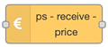

# ps-receive-price



## Description

The `ps-receive-price` node is used to convert prices from Tibber or Nord Pool to the format used by the strategy nodes. It takes its input directly from the output of the following nodes (see details below):

- `tibber-query` node from Tibber (`node-red-contrib-tibber-api`)
- `current state` node in Home Assistant
- `events: state` node in Home Assistant

Output can be sent directly to the strategy nodes (for example `strategy-best-save` or `strategy-lowest-price`), or it can be sent via another node to add grid tariff or other additional costs before the calculation is done.

::: warning Note
In version 2 of `node-red-contrib-power-saver`, prices were received directly by the Power Saver node.
This made it hard to add grid tariff before the calculation was done.
That is why this is now a separate node.
:::

## Configuration

There is no configuration except from node name.

###

<AdsenseAdd type="artikkel"/>

## Input

### Tibber input

If you are a Tibber customer, you can use the `tibber-query` node from the [`node-red-contrib-tibber-api`](https://flows.nodered.org/node/node-red-contrib-tibber-api). Set it up with the following query:

```gql
{
  viewer {
    homes {
      currentSubscription {
        priceInfo {
          today {
            total
            startsAt
          }
          tomorrow {
            total
            startsAt
          }
        }
      }
    }
  }
}
```

Send the result from the `tibber-query` node with the query above directly to the `ps-receive-price` node. Make sure it is refreshed when new prices are ready. Prices for the next day are normally ready at 13:00, but refreshing every hour can be a good idea.

[See example with Tibber, a switch and MQTT](../examples/example-tibber-mqtt.md)

::: danger Warning
The query above returns an array with all houses you have in your Tibber account.
It will work only if the house you want is the first house in the array, for example if you have only one house.
If that is not the case, you must use the query below.
:::

**Tibber query for a specific house**

If the above query does not give you the house you want as the first in the result array, you can use the following method. In this method you need run one query in order to find the id of the house you want the prices for first, and then use the id in the real query.

Go to the [Tibber Developer pages](https://developer.tibber.com/), sign in, and go to the [API Explorer](https://developer.tibber.com/explorer). Load your personal token, then run the following query:

```gql
{
  viewer {
    homes {
      id
      address {
        address1
        address2
        address3
        postalCode
        city
        country
      }
    }
  }
}
```

Then copy the `id` of the house you want to use prices for. It may look like this:

```
NB! This is just an example:
142c1670-ab43-2ab3-ba6d-723703a551e2
```

Then use the id in the following query, replacing the id with the one you found in the previous query:

```gql{3}
{
  viewer {
    home(id: "142c1670-ab43-2ab3-ba6d-723703a551e2") {
      currentSubscription{
        priceInfo{
          today {
            total
            startsAt
          }
          tomorrow {
            total
            startsAt
          }
        }
      }
    }
  }
}
```

This is the query you shall put in the `tibber-query` node.

###

<AdsenseAdd type="artikkel"/>

### Nord Pool input

This is especially designed to work for Home Assistant (HA), and the [Nord Pool custom component](https://github.com/custom-components/nordpool). The Nord Pool component provides a _sensor_ that gives price per hour for today and tomorrow (after 13:00). Send the output from this sensor directly to the `ps-receive-price` node. Make sure this is done whenever the node is updated, as well as when the system starts up.

Data can be sent from both the `current state` node or the `events: state` node.

::: tip Output properties
When using the `current state` node, configure the output properties to set `msg.payload` to `entity`.
:::

[See example with Nord Pool and `current state` node](../examples/example-nordpool-current-state.md)

[See example with Nord Pool and `events: state` node](../examples/example-nordpool-events-state.md)

### Other input

If you cannot use any of the two above (Tibber or Nord Pool), create the input to the node with the payload containing JSON like this:

```json
{
  "today": [
    { "value": 1, "start": "2021-06-21T00:00:00+02:00" },
    { "value": 2, "start": "2021-06-21T01:00:00+02:00" }
    //...
  ],
  "tomorrow": [
    { "value": 3, "start": "2021-06-22T00:00:00+02:00" },
    { "value": 4, "start": "2021-06-22T01:00:00+02:00" }
    //...
  ]
}
```

## Output

The output is the [common strategy input format](./strategy-input.md), so it can be sent directly to the strategy nodes, or via any `ps-xxx-add-tariff` node.

###

<AdsenseAdd type="nederst"/>
