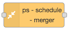
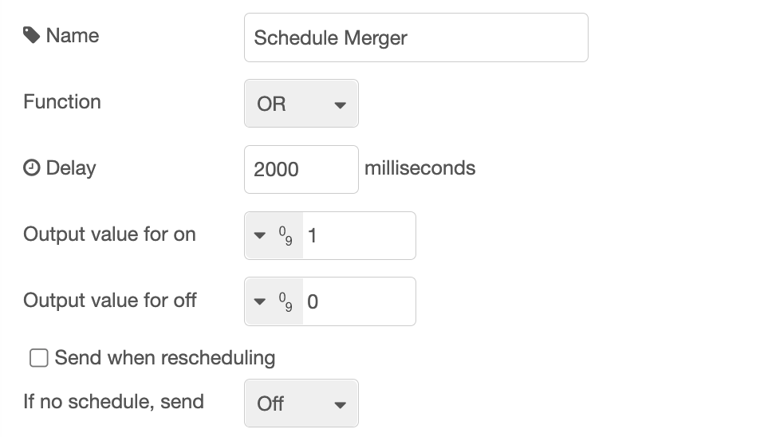

# ps-schedule-merger



## Description

This node can be used to merge schedules from multiple strategy nodes, and create one resulting schedule. It can be useful for example to have multiple lowest price nodes to cover different periods of the day. Send all schedules as input to this node and get one schedule as output. It works for schedules from Lowest Price, Best Save and Fixed Schedule.


All incoming schedules are saved, and after a timeout, a new resulting schedule is calculated based on all incoming schedules. The timeout can be configured, and should be long enough for all preceding strategy nodes to finish their calculation. Normally all strategy nodes will receive the same set of prices at the same time, and do their calculations almost simultaneously, so all strategies can send their schedules at the same time.

The schedules that are merged must be for the exact same period and have the exact same number of hours. If only one schedule is received, it is used unchanged.

::: warning Different period
If a schedule with prices for a different period is received, all saved schedules are deleted, and not used any more.
:::

The merge can be done using one of two functions:

- OR
- AND

### OR

For each hour, all schedules are compared. If any of them is `on`, the hour in the resulting schedule is `on`.
Only if all schedules has the hour set to `off` will the resulting schedule have the hour `off`.

### AND

For each hour, all schedules are compared. If any of them is `off`, the hour in the resulting schedule is `off`.
Only if all schedules has the hour set to `on` will the resulting schedule have the hour `on``.

::: tip Combine with Fixed Schedule
Use the Fixed Schedule strategy node to create a mask for a period of the day when you want to make
sure the switch is turned on or off, and then merge the schedule from the Fixed Schedule strategy with
the schedule from for example the Lowest Price node, using the Schedule Merger node.
:::

## Configuration



| Value                  | Description                                                                                                                                                                                    |
| ---------------------- | ---------------------------------------------------------------------------------------------------------------------------------------------------------------------------------------------- |
| Function               | Merging function, either OR or AND (see above).                                                                                                                                                |
| Delay                  | Delay in milliseconds from a schedule is received until a new schedule is calculated. Use this so all schedules can be received before a new schedule is calculated and used.                  |
| Output value for on    | Set what value to output on output 1 in order to turn on. Default is `boolean true`. You can also select a `number`, for example `1`, or a `string`, for example `on`, or any other value.     |
| Output value for off   | Set what value to output on output 2 in order to turn off. Default is `boolean false`. You can also select a `number`, for example `0`, or a `string`, for example `off`, or any other value.  |
| Send when rescheduling | Check this to make sure on or off output is sent immediately after rescheduling. If unchecked, the output is sent only if it has not been sent before, or is different from the current value. |
| If no schedule, send   | What to do if there is no valid schedule any more (turn on or off). This value will be sent also before there is any valid schedule, or after the last hour there is price data for.           |

###

<AdsenseAdd type="artikkel"/>

### Dynamic config

The following config values can be changed dynamically:

| Name                               | Description                                              |
| ---------------------------------- | -------------------------------------------------------- |
| `logicFunction`                    | Legal values: `"OR"`, `"AND"`                            |
| `schedulingDelay`                  | Number (milliseconds), example: `2000`                   |
| `outputIfNoSchedule`               | Legal values: `true`, `false`                            |
| `sendCurrentValueWhenRescheduling` | Legal values: `true`, `false`                            |
| `outputValueForOn`                 | See description in [Dynamic Config](./dynamic-config.md) |
| `outputValueForOff`                | See description in [Dynamic Config](./dynamic-config.md) |
| `outputValueForOntype`             | See description in [Dynamic Config](./dynamic-config.md) |
| `outputValueForOfftype`            | See description in [Dynamic Config](./dynamic-config.md) |
| `override`                         | Legal values: `"on"`, `"off"`, `"auto"`                  |

See [Dynamic Config](./dynamic-config.md) for details and how to send dynamic config.

### Dynamic commands

You can send dynamic commands to this node, for example to make it resend output.
See [Dynamic Commands](./dynamic-commands.md) for details and how to send dynamic commands.

## Input

Input is the same as the output from the Lowest Price node and the Best Save node, but only the `hours` array is used.

You can make your own input by supplying a payload containing an hours array. Example:

```json
{
  "hours": [
    {
      "price": 1.2584,
      "onOff": false,
      "start": "2021-09-30T00:00:00.000+02:00",
      "saving": 0.2034
    },
    {
      "price": 1.055,
      "onOff": true,
      "start": "2021-09-30T01:00:00.000+02:00",
      "saving": null
    },
    {
      "price": 1.2054,
      "onOff": true,
      "start": "2021-09-30T02:00:00.000+02:00",
      "saving": null
    }
  ]
}
```

## Output

There are three outputs. You use only those you need for your purpose.

### Output 1

A payload with the value set in config, default `true`, is sent to output 1 whenever the power / switch shall be turned on.

### Output 2

A payload with the value set in config, default `false`, is sent to output 2 whenever the power / switch shall be turned off.

### Output 3

When valid input is received, and the schedule is recalculated (after the timeout), the resulting schedule, as well as some other information, is sent to output 3. You can use this to see the plan and verify that it meets your expectations. You can also use it to display the schedule in any way you like.

Example of output:

```json
{
  "schedule": [
    { "time": "2022-10-31T00:00:00.000+01:00", "value": true, "countHours": 5 },
    { "time": "2022-10-31T05:00:00.000+01:00", "value": false, "countHours": 1 },
    { "time": "2022-10-31T06:00:00.000+01:00", "value": true, "countHours": 3 },
    { "time": "2022-10-31T09:00:00.000+01:00", "value": false, "countHours": 2 },
    { "time": "2022-10-31T11:00:00.000+01:00", "value": true, "countHours": 21 },
    { "time": "2022-11-01T08:00:00.000+01:00", "value": false, "countHours": 3 },
    { "time": "2022-11-01T11:00:00.000+01:00", "value": true, "countHours": 3 },
    { "time": "2022-11-01T14:00:00.000+01:00", "value": false, "countHours": 3 },
    { "time": "2022-11-01T17:00:00.000+01:00", "value": true, "countHours": 7 },
    { "time": "2022-11-02T00:00:00.000+01:00", "value": false, "countHours": null }
  ],
  "hours": [
    {
      "start": "2022-10-31T00:00:00.000+01:00",
      "onOff": true,
      "sources": {
        "01e61b1bc2b094e5": {
          "hour": { "start": "2022-10-31T00:00:00.000+01:00", "price": 0.5197, "onOff": false, "saving": null }
        },
        "7c8126f3a95f9cc0": {
          "hour": { "start": "2022-10-31T00:00:00.000+01:00", "price": 0.5197, "onOff": true, "saving": null }
        },
        "e4ded64403d92b14": {
          "hour": { "start": "2022-10-31T00:00:00.000+01:00", "price": 0.5197, "onOff": false, "saving": null }
        }
      },
      "price": 0.5197,
      "saving": null
    },
    {
      "start": "2022-10-31T01:00:00.000+01:00",
      "onOff": true,
      "sources": {
        "01e61b1bc2b094e5": {
          "hour": { "start": "2022-10-31T01:00:00.000+01:00", "price": 0.5117, "onOff": false, "saving": null }
        },
        "7c8126f3a95f9cc0": {
          "hour": { "start": "2022-10-31T01:00:00.000+01:00", "price": 0.5117, "onOff": true, "saving": null }
        },
        "e4ded64403d92b14": {
          "hour": { "start": "2022-10-31T01:00:00.000+01:00", "price": 0.5117, "onOff": true, "saving": null }
        }
      },
      "price": 0.5117,
      "saving": null
    },
    // ...
    {
      "start": "2022-11-01T23:00:00.000+01:00",
      "onOff": true,
      "sources": {
        "01e61b1bc2b094e5": {
          "hour": { "start": "2022-11-01T23:00:00.000+01:00", "price": 0.2233, "onOff": true, "saving": null }
        },
        "7c8126f3a95f9cc0": {
          "hour": { "start": "2022-11-01T23:00:00.000+01:00", "price": 0.2233, "onOff": true, "saving": null }
        },
        "e4ded64403d92b14": {
          "hour": { "start": "2022-11-01T23:00:00.000+01:00", "price": 0.2233, "onOff": false, "saving": null }
        }
      },
      "price": 0.2233,
      "saving": null
    }
  ],
  "source": "Schedule Merger",
  "config": {
    "logicFunction": "OR",
    "schedulingDelay": "2000",
    "outputIfNoSchedule": false,
    "hasChanged": false
  },
  "time": "2022-10-31T21:56:51.178+01:00",
  "version": "4.0.0",
  "strategyNodeId": "796f2d96a83aa709",
  "current": true
}
```

The `schedule` array shows every time the switch is turned on or off. The `hours` array shows values per hour containing the price (received as input), whether that hour is on or off and the start time of the hour. The `saving` value is always `null`.

## Usage ideas

### Multiple Lowest Price

If you want a switch to be on for example two of the cheapest hours between 00:00 and 08:00, and then the two cheapest hours between 12:00 and 20:00, you can do this by combining the schedule from two Lowest Price nodes, one for each of the mentioned periods. Merge the two using a Schedule Merger node with the `OR` function. Make sure to send `off` if no schedule for all nodes.

### Day-filter for strategy nodes

If you have a strategy node, for example Lowest Price or Best Save, that you want to have effect only on weekdays,
make a Fixed Schedule node with all hours on, but only valid for weekdays, then merge the two of them with
the Schedule Merger function `"AND"`. Make sure the `If no schedule, send` is set to `off` so that this will be the
values for the other days.

<VippsPlakat/>
