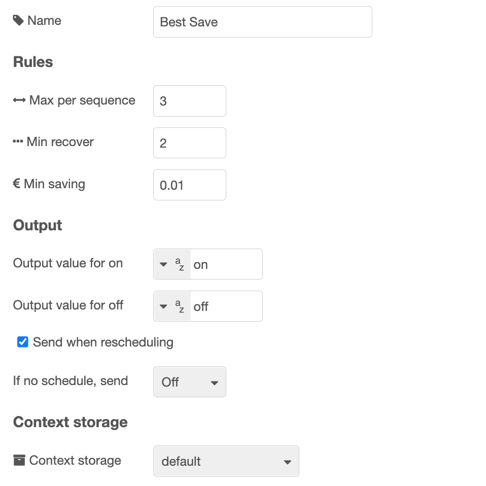

# ps-strategy-best-save


Strategy node to postpone power consumption until the price is lower.


## Description

This strategy turns off power if money can be saved by postponing the consumption, that is if the price is lower later. The idea is that the power you are not using when the switch is turned off, will be used immediately when the switch is turned on (during the first period). This would fit well for turning off a water heater or another thermostat controlled heater.

::: danger 70°C
Be aware that the norwegian [FHI](https://www.fhi.no/nettpub/legionellaveilederen/) recommends that the temperature in the water heater is at least 70°C.
:::

The picture at the bottom of the page, under [Integration with MagicMirror](#integration-with-magicmirror), illustrates this by the purple strokes, taking the price from the top of the price curve to the level of the first period after the save-period.


## Configuration



| Value                  |                                                                                                                                                                                                |
| ---------------------- | ---------------------------------------------------------------------------------------------------------------------------------------------------------------------------------------------- |
| Max minutes off        | Maximum time (minutes) to turn off in a sequence  | 
| Min minutes off        | Minimum time (minutes) to turn off in a sequence  | 
| Recovery time %        | After having turned off, the power must be turned on minimum this % of the time it was off |
| Max recovery time      | Recovery time does not have to be more then this number of minutes |
| Min saving             | Minimum amount to save per kWh in order to bother turning it off. It is recommended to have some amount here, e.g. 2 cents / 2 øre. No point in saving 0.001, is it?                           |
| Output value for on    | Set what value to send to output 1 in order to turn on. Default is `boolean true`. You can also select a `number`, for example `1`, or a `string`, for example `on`, or any other value.     |
| Output value for off   | Set what value to output on output 2 in order to turn off. Default is `boolean false`. You can also select a `number`, for example `0`, or a `string`, for example `off`, or any other value.  |
| Send when rescheduling | Check this to make sure on or off output is sent immediately after rescheduling. If unchecked, the output is sent only if it has not been sent before, or is different from the current value. |
| If no schedule, send   | What to do if there is no valid schedule any more (turn on or off). This value will be sent also before there is any valid schedule, or after the last time there is price data for.           |
| Context storage        | Select context storage to save data to, if more than one is configured in the Node-RED `settings.js` file.                                                                                     |

::: info Recovery
The term revovery is used to set things right after having turned off. For example, if this is used to turn off the water heater, the recovery time is the time required to heat the water after having turned off. This is hard to get accurate only by timing, but this is one way to have some control. You set recovery time as a percentage of the time it was turned off, and you can limit it to a maximum time.
:::

###


### Dynamic config

The following config values can be changed dynamically:

| Name                               | Description                                              |
| ---------------------------------- | -------------------------------------------------------- |
| `contextStorage`                   | String                                                   |
| `maxMinutesOff`                    | Number                                                   |
| `minMinutesOff`                    | Number                                                   |
| `recoveryPercentage`               | Number                                                   |
| `recoveryMaxMinutes`               | Number                                                   |
| `minSaving`                        | Number                                                   |
| `outputIfNoSchedule`               | Legal values: `true`, `false`                            |
| `sendCurrentValueWhenRescheduling` | Legal values: `true`, `false`                            |
| `outputValueForOn`                 | See description in [Dynamic Config](./dynamic-config.md) |
| `outputValueForOff`                | See description in [Dynamic Config](./dynamic-config.md) |
| `outputValueForOntype`             | See description in [Dynamic Config](./dynamic-config.md) |
| `outputValueForOfftype`            | See description in [Dynamic Config](./dynamic-config.md) |
| `override`                         | Legal values: `"on"`, `"off"`, `"auto"`                  |

See [Dynamic Config](./dynamic-config.md) for details and how to send dynamic config.


### Dynamic commands

You can send dynamic commands to this node, for example to make it resend output.
See [Dynamic Commands](./dynamic-commands.md) for details and how to send dynamic commands.

## Input

The input is the [common strategy input format](./strategy-input.md).

In addition to the prices sent as input,
the node is using the schedule for the day before it receives data for,
so that it can calculate the schedule in the beginning of the day according to the configured rules.
This requires of course that the node was run the day before.

When a payload with `priceData` is received, this is saved to the nodes context as `lastPriceData`.
The source is saved as `lastSource`. If config- or command-messages are received without price data,
the data saved in context is used for replanning.


## Output

There are three outputs. You use only those you need for your purpose.

### Output 1

A payload with the value set in config, default `true`, is sent to output 1 whenever the power / switch shall be turned on.

### Output 2

A payload with the value set in config, default `false` is sent to output 2 whenever the power / switch shall be turned off.


### Output 3

When a valid input is received, and the schedule is recalculated, the resulting schedule, as well as some other information, is sent to output 3. You can use this to see the plan and verify that it meets your expectations. You can also use it to display the schedule in any way you like.

###


Example of output:

```json
{
  "schedule": [
    {
      "time": "2021-09-30T00:00:00.000+02:00",
      "value": false,
      "countMinutes": 60
    },
    {
      "time": "2021-09-30T01:00:00.000+02:00",
      "value": true,
      "countMinutes": 1380
    },
    {
      "time": "2021-09-31T00:00:00.000+02:00",
      "value": false,
      "countMinutes": null
    }
  ],
  "minutes": [
    {
    "start": "2025-09-30T00:00:00.000+02:00",
    "price": 0.2129,
    "onOff": false,
    "saving": 0.0631
  },
  {
    "start": "2025-09-30T00:01:00.000+02:00",
    "price": 0.2129,
    "onOff": false,
    "saving": 0.0631
  },
  {
    "start": "2025-09-30T00:02:00.000+02:00",
    "price": 0.2129,
    "onOff": false,
    "saving": 0.0631
  }, // ...
  ],
  "source": "Nord Pool",
  "config": {
    "contextStorage": "default",
    "maxMinutesOff": "300",
    "minMinutesOff": "30",
    "recoveryPercentage": "50",
    "recoveryMaxMinutes": "120",
    "minSaving": 0.01,
    "outputIfNoSchedule": false,
    "outputValueForOn": "on",
    "outputValueForOff": "off",
    "outputValueForOntype": "str",
    "outputValueForOfftype": "str",
    "override": "auto",
    "sendCurrentValueWhenRescheduling": true,
    "hasChanged": false
  },
  "time": "2025-09-30T23:45:12.123+02:00",
  "version": "5.0.0"
}
```

The `schedule` array shows every time the switch is turned on or off. The `minutes` array shows values per minute containing the price (received as input), whether that minute is on or off, the start time of the minute and the amount per kWh that is saved on minutes that are turned off, compared to the next recovery period.


### Output saved in context

The `schedule` and the `minutes` arrays from Output 3 are both saved to the nodes context in an object with key `lastPlan`. This may be used in the plan for the next day, for example if an off-period at the end of one day continues into the next day. In that case, the `saving` values for the last minutes in the day have to be recalculated, since the next minute on is changed when the new day is calculated.

You can see the saved data if you select the node in Node-RED, and view "Context data", and refresh the Node context.

###


## Algorithm

The calculation that decides what minutes to turn off works as follows:

1. A matrix (x \* y) is created where x is the number of minutes we have price information for, and y is the configured maximum number of minutes to turn off in a sequence.
2. The matrix is filled with how much you save by turning off minute x for y minutes.
3. The matrix is processed calculating all possibilities for turning off a number of minutes in a sequence and by that saving money. In this process all non-saving sequences are discarded. Also, if the average saving per minute is less than what you have configured as minimum amount to save per kWh, the sequence is discarded.
4. The remaining sequences are sorted by how much that is saved, in descending order.
5. Next, a table with one value per minute is created, with all minutes in state "on".
6. Then the saving sequences is applied one by one, turning off the minutes in each sequence, discarding sequences that lead to any violation of the rules set by the config.
7. When all sequences are processed, the resulting table shows a pretty good savings plan, that in most cases would be the optimal plan.

I say "in most cases", because there is a chance that a group of two or more sequences combined can give a better plan than a single sequence preceeding those two, but where the selection of the one sequence causes the group to be discarded. If anyone encounters this situation, I would be happy to receive the price data set, and try to improve the algorithm even further.


## Data used for calculation

Normally data is received for one or two whole days, and all this data is used to do the calculation. In addition, if the node has run before, so there is historical data, the last period on or off before the period data is received for, is considered in the calculation, so that the rules in the configuration are followed also between days.

## Restarts and saved context

The config, last received prices and the last calculated schedule are saved to the nodes context.
This may be saved to memory, to file or to another destination based on how your Node-RED is configured.
If multiple context storages are defined, you can select which one to use in the nodes config.
If there is only one context storage defined, this is normally `memory`. In that case, data is not saved over restarts.
It is common to have two different context storages defined, `memory` and `file`, but there may be more.
It is also common to have a `default` context storage defined, and often this points to either `memory` or `file`.
However, the configuration can be different from this.


You can find this configuration in the `settings.js` file for Node-RED, usually in the node-red config folder.
In Home Assistant, this is normally `/config/node-red/settings.js`.

Here is an example of a configuration for the context storage:

```js
contextStorage: {
  file: { module: "localfilesystem"},
  default: { module: "memory" }
}
```

By default, this node saves context to the `default` context storage. In the example above, this is memory.
Then it is not preserved over a restart.
Please read the [Node-RED documentation](https://nodered.org/docs/user-guide/context) for more details about this.

The data that is saved is the config, the last used prices and the last calculated schedule.


When Node-RED restarts, the config is reset to what is defined in the node config, so by default,
nothing is read from the context storage after a restart. However, if you send a `replan` command to the
nodes input, a plan is recalculated, using the last received prices. One way to do this is to use an `inject` node,
and set `msg.payload` to the following JSON value:

```json
{
  "commands": {
    "replan": true
  }
}
```

This is an alternative to fetching new prices and send as input.

###


## Integration with MagicMirror

Are you using [MagicMirror](https://magicmirror.builders/)? Are you also using [Tibber](https://tibber.com/)? If so, there is a module for MM called [MMM-Tibber](https://github.com/ottopaulsen/MMM-Tibber), that easily can be used to show savings from this node.


The purple lines show savings per kWh.

Read more about this in the [MMM-Tibber documentation](https://github.com/ottopaulsen/MMM-Tibber#show-savings).

::: danger Quarterly hour prices
The MagicMirror integration has not been prepared for quarterly hour prices.
:::

## Viewer

If you like to analyze the data output by the node, take a look at the [Best Save Viewer](../faq/best-save-viewer.md).

###


