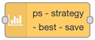

# ps-strategy-best-save



Strategy node to postpone power consumption until the price is lower.

## Description

This strategy turns off the hours where the price difference is largest compared to the next hour that is on. The idea is that the power you are not using when the switch is turned off, will be used immediately when the switch is turned on. This would fit well for turning off a water heater or another thermostat controlled heater.

The picture at the bottom of the page, under [Integration with MagicMirror](#integration-with-magicmirror), illustrates this by the purple strokes, taking the price from the top of the price curve to the level of the first hour after the save-period.

## Configuration


| Value                  | Description                                                                                                                                                          |
| ---------------------- | -------------------------------------------------------------------------------------------------------------------------------------------------------------------- |
| Max per sequence       | Maximum number of hours to turn off in a sequence.                                                                                                                   |
| Min recover            | Minimum hours to turn on immediately after a period when turned off the maximum number of hours that is allowed to be turned off                                     |
| Min saving             | Minimum amount to save per kWh in order to bother turning it off. It is recommended to have some amount here, e.g. 2 cents / 2 øre. No point in saving 0.001, is it? |
| Send when rescheduling | Check this to make sure on or off output is sent immediately after rescheduling                                                                                      |
| If no schedule, send   | What to do if there is no valid schedule any more (turn on or off).                                                                                                  |

::: warning Min recover
NB! The `Min recover` only has effect if the previous save-period is of length `Max per sequence`. If the save-period is shorter, the following on-period may be as short as one hour.
:::

### Dynamic config

It is possible to change config dynamically by sending a config message to the node. The config messages has a payload with a config object like this example:

```json
"payload": {
  "config": {
    "maxHoursToSaveInSequence": 4,
    "minHoursOnAfterMaxSequenceSaved": 2,
    "minSaving": 0.02,
    "sendCurrentValueWhenRescheduling": true,
    "outputIfNoSchedule": true,
  }
}
```

All the variables in the config object are optional. You can send only those you want to change.

The config sent like this will be valid until a new config is sent the same way, or until the flow is restarted. On a restart, the original config set up in the node will be used.

When a config is sent like this, and without price data, the schedule will be replanned based on the last previously received price data. If no price data has been received, no scheduling is done.

However, you can send config and price data in the same message. Then both will be used.

### Dynamic commands

You can dynamically send some commands to the node via its input, by using a `commands` object in the payload as described below.

Commands can be sent together with config and/or price data, but the exact behavior is not defined.

#### sendSchedule

You can get the schedule sent to output 3 any time by sending a message like this to the node:

```json
"payload": {
  "commands": {
    "sendSchedule": true,
  }
}
```

When you do this, the current schedule is actually recalculated based on the last received data, and then sent to output 3 the same way as when it was originally planned.

#### reset

You can reset data the node has saved in context by sending this message:

```json
"payload": {
  "commands": {
    "reset": true,
  }
}
```

When you do this, all historical data the node has saved is deleted, including the current schedule, so the result will be
that the node shows status "No price data". When new price data is received, a schedule is calculated without considering any history.

The nodes config is not deleted, as the node depends on it to work.

::: warning
This operation cannot be undone.

However, it is normally not a big loss, as you can just feed the node with new price data and start from scratch.
:::

## Input

The input is the [common strategy input format](./strategy-input.md).

In addition to the prices sent as input,
the node is using the schedule for the day before it receives data for,
so that it can calculate the schedule in the beginning of the day according to the configured rules. This requires of course that the node was run the day before.

## Output

There are three outputs. You use only those you need for your purpose.

### Output 1

A payload with the word `true` is sent to output 1 whenever the power / switch shall be turned on.

### Output 2

A payload with the word `false` is sent to output 2 whenever the power / switch shall be turned off.

### Output 3

When a valid input is received, and the schedule is recalculated, the resulting schedule, as well as some other information, is sent to output 3. You can use this to see the plan and verify that it meets your expectations. You can also use it to display the schedule in any way you like.

Example of output:

```json
{
  "schedule": [
    {
      "time": "2021-09-30T00:00:00.000+02:00",
      "value": false
    },
    {
      "time": "2021-09-30T01:00:00.000+02:00",
      "value": true
    }
  ],
  "hours": [
    {
      "price": 1.2584,
      "onOff": false,
      "start": "2021-09-30T00:00:00.000+02:00",
      "saving": 0.2034
    },
    {
      "price": 1.055,
      "onOff": true,
      "start": "2021-09-30T01:00:00.000+02:00",
      "saving": null
    },
    {
      "price": 1.2054,
      "onOff": true,
      "start": "2021-09-30T02:00:00.000+02:00",
      "saving": null
    }
  ],
  "source": "Nord Pool",
  "config": {
    "maxHoursToSaveInSequence": 3,
    "minHoursOnAfterMaxSequenceSaved": "1",
    "minSaving": 0.001,
    "sendCurrentValueWhenRescheduling": true,
    "outputIfNoSchedule": false
  },
  "time": "2021-09-30T23:45:12.123+02:00",
  "version": "3.1.2"
}
```

The `schedule` array shows every time the switch is turned on or off. The `hours` array shows values per hour containing the price (received as input), whether that hour is on or off, the start time of the hour and the amount per kWh that is saved on hours that are turned off, compared to the next hour that is on.

### Data saved in context

The node saves some data in the nodes context, so that it can be used on restarts and also taken into consideration when calculating the schedule over midnight.

You can see the saved data if you select the node in Node-RED, and view "Context data", and refresh the Node context.

## Algorithm

The calculation that decides what hours to turn off works as follows:

1. A matrix (x \* y) is created where x is the number of hours we have price information for, and y is the configured maximum number of hours to turn off in a sequence.
2. The matrix is filled with how much you save by turning off hour x for y hours.
3. The matrix is processed calculating all possibilities for turning off a number of hours in a sequence and by that saving money. In this process all non-saving sequences are discarded. Also, if the average saving per hour is less than what you have configured as minimum amount to save per kWh, the sequence is discarded.
4. The remaining sequences are sorted by how much that is saved, in descending order.
5. Next, a table with one value per hour is created, with all hours in state "on".
6. Then the saving sequences is applied one by one, turning off the hours in each sequence, discarding sequences that lead to any violation of the rules set by the config.
7. When all sequences are processed, the resulting table shows a pretty good savings plan, that in most cases would be the optimal plan.

I say "in most cases", because there is a chance that a group of two or more sequences combined can give a better plan than a single sequence preceeding those two, but where the selection of the one sequence causes the group to be discarded. If anyone encounters this situation, I would be happy to receive the price data set, and try to improve the algorithm even further.

## Data used for calculation

Normally data is received for one or two whole days, and all this data is used to do the calculation. In addition, if the node has run before, so there is historical data, the last period on or off before the period data is received for, is considered in the calculation, so that the rules in the configuration are followed also between days.

## Restarts

The node saves data in the nodes context, so if Node-RED is configured to save context between restarts, the node will replan with the last received data when it restarts.

::: warning
In Home Assistant, Node-RED is by default configured to save context between restarts. However, if you run Node-RED another way, this may not be the case by default. If context is only stored in memory, it is lost between restarts, and even between re-deployments. This can be changed in the `settings.js` file for Node-RED like this:

```js
contextStorage: {
   default: {
       module: "localfilesystem"
   }
}
```

Please read the [Node-RED documentation](https://nodered.org/docs/user-guide/context) for more details about this.
:::

## Integration with MagicMirror

Are you using [MagicMirror](https://magicmirror.builders/)? Are you also using [Tibber](https://tibber.com/)? If so, there is a module for MM called [MMM-Tibber](https://github.com/ottopaulsen/MMM-Tibber), that easily can be used to show savings from this node.


The purple lines show savings per kWh.

Read more about this in the [MMM-Tibber documentation](https://github.com/ottopaulsen/MMM-Tibber#show-savings).
