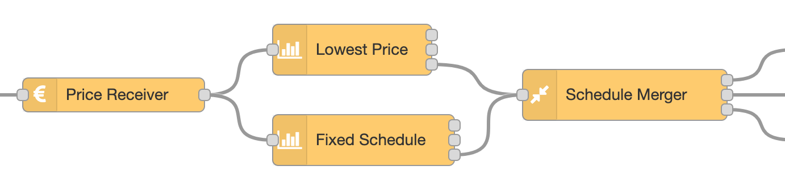
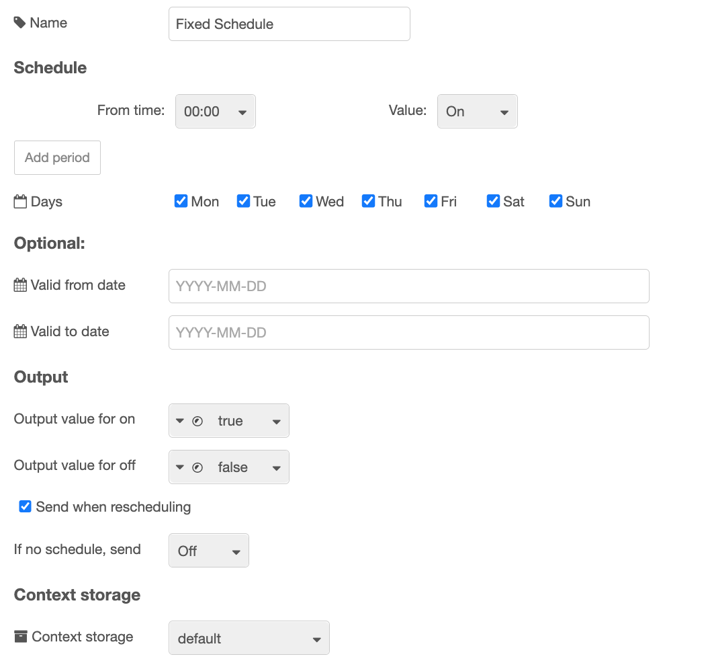

# ps-strategy-fixed-schedule

Strategy node to set a fixed schedule.
This can be used by itself, but it is also perfect to combine with other strategies
and the [Schedule Merger](./ps-schedule-merger.md) node in order to force periods of the day either on or off.

## Description

This strategy can be used to set a period of the day or the week fixed to on or off.

The strategy was made together with the [Schedule Merger](./ps-schedule-merger.md) node,
and can be used together with this in order to mask periods of the day from being
affected by another schedule, primarily the Fixed Schedule or Lowest Price strategies.

Here is an example of how to combine it with the Lowest Price node:

## Configuration

| Value                  |                                                                                                                                                                                                                                                                                     |
| ---------------------- | ----------------------------------------------------------------------------------------------------------------------------------------------------------------------------------------------------------------------------------------------------------------------------------- |
| Schedule               | Decide from what time, and what value to set, for one or more periods during the day. It is working around the clock, so the value that is at the end of one day continues on the beginning of the next day, unless you change it at 00:00. Click `Add period` to get more periods. |
| Days                   | Use this if you want the schedule to work only on specific days. For the other days, the value on the `If no schedule, send` setting is sent.                                                                                                                                       |
| Valid from date        | If this is set, the schedule is not valid before this date.                                                                                                                                                                                                                         |
| Valid to date          | If this is set, the schedule is not valid after this date.                                                                                                                                                                                                                          |
| Output value for on    | Set what value to output on output 1 in order to turn on. Default is `boolean true`. You can also select a `number`, for example `1`, or a `string`, for example `on`, or any other value.                                                                                          |
| Output value for off   | Set what value to output on output 2 in order to turn off. Default is `boolean false`. You can also select a `number`, for example `0`, or a `string`, for example `off`, or any other value.                                                                                       |
| Send when rescheduling | Check this to make sure on or off output is sent immediately after rescheduling. If unchecked, the output is sent only if it has not been sent before, or is different from the current value.                                                                                      |
| If no schedule, send   | What to do if there is no valid schedule any more (turn on or off). This value will be sent also before there is any valid schedule, or after the last hour there is price data for.                                                                                                |
| Context storage        | Select context storage to save data to, if more than one is configured in the Node-RED `settings.js` file.                                                                                                                                                                          |

###

<AdsenseAdd type="artikkel"/>

### Dynamic config

The following config values can be changed dynamically:

| Name                               | Description                                              |
| ---------------------------------- | -------------------------------------------------------- |
| `contextStorage`                   | String                                                   |
| `periods`                          | An array with periods. See below.                        |
| `validFrom`                        | String with date in form `YYYY-MM-DD`                    |
| `validTo`                          | String with date in form `YYYY-MM-DD`                    |
| `days`                             | An array of days. See below.                             |
| `outputIfNoSchedule`               | Legal values: `true`, `false`                            |
| `sendCurrentValueWhenRescheduling` | Legal values: `true`, `false`                            |
| `outputValueForOn`                 | See description in [Dynamic Config](./dynamic-config.md) |
| `outputValueForOff`                | See description in [Dynamic Config](./dynamic-config.md) |
| `outputValueForOntype`             | See description in [Dynamic Config](./dynamic-config.md) |
| `outputValueForOfftype`            | See description in [Dynamic Config](./dynamic-config.md) |
| `override`                         | Legal values: `"on"`, `"off"`, `"auto"`                  |

See [Dynamic Config](./dynamic-config.md) for details and how to send dynamic config.

### Dynamic commands

You can send dynamic commands to this node, for example to make it resend output.
See [Dynamic Commands](./dynamic-commands.md) for details and how to send dynamic commands.

## Input

The input is the [common strategy input format](./strategy-input.md).

The node requires the price-data input in order to know what times to generate schedule for.
This is especially important when merging the schedule using the Schedule Merger node,
as all schedules that are merged must be for the exact same period.

## Output

There are three outputs. You use only those you need for your purpose.

### Output 1

A payload with the value set in config, default `true`, is sent to output 1 whenever the power / switch shall be turned on.

### Output 2

A payload with the value set in config, default `false` is sent to output 2 whenever the power / switch shall be turned off.

### Output 3

When a valid input is received, and the schedule is recalculated, the resulting schedule, as well as some other information, is sent to output 3. You can use this to see the plan and verify that it meets your expectations. You can also use it to display the schedule in any way you like.

The aoutput is similar to the output from the other strategy nodes.

###

<AdsenseAdd type="artikkel"/>

## Usage ideas

### Turn on every morning

If you want to make sure that a switch is turned on at least 2 hours every morning from 04:00 to 06:00,
even if you are using the Lowest Price node to turn it on only the 4 cheapest hours during
the whole day, you can use this node to make sure it is on this period, and then merge it with the
Lowest Price schedule using the Schedule Merger node with the `OR` function.

###

<AdsenseAdd type="nederst"/>
