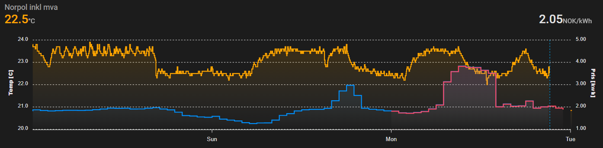
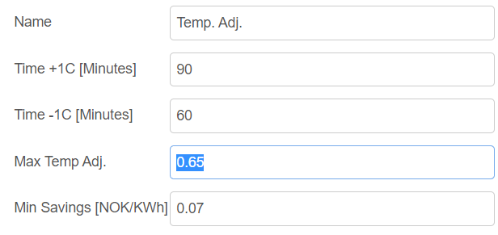
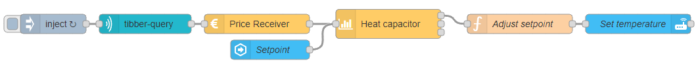

# ps-strategy-heat-capacitor


A strategy for moving consumption from expensive to cheap periods utilizing climate entities.

## Description

The heat capacitor strategy utilizes a large body of mass, like your house or cabin, to procure heat at a time where electricity is cheap, and divest at a time where electricity is expensive.

This is achieved by increasing the temperature setpoint of one or several climate entities at times when electricity is cheap, and reducing it when electricity is expensive.

It is a good application for cabins/heated storage spaces, as the entity never actually shuts off the climate entities and should therefore be rather safe to apply (still at you own risk :-)). It can also be used for you house, jacuzzi, and/or pool.



## Configuration



| Value             | Description                                                                |
| ----------------- | -------------------------------------------------------------------------- |
| Time + 1C         | The time required to increase the temperature by 1C.                       |
| Time - 1C         | The time required to decrease the temperature by 1C.                       |
| Setpoint          | Ideal temperature in C                                                     |
| Max temp adj.     | The number of degrees the system is allowed to increase/decrease.          |
| Heating Boost [C] | An extra increase in temperature to the setpoint for the investment period |
| Cooling Boost [C] | An extra decrease in temperature to the setpoint for the divestment period |
| Min Savings       | The minimum amount of savings required for a buy/sell cycle.               |



The node consumes price information and outputs $\Delta T$ on its first output and the planned schedule and benefit calculations on the second output. The $\Delta T$ is used to adjust the set-point of a climate entity.

###

<AdsenseAdd type="artikkel"/>

### The impact of **Time +1C**

This time is used to optimize the timing of when to turn up the heat. An increase in temperature from 22 to 23C will cause an increased electricity consumption for quite some time after the change has occurred. For heat-pumps, the air is heated first, then walls, furniture etc., creating a high electricity demand in the first hour or so before the demand slowly reduces down to normal levels. The algorithm uses this time to estimate a period of increased consumption and places this at an optimum point in time.

To get started, 90 minutes can be used for air heaters. Later, one can study the temperature curves or, if available, the power consumption curves of the climate entity, to achieve a better accuracy.

### Setpoint

The setpoint, $S_p$, indicates the ideal temperature.

### Max temperature adjustment

A max temperature adjustment $M_{ta}$ value of $0.65~^{\circ}C$ will change the setpoint temperature by $\pm0.65~^{\circ}C$. Please note that a larger number will indicate a longer heating time (Time +1C = 60 and Max Temp Adj.= $0.75~^{\circ}C$ results in a heating time of $60\times0.75\times 2= 90$ minutes

### Heating Boost [C]

The boost temperatures are used to ensure that a climate entity start to heat during the `investment period` (the period where the temperature increases). Some climate entities fail to respond when their setpoint is changed by a small $\Delta T$.

The heating boost, $H_b$, adds this amount of degrees to the setpoint for the investment period. In the previous example, $H_b = 2~^{\circ}C$ will set the temperature to $S_p + 2.75$ for the first 90 minutes, and then reduce it to $S_p+0.75$.

### Cooling Boost [C]

Similarly to the heating boost temperature, the Cooling boost $C_b$ is used in the `divestment period` (the period where the temperature decreases).

In the scenario where one should invest at 03:00 at night, and divest at 08:00 in the morning, $M_{ta}=1~^{\circ}C$, $H_b= 2~^{\circ}C$, $C_b=1~^{\circ}C$, and investment and divestment times of 60 minutes will result in the following

- 02:00 to 03:00: $+3~^{\circ}C$
- 03:00 to 08:00: $+1~^{\circ}C$
- 08:00 to 09:00: $-2~^{\circ}C$
- 09:00 and onward: $-1~^{\circ}C$

### Min Savings

The heating and cooling periods can be seen as buy - sell pairs. That is, heat is procured at time t, and the same heat is sold at t+dt. The savings can then be estimated as the price difference $S=price(t+dt) - price(t)$. If this saving is less that the minimum savings requirement, it will be removed. The algorithm removes these in a prioritized order, starting with the pair with the smallest gain.

## Dynamic config

It is possible to change config dynamically by sending a config message to the node. The config messages has a payload with a config object like this example:

```json
"payload": {
  "config": {
    "timeHeat1C": 75,
    "timeCool1C": 50,
    "setpoint": 22.5,
    "maxTempAdjustment": 0.5,
    "boostTempHeat": 2,
    "boostTempCool": 1,
    "minSavings": 0.08,
  }
}
```

All the variables in the config object are optional. You can send only those you want to change.

The config sent like this will be valid until a new config is sent the same way, or until the flow is restarted. On a restart, the original config set up in the node will be used.

When a config is sent like this, and without price data, the schedule will be replanned based on the last previously received price data. If no price data has been received, no scheduling is done. You can send config and price data in the same message. Then both will be used.

## Output

There are three outputs. You use only those you need for your purpose.

### Output 1 - Temperature

The setpoint temperature intended to be passed to a climate entity (or a PID controller).

Example:

```json
{
  "payload": 22.5,
  "topic": "setpoint",
  "time": "2022-02-08T00:06:06.000+01:00",
  "version": "3.3.1"
}
```

### Output 2 - $\Delta T$

The number of degrees which has been added or subtracted to the setpoint

```json
{
  "payload": -0.5,
  "topic": "adjustment",
  "time": "2022-02-08T00:05:05.924+01:00",
  "version": "3.3.1"
}
```

### Output 3

The current schedule as well as some other information. You can use this to see the plan and verify that it meets your expectations. You can also use it to display the schedule in any way you like.

The "trades" key contains a list of dictionaries indicating the trades:

```json
{
  "type": "buy - sell",
  "tradeValue": 0.2558,
  "buyIndex": 165,
  "buyDate": "2022-02-07T02:45:00.000+01:00",
  "buyPrice": 1.3904,
  "sellIndex": 490,
  "sellDate": "2022-02-07T08:10:00.000+01:00",
  "sellPrice": 1.6462
}
```

A trade consists of a `buy action` and a `sell action`. You buy electricity in the heating period, and sell it during the cooling period. `buyPrice` indicates the price at which the electricity is bought, while `sellPrice` indicates the price at which it is sold. This yields the `tradeValue`, which is how much is gained by moving one kWh from the expensive to the cheap period. If you run two 1kWh heaters and is able to turn it off from a 50% load for an hour, you earn 1kWh _ 2 _ 50% \* 0.2558 = 0.2558.

The temperature variations from the setpoint are shown in a list at the end of the dictionary. The array has minute resolution, meaning that the first value is valid from 07.02.2022 00:00 till 00:01. As such, this is an indexed list, and the `buyIndex` and `sellIndex` values is a reference to the index in this array.

Full example:

```json
{
  "payload": {
    "startAt": "2022-02-07T00:00:00.000+01:00",
    "maxTempAdjustment": 0.5,
    "durationInMinutes": 2806,
    "boostTempHeat": 1,
    "boostTempCool": 1,
    "heatingDuration": 75,
    "coolingDuration": 50,
    "trades": [
      {
        "type": "buy - sell",
        "tradeValue": 0.2558,
        "buyIndex": 165,
        "buyDate": "2022-02-07T02:45:00.000+01:00",
        "buyPrice": 1.3904,
        "sellIndex": 490,
        "sellDate": "2022-02-07T08:10:00.000+01:00",
        "sellPrice": 1.6462
      },
      {
        "type": "sell - buy",
        "tradeValue": 0.1508,
        "buyIndex": 720,
        "buyDate": "2022-02-07T12:00:00.000+01:00",
        "buyPrice": 1.4954,
        "sellIndex": 490,
        "sellDate": "2022-02-07T08:10:00.000+01:00",
        "sellPrice": 1.6462
      },
      {
        "type": "buy - sell",
        "tradeValue": 0.2134,
        "buyIndex": 720,
        "buyDate": "2022-02-07T12:00:00.000+01:00",
        "buyPrice": 1.4954,
        "sellIndex": 1090,
        "sellDate": "2022-02-07T18:10:00.000+01:00",
        "sellPrice": 1.7088
      },
      {
        "type": "sell - buy",
        "tradeValue": 0.3424,
        "buyIndex": 1665,
        "buyDate": "2022-02-08T03:45:00.000+01:00",
        "buyPrice": 1.3664,
        "sellIndex": 1090,
        "sellDate": "2022-02-07T18:10:00.000+01:00",
        "sellPrice": 1.7088
      },
      {
        "type": "buy - sell",
        "tradeValue": 0.2731,
        "buyIndex": 1665,
        "buyDate": "2022-02-08T03:45:00.000+01:00",
        "buyPrice": 1.3664,
        "sellIndex": 1930,
        "sellDate": "2022-02-08T08:10:00.000+01:00",
        "sellPrice": 1.6395
      },
      {
        "type": "sell - buy",
        "tradeValue": 0.0902,
        "buyIndex": 2265,
        "buyDate": "2022-02-08T13:45:00.000+01:00",
        "buyPrice": 1.5493,
        "sellIndex": 1930,
        "sellDate": "2022-02-08T08:10:00.000+01:00",
        "sellPrice": 1.6395
      },
      {
        "type": "buy - sell",
        "tradeValue": 0.1208,
        "buyIndex": 2265,
        "buyDate": "2022-02-08T13:45:00.000+01:00",
        "buyPrice": 1.5493,
        "sellIndex": 2530,
        "sellDate": "2022-02-08T18:10:00.000+01:00",
        "sellPrice": 1.6701
      }
    ],
    "config": {
      "timeHeat1C": 75,
      "timeCool1C": 50,
      "setpoint": 23,
      "maxTempAdjustment": 0.5,
      "boostTempHeat": 1,
      "boostTempCool": 1,
      "minSavings": 0.08
    },
    "priceData": [
      { "value": 1.414, "start": "2022-02-07T00:00:00.000+01:00" },
      { "value": 1.3927, "start": "2022-02-07T01:00:00.000+01:00" },
      { "value": 1.3914, "start": "2022-02-07T02:00:00.000+01:00" },
      { "value": 1.3901, "start": "2022-02-07T03:00:00.000+01:00" },
      { "value": 1.3923, "start": "2022-02-07T04:00:00.000+01:00" },
      { "value": 1.4295, "start": "2022-02-07T05:00:00.000+01:00" },
      { "value": 1.5149, "start": "2022-02-07T06:00:00.000+01:00" },
      { "value": 1.6198, "start": "2022-02-07T07:00:00.000+01:00" },
      { "value": 1.6462, "start": "2022-02-07T08:00:00.000+01:00" },
      { "value": 1.6097, "start": "2022-02-07T09:00:00.000+01:00" },
      { "value": 1.5589, "start": "2022-02-07T10:00:00.000+01:00" },
      { "value": 1.5473, "start": "2022-02-07T11:00:00.000+01:00" },
      { "value": 1.4881, "start": "2022-02-07T12:00:00.000+01:00" },
      { "value": 1.5246, "start": "2022-02-07T13:00:00.000+01:00" },
      { "value": 1.548, "start": "2022-02-07T14:00:00.000+01:00" },
      { "value": 1.5483, "start": "2022-02-07T15:00:00.000+01:00" },
      { "value": 1.5755, "start": "2022-02-07T16:00:00.000+01:00" },
      { "value": 1.6862, "start": "2022-02-07T17:00:00.000+01:00" },
      { "value": 1.7088, "start": "2022-02-07T18:00:00.000+01:00" },
      { "value": 1.6983, "start": "2022-02-07T19:00:00.000+01:00" },
      { "value": 1.6704, "start": "2022-02-07T20:00:00.000+01:00" },
      { "value": 1.6128, "start": "2022-02-07T21:00:00.000+01:00" },
      { "value": 1.5595, "start": "2022-02-07T22:00:00.000+01:00" },
      { "value": 1.4605, "start": "2022-02-07T23:00:00.000+01:00" },
      { "value": 1.496, "start": "2022-02-08T00:00:00.000+01:00" },
      { "value": 1.4436, "start": "2022-02-08T01:00:00.000+01:00" },
      { "value": 1.4128, "start": "2022-02-08T02:00:00.000+01:00" },
      { "value": 1.3751, "start": "2022-02-08T03:00:00.000+01:00" },
      { "value": 1.3642, "start": "2022-02-08T04:00:00.000+01:00" },
      { "value": 1.4415, "start": "2022-02-08T05:00:00.000+01:00" },
      { "value": 1.5473, "start": "2022-02-08T06:00:00.000+01:00" },
      { "value": 1.5798, "start": "2022-02-08T07:00:00.000+01:00" },
      { "value": 1.6395, "start": "2022-02-08T08:00:00.000+01:00" },
      { "value": 1.6114, "start": "2022-02-08T09:00:00.000+01:00" },
      { "value": 1.5715, "start": "2022-02-08T10:00:00.000+01:00" },
      { "value": 1.5747, "start": "2022-02-08T11:00:00.000+01:00" },
      { "value": 1.5608, "start": "2022-02-08T12:00:00.000+01:00" },
      { "value": 1.5537, "start": "2022-02-08T13:00:00.000+01:00" },
      { "value": 1.5482, "start": "2022-02-08T14:00:00.000+01:00" },
      { "value": 1.5935, "start": "2022-02-08T15:00:00.000+01:00" },
      { "value": 1.6406, "start": "2022-02-08T16:00:00.000+01:00" },
      { "value": 1.6603, "start": "2022-02-08T17:00:00.000+01:00" },
      { "value": 1.6701, "start": "2022-02-08T18:00:00.000+01:00" },
      { "value": 1.6671, "start": "2022-02-08T19:00:00.000+01:00" },
      { "value": 1.6632, "start": "2022-02-08T20:00:00.000+01:00" },
      { "value": 1.6466, "start": "2022-02-08T21:00:00.000+01:00" },
      { "value": 1.6004, "start": "2022-02-08T22:00:00.000+01:00" },
      { "value": 1.5536, "start": "2022-02-08T23:00:00.000+01:00" }
    ],
    "time": "2022-02-07T23:59:50.526+01:00",
    "version": "3.3.1"
  },
  "temperatures": [
    -0.5, -0.5, -0.5, -0.5, -0.5, -0.5, -0.5, -0.5, -0.5, -0.5, -0.5, -0.5, -0.5, -0.5, -0.5, -0.5, -0.5, -0.5, -0.5,
    -0.5, -0.5, -0.5, -0.5, -0.5, -0.5, -0.5, -0.5, -0.5, -0.5, -0.5, -0.5, -0.5, -0.5, -0.5, -0.5, -0.5, -0.5, -0.5,
    -0.5, -0.5, -0.5, -0.5, -0.5, -0.5, -0.5, -0.5, -0.5, -0.5, -0.5, -0.5, -0.5, -0.5, -0.5, -0.5, -0.5, -0.5, -0.5,
    -0.5, -0.5, -0.5, -0.5, -0.5, -0.5, -0.5, -0.5, -0.5, -0.5, -0.5, -0.5, -0.5, -0.5, -0.5, -0.5, -0.5, -0.5, -0.5,
    -0.5, -0.5, -0.5, -0.5, -0.5, -0.5, -0.5, -0.5, -0.5, -0.5, -0.5, -0.5, -0.5, -0.5, -0.5, -0.5, -0.5, -0.5, -0.5,
    -0.5, -0.5, -0.5, -0.5, -0.5, -0.5, -0.5, -0.5, -0.5, -0.5, -0.5, -0.5, -0.5, -0.5, -0.5, -0.5, -0.5, -0.5, -0.5,
    -0.5, -0.5, -0.5, -0.5, -0.5, -0.5, -0.5, -0.5, -0.5, -0.5, -0.5, -0.5, -0.5, -0.5, -0.5, -0.5, -0.5, -0.5, -0.5,
    -0.5, -0.5, -0.5, -0.5, -0.5, -0.5, -0.5, -0.5, -0.5, -0.5, -0.5, -0.5, -0.5, -0.5, -0.5, -0.5, -0.5, -0.5, -0.5,
    -0.5, -0.5, -0.5, -0.5, -0.5, -0.5, -0.5, -0.5, -0.5, -0.5, -0.5, -0.5, -0.5, 1.5, 1.5, 1.5, 1.5, 1.5, 1.5, 1.5,
    1.5, 1.5, 1.5, 1.5, 1.5, 1.5, 1.5, 1.5, 1.5, 1.5, 1.5, 1.5, 1.5, 1.5, 1.5, 1.5, 1.5, 1.5, 1.5, 1.5, 1.5, 1.5, 1.5,
    1.5, 1.5, 1.5, 1.5, 1.5, 1.5, 1.5, 1.5, 1.5, 1.5, 1.5, 1.5, 1.5, 1.5, 1.5, 1.5, 1.5, 1.5, 1.5, 1.5, 1.5, 1.5, 1.5,
    1.5, 1.5, 1.5, 1.5, 1.5, 1.5, 1.5, 1.5, 1.5, 1.5, 1.5, 1.5, 1.5, 1.5, 1.5, 1.5, 1.5, 1.5, 1.5, 1.5, 1.5, 1.5, 0.5,
    0.5, 0.5, 0.5, 0.5, 0.5, 0.5, 0.5, 0.5, 0.5, 0.5, 0.5, 0.5, 0.5, 0.5, 0.5, 0.5, 0.5, 0.5, 0.5, 0.5, 0.5, 0.5, 0.5,
    0.5, 0.5, 0.5, 0.5, 0.5, 0.5, 0.5, 0.5, 0.5, 0.5, 0.5, 0.5, 0.5, 0.5, 0.5, 0.5, 0.5, 0.5, 0.5, 0.5, 0.5, 0.5, 0.5,
    0.5, 0.5, 0.5, 0.5, 0.5, 0.5, 0.5, 0.5, 0.5, 0.5, 0.5, 0.5, 0.5, 0.5, 0.5, 0.5, 0.5, 0.5, 0.5, 0.5, 0.5, 0.5, 0.5,
    0.5, 0.5, 0.5, 0.5, 0.5, 0.5, 0.5, 0.5, 0.5, 0.5, 0.5, 0.5, 0.5, 0.5, 0.5, 0.5, 0.5, 0.5, 0.5, 0.5, 0.5, 0.5, 0.5,
    0.5, 0.5, 0.5, 0.5, 0.5, 0.5, 0.5, 0.5, 0.5, 0.5, 0.5, 0.5, 0.5, 0.5, 0.5, 0.5, 0.5, 0.5, 0.5, 0.5, 0.5, 0.5, 0.5,
    0.5, 0.5, 0.5, 0.5, 0.5, 0.5, 0.5, 0.5, 0.5, 0.5, 0.5, 0.5, 0.5, 0.5, 0.5, 0.5, 0.5, 0.5, 0.5, 0.5, 0.5, 0.5, 0.5,
    0.5, 0.5, 0.5, 0.5, 0.5, 0.5, 0.5, 0.5, 0.5, 0.5, 0.5, 0.5, 0.5, 0.5, 0.5, 0.5, 0.5, 0.5, 0.5, 0.5, 0.5, 0.5, 0.5,
    0.5, 0.5, 0.5, 0.5, 0.5, 0.5, 0.5, 0.5, 0.5, 0.5, 0.5, 0.5, 0.5, 0.5, 0.5, 0.5, 0.5, 0.5, 0.5, 0.5, 0.5, 0.5, 0.5,
    0.5, 0.5, 0.5, 0.5, 0.5, 0.5, 0.5, 0.5, 0.5, 0.5, 0.5, 0.5, 0.5, 0.5, 0.5, 0.5, 0.5, 0.5, 0.5, 0.5, 0.5, 0.5, 0.5,
    0.5, 0.5, 0.5, 0.5, 0.5, 0.5, 0.5, 0.5, 0.5, 0.5, 0.5, 0.5, 0.5, 0.5, 0.5, 0.5, 0.5, 0.5, 0.5, 0.5, 0.5, 0.5, 0.5,
    0.5, 0.5, 0.5, 0.5, 0.5, 0.5, 0.5, 0.5, 0.5, 0.5, 0.5, 0.5, 0.5, 0.5, 0.5, 0.5, 0.5, 0.5, 0.5, -1.5, -1.5, -1.5,
    -1.5, -1.5, -1.5, -1.5, -1.5, -1.5, -1.5, -1.5, -1.5, -1.5, -1.5, -1.5, -1.5, -1.5, -1.5, -1.5, -1.5, -1.5, -1.5,
    -1.5, -1.5, -1.5, -1.5, -1.5, -1.5, -1.5, -1.5, -1.5, -1.5, -1.5, -1.5, -1.5, -1.5, -1.5, -1.5, -1.5, -1.5, -1.5,
    -1.5, -1.5, -1.5, -1.5, -1.5, -1.5, -1.5, -1.5, -1.5, -0.5, -0.5, -0.5, -0.5, -0.5, -0.5, -0.5, -0.5, -0.5, -0.5,
    -0.5, -0.5, -0.5, -0.5, -0.5, -0.5, -0.5, -0.5, -0.5, -0.5, -0.5, -0.5, -0.5, -0.5, -0.5, -0.5, -0.5, -0.5, -0.5,
    -0.5, -0.5, -0.5, -0.5, -0.5, -0.5, -0.5, -0.5, -0.5, -0.5, -0.5, -0.5, -0.5, -0.5, -0.5, -0.5, -0.5, -0.5, -0.5,
    -0.5, -0.5, -0.5, -0.5, -0.5, -0.5, -0.5, -0.5, -0.5, -0.5, -0.5, -0.5, -0.5, -0.5, -0.5, -0.5, -0.5, -0.5, -0.5,
    -0.5, -0.5, -0.5, -0.5, -0.5, -0.5, -0.5, -0.5, -0.5, -0.5, -0.5, -0.5, -0.5, -0.5, -0.5, -0.5, -0.5, -0.5, -0.5,
    -0.5, -0.5, -0.5, -0.5, -0.5, -0.5, -0.5, -0.5, -0.5, -0.5, -0.5, -0.5, -0.5, -0.5, -0.5, -0.5, -0.5, -0.5, -0.5,
    -0.5, -0.5, -0.5, -0.5, -0.5, -0.5, -0.5, -0.5, -0.5, -0.5, -0.5, -0.5, -0.5, -0.5, -0.5, -0.5, -0.5, -0.5, -0.5,
    -0.5, -0.5, -0.5, -0.5, -0.5, -0.5, -0.5, -0.5, -0.5, -0.5, -0.5, -0.5, -0.5, -0.5, -0.5, -0.5, -0.5, -0.5, -0.5,
    -0.5, -0.5, -0.5, -0.5, -0.5, -0.5, -0.5, -0.5, -0.5, -0.5, -0.5, -0.5, -0.5, -0.5, -0.5, -0.5, -0.5, -0.5, -0.5,
    -0.5, -0.5, -0.5, -0.5, -0.5, -0.5, -0.5, -0.5, -0.5, -0.5, -0.5, -0.5, -0.5, -0.5, -0.5, -0.5, -0.5, -0.5, 1.5,
    1.5, 1.5, 1.5, 1.5, 1.5, 1.5, 1.5, 1.5, 1.5, 1.5, 1.5, 1.5, 1.5, 1.5, 1.5, 1.5, 1.5, 1.5, 1.5, 1.5, 1.5, 1.5, 1.5,
    1.5, 1.5, 1.5, 1.5, 1.5, 1.5, 1.5, 1.5, 1.5, 1.5, 1.5, 1.5, 1.5, 1.5, 1.5, 1.5, 1.5, 1.5, 1.5, 1.5, 1.5, 1.5, 1.5,
    1.5, 1.5, 1.5, 1.5, 1.5, 1.5, 1.5, 1.5, 1.5, 1.5, 1.5, 1.5, 1.5, 1.5, 1.5, 1.5, 1.5, 1.5, 1.5, 1.5, 1.5, 1.5, 1.5,
    1.5, 1.5, 1.5, 1.5, 1.5, 0.5, 0.5, 0.5, 0.5, 0.5, 0.5, 0.5, 0.5, 0.5, 0.5, 0.5, 0.5, 0.5, 0.5, 0.5, 0.5, 0.5, 0.5,
    0.5, 0.5, 0.5, 0.5, 0.5, 0.5, 0.5, 0.5, 0.5, 0.5, 0.5, 0.5, 0.5, 0.5, 0.5, 0.5, 0.5, 0.5, 0.5, 0.5, 0.5, 0.5, 0.5,
    0.5, 0.5, 0.5, 0.5, 0.5, 0.5, 0.5, 0.5, 0.5, 0.5, 0.5, 0.5, 0.5, 0.5, 0.5, 0.5, 0.5, 0.5, 0.5, 0.5, 0.5, 0.5, 0.5,
    0.5, 0.5, 0.5, 0.5, 0.5, 0.5, 0.5, 0.5, 0.5, 0.5, 0.5, 0.5, 0.5, 0.5, 0.5, 0.5, 0.5, 0.5, 0.5, 0.5, 0.5, 0.5, 0.5,
    0.5, 0.5, 0.5, 0.5, 0.5, 0.5, 0.5, 0.5, 0.5, 0.5, 0.5, 0.5, 0.5, 0.5, 0.5, 0.5, 0.5, 0.5, 0.5, 0.5, 0.5, 0.5, 0.5,
    0.5, 0.5, 0.5, 0.5, 0.5, 0.5, 0.5, 0.5, 0.5, 0.5, 0.5, 0.5, 0.5, 0.5, 0.5, 0.5, 0.5, 0.5, 0.5, 0.5, 0.5, 0.5, 0.5,
    0.5, 0.5, 0.5, 0.5, 0.5, 0.5, 0.5, 0.5, 0.5, 0.5, 0.5, 0.5, 0.5, 0.5, 0.5, 0.5, 0.5, 0.5, 0.5, 0.5, 0.5, 0.5, 0.5,
    0.5, 0.5, 0.5, 0.5, 0.5, 0.5, 0.5, 0.5, 0.5, 0.5, 0.5, 0.5, 0.5, 0.5, 0.5, 0.5, 0.5, 0.5, 0.5, 0.5, 0.5, 0.5, 0.5,
    0.5, 0.5, 0.5, 0.5, 0.5, 0.5, 0.5, 0.5, 0.5, 0.5, 0.5, 0.5, 0.5, 0.5, 0.5, 0.5, 0.5, 0.5, 0.5, 0.5, 0.5, 0.5, 0.5,
    0.5, 0.5, 0.5
  ]
}
```

###

<AdsenseAdd type="nederst"/>
