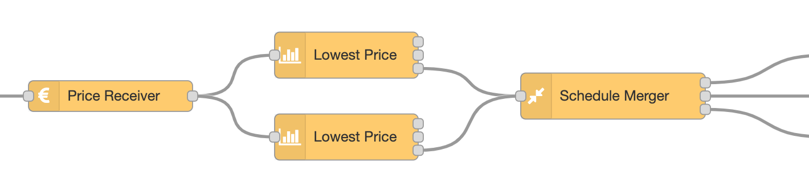

# ps-strategy-lowest-price


Strategy node to turn on power the hours when the price is lowest during a given period, and turn off the other hours.

## Description

The node can work on a specific period from 1 to 24 hours during a 24 hour period. Inside this period, you can decide how many hours that shall be on. The rest of the period will be off. Outside the period, you can select that the output shall be either on or off. You can also decide that the hours on shall be consecutive (one continuous period) or spread around in multiple on-periods.

## Configuration


| Value                  | Description                                                                                                                                                                                    |
| ---------------------- | ---------------------------------------------------------------------------------------------------------------------------------------------------------------------------------------------- |
| From time              | The start time of the selected period.                                                                                                                                                         |
| To time                | The end time of the selected period.                                                                                                                                                           |
| Hours on               | The number of hours that shall be turned on.                                                                                                                                                   |
| Max price              | If set, does not turn on if price is over this limit. See below.                                                                                                                               |
| Consecutive on-period  | Check this if you need the on-period to be consecutive.                                                                                                                                        |
| Output value for on    | Set what value to output on output 1 in order to turn on. Default is `boolean true`. You can also select a `number`, for example `1`, or a `string`, for example `on`, or any other value.     |
| Output value for off   | Set what value to output on output 2 in order to turn off. Default is `boolean false`. You can also select a `number`, for example `0`, or a `string`, for example `off`, or any other value.  |
| Send when rescheduling | Check this to make sure on or off output is sent immediately after rescheduling. If unchecked, the output is sent only if it has not been sent before, or is different from the current value. |
| If no schedule, send   | What to do if there is no valid schedule any more (turn on or off). This value will be sent also before there is any valid schedule, or after the last hour there is price data for.           |
| Context storage        | Select context storage to save data to, if more than one is configured in the Node-RED `settings.js` file.                                                                                     |

If you want to use a period of 24 hours, set the From Time and To Time to the same value. The time you select is significant in the way that it decides which 24 hours that are considered when finding the hours with lowest price.

::: tip Example with Consecutive On-Period
One example to need a consecutive on-period can be if you want to control the washing machine. Let's say it needs 3 hours, and you want it to run between 22:00 and 06:00. Set `From Time = 22:00`, `To Time = 06:00` and check the `Consecutive On-Period` flag. This will turn on the cheapest 3-hour period from 22:00 to 06:00.

NB! It is not recommended to run the washing machine when you are sleeping or away.
:::

::: tip Example with non-consecutive on-period
If you have heating cables in the driveway, you may need them to be on only for a few hours every day, for example 4 hours, but it may not be important when this is. Then set `From Time = 00:00`, `To Time = 00:00` and **un-check** the `Consecutive On-Period` flag. This will turn on the 4 cheapest hours during the whole day, and off the rest.

You can use any time for start and end, but it is a good idea to use `00:00`, since the prices normally comes for this period.
:::

::: warning Outside Period, Send
Unless the period you select is 24 hours (`From Time` and `To Time` are the same), it is important what value you choose for `Outside Period, Send`. This decides whether the output is on or off during the period that is outside the selected period.
:::

::: danger Schedule not calculated
If you select a period for example from 10:00 to 02:00, it may not be possible to calculate before the period starts. This is because electricity prices for the next day (in the Nord Pool area) normally are received around 13:00. The node cannot calculate the period until it has price data for the whole period.
:::

::: warning Max price
Use this to set a maximum price for hours to be on.
Leave this blank if you don't understand how it works.!
If this is set, the number of hours on may be less then configured for `Hours on`.

If `Consecutive on period` is off (not checked), hours will be turned on only if the price is below or equal to `Max price`.

If `Consecutive on period` is on (checked), hours will be turned on only if the average price for the whole period is below or equal to `Max price`. If the average price for the hours that are supposed to be turned on is higher then `Max price`, then **all hours** will be off. This is to make sure that if the switch (or whatever you have connected) is turned on, it is turned on the whole period.

If you leave `Max price` blank, it has no effect.
:::

###

<AdsenseAdd type="artikkel"/>

### Dynamic config

The following config values can be changed dynamically:

| Name                               | Description                                              |
| ---------------------------------- | -------------------------------------------------------- |
| `contextStorage`                   | String                                                   |
| `fromTime`                         | String with number, 2 digits, "00"-"23"                  |
| `toTime`                           | String with number, 2 digits, "00"-"23"                  |
| `hoursOn`                          | Number                                                   |
| `maxPrice`                         | Number                                                   |
| `outputIfNoSchedule`               | Legal values: `true`, `false`                            |
| `outputIfNoSchedule`               | Legal values: `true`, `false`                            |
| `doNotSplit`                       | Legal values: `true`, `false`                            |
| `outputOutsidePeriod`              | Legal values: `true`, `false`                            |
| `sendCurrentValueWhenRescheduling` | Legal values: `true`, `false`                            |
| `outputValueForOn`                 | See description in [Dynamic Config](./dynamic-config.md) |
| `outputValueForOff`                | See description in [Dynamic Config](./dynamic-config.md) |
| `outputValueForOntype`             | See description in [Dynamic Config](./dynamic-config.md) |
| `outputValueForOfftype`            | See description in [Dynamic Config](./dynamic-config.md) |
| `override`                         | Legal values: `"on"`, `"off"`, `"auto"`                  |

See [Dynamic Config](./dynamic-config.md) for details and how to send dynamic config.

### Dynamic commands

You can send dynamic commands to this node, for example to make it resend output.
See [Dynamic Commands](./dynamic-commands.md) for details and how to send dynamic commands.

## Input

The input is the [common strategy input format](./strategy-input.md)

## Output

There are three outputs. You use only those you need for your purpose.

### Output 1

A payload with the value set in config, default `true`, is sent to output 1 whenever the power / switch shall be turned on.

### Output 2

A payload with the value set in config, default `false` is sent to output 2 whenever the power / switch shall be turned off.

### Output 3

When a valid input is received, and the schedule is recalculated, the resulting schedule, as well as some other information, is sent to output 3. You can use this to see the plan and verify that it meets your expectations. You can also use it to display the schedule in any way you like.

###

<AdsenseAdd type="artikkel"/>

Example of output:

```json
{
  "schedule": [
    {
      "time": "2021-12-10T00:00:00.000+01:00",
      "value": "true"
    },
    {
      "time": "2021-12-10T04:00:00.000+01:00",
      "value": true
    },
    {
      "time": "2021-12-10T10:00:00.000+01:00",
      "value": false
    },
    {
      "time": "2021-12-10T18:00:00.000+01:00",
      "value": "true"
    },
    {
      "time": "2021-12-11T04:00:00.000+01:00",
      "value": true
    },
    {
      "time": "2021-12-11T10:00:00.000+01:00",
      "value": false
    },
    {
      "time": "2021-12-11T18:00:00.000+01:00",
      "value": "true"
    }
  ],
  "hours": [
    {
      "price": 0.4778,
      "onOff": "true",
      "start": "2021-12-10T00:00:00.000+01:00",
      "saving": null
    },
    {
      "price": 0.4828,
      "onOff": "true",
      "start": "2021-12-10T01:00:00.000+01:00",
      "saving": null
    },
    //...
    {
      "price": 0.6514,
      "onOff": "true",
      "start": "2021-12-11T23:00:00.000+01:00",
      "saving": null
    }
  ],
  "source": "Tibber",
  "config": {
    "contextStorage": "default",
    "fromTime": "04",
    "toTime": "18",
    "hasChanged": false,
    "hoursOn": "06",
    "doNotSplit": false,
    "sendCurrentValueWhenRescheduling": true,
    "outputIfNoSchedule": "true",
    "outputOutsidePeriod": "true"
  },
  "time": "2021-09-30T23:45:12.123+02:00",
  "version": "3.1.2"
}
```

The `schedule` array shows every time the switch is turned on or off. The `hours` array shows values per hour containing the price (received as input), whether that hour is on or off, the start time of the hour and the amount per kWh that is saved on hours that are turned off, compared to the next hour that is on.

## Restarts and saved context

The config, last received prices and the last calculated schedule are saved to the nodes context.
This may be saved to memory, to file or to another destination based on how your Node-RED is configured.
If multiple context storages are defined, you can select which one to use in the nodes config.
If there is only one context storage defined, this is normally `memory`. In that case, data is not saved over restarts.
It is common to have two different context storages defined, `memory` and `file`, but there may be more.
It is also common to have a `default` context storage defined, and often this points to either `memory` or `file`.
However, the configuration can be different from this.

You can find this configuration in the `settings.js` file for Node-RED, usually in the node-red config folder.
In Home Assistant, this is normally `/config/node-red/settings.js`.

Here is an example of a configuration for the context storage:

```js
contextStorage: {
  file: { module: "localfilesystem"},
  default: { module: "memory" }
}
```

By default, this node saves context to the `default` context storage. In the example above, this is memory.
Then it is not preserved over a restart.
Please read the [Node-RED documentation](https://nodered.org/docs/user-guide/context) for more details about this.

The data that is saved is the config, the last used prices and the last calculated schedule.

When Node-RED restarts, the config is reset to what is defined in the node config, so by default,
nothing is read from the context storage after a restart. However, if you send a `replan` command to the
nodes input, a plan is recalculated, using the last received prices. One way to do this is to use an `inject` node,
and set `msg.payload` to the following JSON value:

```json
{
  "commands": {
    "replan": true
  }
}
```

This is an alternative to fetching new prices and send as input.

## Tips & tricks

### Multiple nodes works together

You can use multiple nodes simultanously, for different periods, for example if you want more hours on one part of the day than another part, or to make sure there are at least some hours on during each period. In this case set up one Lowest Price node for each period and
combine the output from them into one schedule using the Schedule Merger node:



### Highest price

If you want to find the `x` hours with the highest prices, do as follows:

1. Calculate `y` as the total number of hours in the period. For example, if the period is from `08:00` to `20:00`, then `y = 12`.
2. Configure `Hours On = y - x`, so if `x = 4`, then `Hours On = 12 - 4 = 8`.
3. Use **Output 2** to get a signal when you have the hours with the highest prices. Just remember that the value sent to output 2 is `false`, not `true` as it is on output 1.

###

<AdsenseAdd type="nederst"/>
