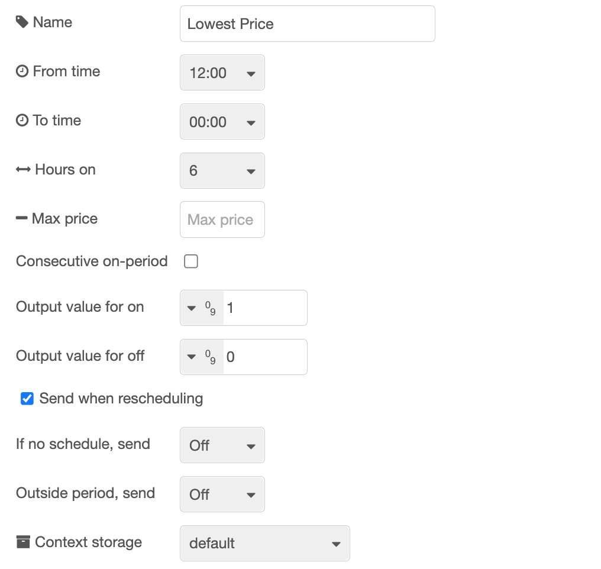

# ps-strategy-lowest-price


Strategy node to turn on power the hours when the price is lowest during a given period, and turn off the other hours.

## Description

The node can work on a specific period from 1 to 24 hours during a 24 hour period. Inside this period, you can decide how many hours that shall be on. The rest of the period will be off. Outside the period, you can select that the output shall be either on or off. You can also decide that the hours on shall be consecutive (one continuous period) or spread around in multiple on-periods.

## Configuration



| Value                  | Description                                                                      |
| ---------------------- | -------------------------------------------------------------------------------- |
| From time              | The start time of the selected period.                                           |
| To time                | The end time of the selected period.                                             |
| Hours on               | The number of hours that shall be turned on.                                     |
| Max price              | If set, does not turn on if price is over this limit. See below.                 |
| Consecutive on-period  | Check this if you need the on-period to be consecutive.                          |
| Send when rescheduling | Check this to make sure on or off output is sent immediately after rescheduling. |
| If no schedule, send   | What to do if there is no valid schedule any more (turn on or off).              |
| Outside period, send   | Select the value to send outside the selected period.                            |
| Context storage        | Select context storage to save data to, if you want other than the default.      |

If you want to use a period of 24 hours, set the From Time and To Time to the same value. The time you select is significant in the way that it decides which 24 hours that are considered when finding the hours with lowest price.

::: tip Example with Consecutive On-Period
One example to need a consecutive on-period can be if you want to control the washing machine. Let's say it needs 3 hours, and you want it to run between 22:00 and 06:00. Set `From Time = 22:00`, `To Time = 06:00` and check the `Consecutive On-Period` flag. This will turn on the cheapest 3-hour period from 22:00 to 06:00.

NB! It is not recommended to run the washing machine when you are sleeping or away.
:::

::: tip Example with non-consecutive on-period
If you have heating cables in the driveway, you may need them to be on only for a few hours every day, for example 4 hours, but it may not be important when this is. Then set `From Time = 00:00`, `To Time = 00:00` and **un-check** the `Consecutive On-Period` flag. This will turn on the 4 cheapest hours during the whole day, and off the rest.

You can use any time for start and end, but it is a good idea to use `00:00`, since the prices normally comes for this period.
:::

::: warning Outside Period, Send
Unless the period you select is 24 hours (`From Time` and `To Time` are the same), it is important what value you choose for `Outside Period, Send`. This decides whether the output is on or off during the period that is outside the selected period.
:::

::: danger Schedule not calculated
If you select a period for example from 10:00 to 02:00, it may not be possible to calculate before the period starts. This is because electricity prices for the next day (in the Nord Pool area) normally are received around 13:00. The node cannot calculate the period until it has price data for the whole period.
:::

::: warning Max price
Use this to set a maximum price for hours to be on.
Leave this blank if you don't understand how it works.!
If this is set, the number of hours on may be less then configured for `Hours on`.

If `Consecutive on period` is off (not checked), hours will be turned on only if the price is below or equal to `Max price`.

If `Consecutive on period` is on (checked), hours will be turned on only if the average price for the whole period is below or equal to `Max price`. If the average price for the hours that are supposed to be turned on is higher then `Max price`, then **all hours** will be off. This is to make sure that if the switch (or whatever you have connected) is turned on, it is turned on the whole period.

If you leave `Max price` blank, it has no effect.
:::

### Dynamic config

It is possible to change config dynamically by sending a config message to the node. The config messages has a payload with a config object like this example:

```json
"payload": {
  "config": {
    "contextStorage": "file",
    "fromTime": 10,
    "toTime": 16,
    "hoursOn": 3,
    "maxPrice": null,
    "doNotSplit": false,
    "sendCurrentValueWhenRescheduling": true,
    "outputIfNoSchedule": false,
    "outputOutsidePeriod": false
  }
}
```

All the variables in the config object are optional. You can send only those you want to change.

The config sent like this will be valid until a new config is sent the same way, or until the flow is restarted. On a restart, the original config set up in the node will be used.

When a config is sent like this, and without price data, the schedule will be replanned based on the last previously received price data. If no price data has been received, no scheduling is done.

However, you can send config and price data in the same message. Then both will be used .

### Dynamic commands

You can dynamically send some commands to the node via its input, by using a `commands` object in the payload as described below.

Commands can be sent together with config and/or price data, but the exact behavior is not defined.

#### sendSchedule

You can get the schedule sent to output 3 any time by sending a message like this to the node:

```json
"payload": {
  "commands": {
    "sendSchedule": true,
  }
}
```

When you do this, the current schedule is actually recalculated based on the last received data, and then sent to output 3 the same way as when it was originally planned.

#### sendOutput

You can get the node to send the current output to output 1 or 2 any time by sending a message like this to the node:

```json
"payload": {
  "commands": {
    "sendOutput": true,
  }
}
```

When you do this, the current schedule is actually recalculated based on the last received data. The current output is sent to output 1 or 2, and the schedule is sent to output 3.

#### reset

You can reset data the node has saved in context by sending this message:

```json
"payload": {
  "commands": {
    "reset": true,
  }
}
```

When you do this, all historical data the node has saved is deleted, including the current schedule, so the result will be
that the node shows status "No price data". When new price data is received, a schedule is calculated without considering any history.

The nodes config is not deleted, as the node depends on it to work.

::: warning
This operation cannot be undone.

However, it is normally not a big loss, as you can just feed the node with new price data and start from scratch.
:::

#### replan

By sending this command, you can have the node read the last received prices from the context storage,
and make a plan based on those prices:

```json
"payload": {
  "commands": {
    "replan": true,
  }
}
```

If the context storage is `file` you can use this to create a new schedule after a restart,
instead of fetching prices again.

### Config saved in context

The nodes config is saved in the nodes context.
If dynamic config is sent as input, this replaces the saved config.
It is the config that is saved in context that is used when calculating.
When Node-RED starts or the flow is redeployed, the config defined in the node replaces the saved config and will be used when planning.

## Input

The input is the [common strategy input format](./strategy-input.md)

## Output

When a valid input is received, and the schedule is recalculated, the resulting schedule, as well as some other information, is sent to output 3. You can use this to see the plan and verify that it meets your expectations. You can also use it to display the schedule in any way you like.

Example of output:

```json
{
  "schedule": [
    {
      "time": "2021-12-10T00:00:00.000+01:00",
      "value": "true"
    },
    {
      "time": "2021-12-10T04:00:00.000+01:00",
      "value": true
    },
    {
      "time": "2021-12-10T10:00:00.000+01:00",
      "value": false
    },
    {
      "time": "2021-12-10T18:00:00.000+01:00",
      "value": "true"
    },
    {
      "time": "2021-12-11T04:00:00.000+01:00",
      "value": true
    },
    {
      "time": "2021-12-11T10:00:00.000+01:00",
      "value": false
    },
    {
      "time": "2021-12-11T18:00:00.000+01:00",
      "value": "true"
    }
  ],
  "hours": [
    {
      "price": 0.4778,
      "onOff": "true",
      "start": "2021-12-10T00:00:00.000+01:00",
      "saving": null
    },
    {
      "price": 0.4828,
      "onOff": "true",
      "start": "2021-12-10T01:00:00.000+01:00",
      "saving": null
    },
    //...
    {
      "price": 0.6514,
      "onOff": "true",
      "start": "2021-12-11T23:00:00.000+01:00",
      "saving": null
    }
  ],
  "source": "Tibber",
  "config": {
    "contextStorage": "default",
    "fromTime": "04",
    "toTime": "18",
    "hoursOn": "06",
    "doNotSplit": false,
    "sendCurrentValueWhenRescheduling": true,
    "outputIfNoSchedule": "true",
    "outputOutsidePeriod": "true"
  },
  "time": "2021-09-30T23:45:12.123+02:00",
  "version": "3.1.2"
}
```

The `schedule` array shows every time the switch is turned on or off. The `hours` array shows values per hour containing the price (received as input), whether that hour is on or off, the start time of the hour and the amount per kWh that is saved on hours that are turned off, compared to the next hour that is on.

## Restarts and saved context

The config, last received prices and the last calculated schedule are saved to the nodes context.
This may be saved to memory, to file or to another destination based on how your Node-RED is configured.
If multiple context storages are defined, you can select which one to use in the nodes config.
If there is only one context storage defined, this is normally `memory`. In that case, data is not saved over restarts.
It is common to have two different context storages defined, `memory` and `file`, but there may be more.
It is also common to have a `default` context storage defined, and often this points to either `memory` or `file`.
However, the configuration can be different from this.

You can find this configuration in the `settings.js` file for Node-RED, usually in the node-red config folder.
In Home Assistant, this is normally `/config/node-red/settings.js`.

Here is an example of a configuration for the context storage:

```js
contextStorage: {
  file: { module: "localfilesystem"},
  default: { module: "memory" }
}
```

By default, this node saves context to the `default` context storage. In the example above, this is memory.
Then it is not preserved over a restart.
Please read the [Node-RED documentation](https://nodered.org/docs/user-guide/context) for more details about this.

The data that is saved is the config, the last used prices and the last calculated schedule.

When Node-RED restarts, the config is reset to what is defined in the node config, so by default,
nothing is read from the context storage after a restart. However, if you send a `replan` command to the
nodes input, a plan is recalculated, using the last received prices. One way to do this is to use an `inject` node,
and set `msg.payload` to the following JSON value:

```json
{
  "commands": {
    "replan": true
  }
}
```

This is an alternative to fetching new prices and send as input.

## Tips & tricks

### Multiple nodes works together

You can use multiple nodes simultanously, for different periods, if you want more hours on one part of the day than another part, or to make sure there are at least some hours on during each period.

### Highest price

If you want to find the `x` hours with the highest prices, do as follows:

1. Calculate `y` as the total number of hours in the period. For example, if the period is from `08:00` to `20:00`, then `y = 12`.
2. Configure `Hours On = y - x`, so if `x = 4`, then `Hours On = 12 - 4 = 8`.
3. Use **Output 2** to get a signal when you have the hours with the highest prices. Just remember that the value sent to output 2 is `false`, not `true` as it is on output 1.
