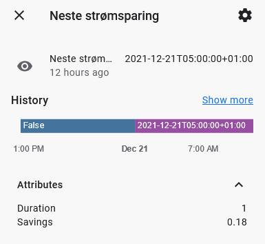
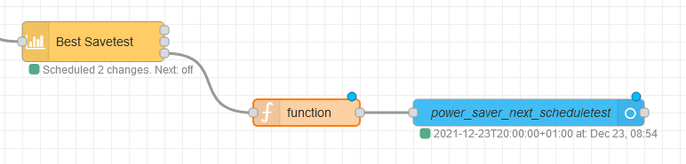
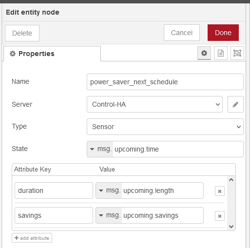

# Output schedule to a sensor entity

Note: Requires [Node-RED Companion Integration](https://github.com/zachowj/hass-node-red).


 

This JavaScript code snippet can be pasted into a Function-node. When connected to the schedule-output (3) from Best Save, it will loop through the array of available hours and find the next timestamp where a power saving schedule is initated.
```js
    for (var i = 0; i < msg.payload.hours.length; i++) {
    if (msg.payload.hours[i].onOff != true) {
        var schedule = {time: msg.payload.hours[i].start, topic: "Neste spareperiode", length: msg.payload.config.maxHoursToSaveInSequence, savings: msg.payload.hours[i].saving}
        break}
    else {
        var schedule = {time: false, topic: "Ingen aksjoner", length: "0", savings: "0"}
    }
    }
    var schedule_array = {upcoming: schedule}
    return [schedule_array]
```

This will return the following:
- msg.upcoming.time = Timestamp if saving is scheduled - False if no schedule with the current available prices.
- msg.upcoming.length = How long the next saving will last - set to 0 if no schedule.
- msg.upcoming.savings = Estimated savings retrieved from the node.

The msg.topic is currently not used, but in case you'd want to specify dynamic names in the sensor instead of in the frontend, go ahead and add them as attributes using the following configuration:

1. **State**: msg.upcoming.time
2. Attribute key **Duration**: msg.upcoming.length
3. Attribute key **Savings**: msg.upcoming.savings



## To-do
If you find any bugs, let me know, but as long as the payload doesn't change it should work.
